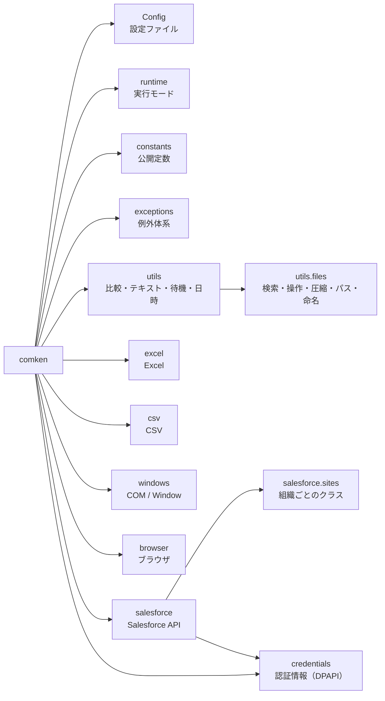

# original_libs

業務自動化で使う Python 共通ライブラリ。

## はじめて使う人へ

この README を最初から最後まで読む必要はない。次の順で進めるのが早い:

1. **プロジェクトの準備**（下の「プロジェクトの準備」節。起動用バッチに共有ライブラリの場所を設定）
2. **やりたいことを「モジュール一覧」から探す** → その節のコード例をコピーして動かす
3. **動くサンプルを見る** → `examples/`（一覧は examples/README.md。CSV→Excel レポート・
   突合転記・差分レポートはインストール直後にそのまま動かせる。新規ツールの雛形もここ）
4. **エラーが出たら** → ERRORS.md（メッセージに対処法が書いてある）

最初の1本はこれだけで書ける（CSV を読んで Excel レポートを作る例）:

```python
from comken.csv import CsvReader
from comken.excel import ExcelWriter

rows = CsvReader(r"C:\作業\data.csv").read_rows()      # CSV を読む（1行 = 1辞書）

with ExcelWriter.create(r"C:\作業\report.xlsx") as f:  # 新規 Excel を作る
    s = f.sheet("Sheet1")
    s.write_table(rows)                            # ヘッダー + データをまとめて書く
    s.auto_width()                                 # 列幅を整える
    s.freeze_header()                              # 1行目を固定
    f.save()
```

## ドキュメントの地図

この README がすべての入口です。目的に合う行から読み始めてください。

| したいこと | 読むもの |
|---|---|
| はじめて使う | この README の「[はじめて使う人へ](#はじめて使う人へ)」 |
| 何が用意されているか探す | このREADMEの「[モジュール一覧](#モジュール一覧)」 |
| モジュールの使い方を知る | [CSV](docs/csv.md)・[Excel](docs/excel.md)・[Access](docs/access.md)・[Outlook](docs/outlook.md)・[Windows](docs/windows.md)・[ブラウザ](docs/browser.md)・[Salesforce](docs/salesforce.md)・[ファイル](docs/utils-files.md)・[認証情報](docs/credentials.md) |
| 引数・戻り値・例外を正確に知る | [公開 API](docs/自動生成/API.md)（**自動生成**） |
| エラーが出た | [エラー対応ガイド](ERRORS.md)（エラー表は **自動生成**） |
| 動くコードを見る | [examples](examples/README.md) |
| なぜこの設計なのか知る | [仕様書](仕様書.md) |
| コードを書く規約 | [共通コーディング規約](CONVENTIONS.md) |
| comken 本体を直す | [ライブラリ開発規約](docs/ライブラリ開発規約.md) |
| comken を使うツールを作る | [プロジェクト規約](docs/プロジェクト規約.md) |
| コードを読む・レビューする | [コードリーディングガイド](docs/コードリーディングガイド.md) |

## モジュール一覧

| モジュール | 概要 |
|---|---|
| Config | INI ファイルの読み込み |
| runtime | `with debug():` / `with dry_run():` による実行モード |
| constants | CSV・Excel・ファイル検索で使う公開定数 |
| exceptions | comken 固有の例外（エラー名別に対処可能） |
| [CSV](docs/csv.md) | CSV の読み込み・検索・抽出 |
| [Excel（openpyxl）](docs/excel.md) | Excel の読み書き（既存数式の計算結果・マクロは必要時に win32com を使用） |
| [Access](docs/access.md) | Access のマクロ・VBA 実行、テーブル／クエリの CSV 出力 |
| [Outlook](docs/outlook.md) | Classic Outlook の受信メール読み取り・下書き作成 |
| [Windows（pywin32）](docs/windows.md) | Excel COM 操作・ウィンドウ操作・レジストリ読み取り |
| [Browser（Edge）](docs/browser.md) | Edge ブラウザ操作 |
| [Salesforce（requests）](docs/salesforce.md) | Salesforce の SOQL・レコード操作・レポート取得・API 使用量の計測 |
| [Salesforce認証の判断根拠](docs/salesforce-authentication.md) | ECA・Client Credentials Flowを選んだ理由と公式資料 |
| [credentials（DPAPI）](docs/credentials.md) | パスワード・client_secret の暗号化保存（Windows ユーザーに紐付く） |
| [utils.files](docs/utils-files.md) | ファイル検索・操作・圧縮・標準フォルダ取得・ファイル名の組み立て |
| [utils](docs/utils-files.md) | データ比較・テキスト正規化・待機・リトライ・時間計測・ローカル日時取得 |

## 定数クラス一覧

選択肢を渡す引数には生の文字列ではなく、これらの定数を使う。

| 定数クラス | import | 用途 | 例 |
|---|---|---|---|
| `Color` | `from comken.constants import Color` | セルの背景色 | `set_fill(color=Color.RED)` |
| `SortBy` | `from comken.constants import SortBy` | FileFinder.latest の並び順 | `latest(by=SortBy.UPDATED)` |
| `Encoding` | `from comken.constants import Encoding` | CSV の文字コード | `CsvReader(path, encoding=Encoding.CP932)` |
| `FileFormat` | `from comken.constants import FileFormat` | Excel COM の別名保存形式 | `save_as(path, file_format=FileFormat.CSV)` |

---

## 機能の追加・変更の要望

「このエンコーディングを `Encoding` に追加してほしい」「この色を `Color` に追加してほしい」など、
**複数のプロジェクトで使えそうな機能は管理者に連絡してください。**

要望の例:

| 種類 | 例 |
|---|---|
| 定数クラスへの値の追加 | `Encoding` に新しい文字コード、`Color` に色を追加したい |
| デフォルト値の変更 | `BrowserOptions` のデフォルトを変えたい |
| ユーティリティの追加 | よく使うファイル操作・文字列変換などを共通化したい |
| 新モジュール | 複数プロジェクトで同じような処理を書いている |

個人プロジェクト固有の処理は各プロジェクト側に書く。
**複数のプロジェクトで繰り返し書いている処理**が追加候補です。

---

## プロジェクトの準備

comken は共有サーバー上の1か所を**直接参照する**（ローカルへのコピー・同期はしない）。

### PCへ恒久的に設定する

リポジトリ直下の`install_pythonpath.bat`を1回実行すると、このフォルダが現在のWindows
ユーザーの`PYTHONPATH`へ追加される。バッチ自身の場所からパスを判定するため編集は不要。
既存の`PYTHONPATH`は残し、同じパスが登録済みなら重複追加しない。

設定は新しく開いたコマンドプロンプト、PowerShell、VS Codeから有効になる。共有フォルダを
移動した場合は、Windowsのユーザー環境変数から古いパスを削除し、移動後のバッチを再実行する。
管理者権限は不要。

### プロジェクトごとに設定する

PCの環境変数を変更したくない場合は、各プロジェクトのルートに
`templates/新規プロジェクト/実行.bat`をコピーし、先頭の`COMKEN_ROOT`を共有サーバー上の
リポジトリルートに合わせる。この方法ではバッチの実行中だけ`PYTHONPATH`を設定する。
（`新規プロジェクト作成.bat`で作ったプロジェクトには、この`実行.bat`が場所入りで最初から入る）

### BO用フォルダへ配置する

`deploy_comken.bat`は、バージョン更新、Ruff、pytest、BO用フォルダへのコピーを順番に行う。
コピー先と更新する桁を引数で渡せる。

```bat
deploy_comken.bat "\\server\share\BO_LIBS" patch
```

第2引数は`patch`、`minor`、`major`、または`1.2.3`のような任意バージョンを指定する。
引数を省略すると画面で入力する。新バージョンは現在より大きい値だけを受け付けるため、
バージョンを変え忘れた状態では配置できない。

配置先の既存`comken`は`backup/`へ退避し、一時フォルダへコピーした新バージョンをimport
できた場合だけ切り替える。`DEPLOYMENT.txt`にはバージョン、日時、Gitコミット、バージョン変更前
から存在した未コミット変更の有無を記録する。手元の未コミット変更も配置できるが、その場合は
警告を表示する。

```bat
set "COMKEN_ROOT=\\server\share\tools\comken"
set "PYTHONPATH=%COMKEN_ROOT%;%PYTHONPATH%"
python main.py
```

以後、どのプロジェクトからでも `import comken` が共有サーバーの最新版を読む。更新のたびの配布作業はない。
（共有サーバーの comken を更新すれば、次に import した全プロジェクトが最新になる）

- **バイトコードキャッシュは自動でローカルに逃がす**: 共有サーバーが読み取り専用でも
  遅くならないよう、comken は import 時に `.pyc` の出力先を `%LOCALAPPDATA%\comken-pycache`
  に向ける（`sys.pycache_prefix`）。環境変数 `PYTHONPYCACHEPREFIX` を設定済みの場合はそちらを尊重する。
- **代償**: import のたびにネットワークを読むので起動が遅く、共有サーバーが落ちると動かない。
  詳しい仕組み・運用（更新/ロールバック/開発との分離）は 仕様書.md の「参照・運用」を参照。

## 実行モード（バージョン / デバッグ / dry-run）

```python
import comken

comken.__version__        # → "0.7.0"

# デバッグモード: ライブラリ主要処理（Excel 読み込み・転記・保存、CSV 読み書き、zip 等）の
# 所要時間を DEBUG ログに出す。どこが遅いかの調査に使う
with comken.debug():
    run()

# dry-run モード: 外部に影響する操作を実行せず、内容だけ [DRY-RUN] 付きで INFO ログに出す。
# 読み取り（CSV・Excel の読み込み）は通常どおり実行される
with comken.dry_run():
    run()
```

自作関数の処理時間も同じ仕組みで計測できる（デバッグモード中だけログに出る）:

```python
from comken.utils import measure

@measure
def build_report():
    ...
```

---

## Config

`config.ini` を `config.SECTION.KEY` の形式で読み込む。

**基本の使い方**（`src/config.py` は不要。エディタ補完も効く）:

```python
from comken import config

# 初回アクセス時にカレントディレクトリの config.ini を1度だけ読む（遅延読み込み）
folder = config.REPORT.OUTPUT_FOLDER
path = config.FILES.INPUT_FOLDER / "支店A.csv"

# config.ini が別の場所にある場合は、最初に使う前に読む場所を指定する
config.read(r"C:\作業\config.ini")
```

> **補完（Pylance）:** config を初めて読むと、config.ini から補完用スタブ
> `typings/comken/`（config.pyi + __init__.pyi）が自動生成される。VS Code + Pylance で
> `config.SECTION.KEY` が型付き補完される（typings/ は .gitignore 推奨）。
> ツール実行前にスタブだけ先に作りたいときは `python -m comken.config`。

明示的にインスタンスを持ちたい場合（テストや複数 ini の読み分けに）:

```python
from comken.config import Config

config = Config()                      # カレントディレクトリの config.ini
config = Config("path/to/config.ini")  # パスを指定する場合
```

```ini
; config.ini（プロジェクト固有の非機密設定を書く）
; セクション名・キー名は大文字で書く（固定値と分かる + Python 側と表記が一致する）

[REPORT]
OUTPUT_FOLDER = C:\作業\reports
TEMPLATE_PATH = \\nas-server\templates\template.xlsx
```

```python
config.REPORT.OUTPUT_FOLDER # → str
config.REPORT.TEMPLATE_PATH # → str
```

**列名の対応表:** セクション名を `MAPPING` で終わらせ、`転記元の列名 = 転記先の列名`
の向きで書く。列名は大文字に直されず、値も常に文字列として返る。

```ini
[受注_MAPPING]
受注No = 受注番号
商品cd = 商品コード
年度 = 2026
```

```python
mapping = config.mapping("受注_MAPPING")
# → {"受注No": "受注番号", "商品cd": "商品コード", "年度": "2026"}
```

半角の `:` と `=` は INI の区切り記号になるため、列名には使えない（全角の `：` `＝` は使用可）。

**値の型変換ルール:**

| config.ini の値 | 返る型 |
|---|---|
| `true` / `false`（大文字小文字問わず） | bool に自動変換 |
| `yes` / `no` / `on` / `off` | **変換しない**（str のまま） |
| `[a, b, c]` | list[str] に自動変換 |
| 整数（`10` など） | int に自動変換 |
| 小数（`1.5` など） | float に自動変換 |
| 絶対パス（`C:\...` / `\\...` / `/...`） | Path に自動変換 |
| その他の文字列 | str のまま |

`true` / `false` 以外の `yes` / `on` / `1` / `0` を bool に変換しないのは、
`1` が「数値の1」なのか「ON の意味」なのか曖昧になる事故を避けるため。
数値を文字列として使いたい場合（シート名 `"2024"` など）はコード側で `str()` に変換する。

**リスト値は `[...]` で囲んで書く**（カンマ区切り。改行区切りも可）:

```ini
[REPORT]
TARGET_SHEETS = [支店A, 支店B, 集計]
ONE_SHEET = [支店A]
```

```python
config.REPORT.TARGET_SHEETS   # → ["支店A", "支店B", "集計"]
config.REPORT.ONE_SHEET       # → ["支店A"]（1要素でもリスト）
```

`[...]` で囲むのは「1要素のリスト」と「ただの文字列」を区別するため
（カンマの有無だけで判定すると、リストを1件に減らした途端に文字列になり、
for ループが文字単位になる事故が起きる）。

**エディタの補完候補（型スタブの自動生成）:**

属性は実行時に動的に作られるため、そのままではエディタが `config.REPORT.` の先を補完できない。
そのため config を初めて読むと、config.ini から補完用スタブ `typings/comken/`
（config.pyi + `__init__.pyi`）が自動生成される。VS Code + Pylance がこれを読み、
セクション・キーが型付きで補完される（config.ini を変更すると次の実行で更新される）。

まだ一度も実行していない状態で先にスタブだけ作りたい場合は手動で生成できる:

```
python -m comken.config
```

生成された `typings/` は手で編集せず、`.gitignore` に含める（自動生成物）。

なお**ブラウザの設定は config.ini には書かない**。`BrowserOptions` のインスタンス
（`src/browser_options.py`）で行う（Browser を参照）。

---

## State

人が書く固定の設定は `config.ini`、プログラムが次回へ持ち越す状態は `state.ini` と
使い分ける。人が調整した設定をプログラムが上書きする事故を防ぐため、両者は混ぜない。

```python
from comken.state import State

state = State()                         # 実行フォルダ直下の state.ini
last_file = state.get("LAST_FILE")     # 無ければ None
position = state.get("POSITION", 0)    # 既定値も指定できる
state.set("LAST_FILE", "data.csv")    # その場で保存
```

`state.ini` が無い初回実行は空の状態で続行する。値は文字列・数値・bool・文字列リストの
型を保って読み戻せる。壊れたファイルは続きの位置を失わないよう、初回扱いにせずエラーで止まる。
dry-run 中の `set()` はログだけを出し、本番の「処理済み」判定を変えない。

実際に保存される内容:

```ini
[STATE]
LAST_FILE = "data.csv"
POSITION = 42
```

---

## Logger

ログの設定（出力先・フォーマット・レベル）は社内の共通ライブラリ側で行う。
comken と利用プロジェクトは、各モジュールで標準の `logging.getLogger(__name__)` を使うだけでよい。
RPA 基盤を通さず `python main.py` で単体実行するときだけ、先頭で `setup_logging()` を呼ぶ。
明示的に呼んだ場合も、すでに設定済みなら既存のログ設定には触れない。

```python
# main.py（単体実行する場合だけ）
from comken.logger import setup_logging

setup_logging()  # コンソールと logs/YYYY-MM-DD.log（UTF-8）へ出力
# setup_logging(to_file=False)  # コンソールだけに出力する場合
```

```python
# main.py
import logging

logger = logging.getLogger(__name__)
logger.info("処理開始")
```

```python
# src/ 以下のモジュール
import logging

logger = logging.getLogger(__name__)
logger.info("CSV読み込み完了: %d件", len(rows))
```

---

---

## パッケージ構成



---

## 主なユースケース

### NAS の Excel を読んで加工・出力する


### CSV を読んで Excel レポートを作る


### ブラウザを自動操作する


---
