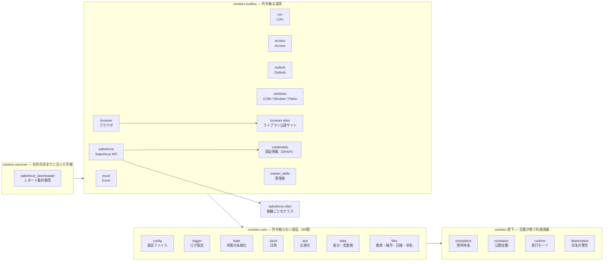

# comken

業務自動化で使う Python 共通ライブラリ。

## はじめて使う人へ

この README を最初から最後まで読む必要はない。次の順で進めるのが早い:

1. **プロジェクトの準備**（下の「プロジェクトの準備」節。起動用バッチに共有ライブラリの場所を設定）
2. **やりたいことを「モジュール一覧」から探す** → その節のコード例をコピーして動かす
3. **動くサンプルを見る** → `examples/`（一覧は examples/README.md。CSV→Excel レポート・
   突合転記・差分レポートはインストール直後にそのまま動かせる。新規ツールの雛形もここ）
4. **エラーが出たら** → ERRORS.md（メッセージに対処法が書いてある）

最初の1本はこれだけで書ける（CSV を読んで Excel レポートを作る例）:

```python
from comken.toolbox.csv import CsvReader
from comken.toolbox.excel import ExcelWriter

rows = CsvReader(r"C:\作業\data.csv").read_rows()      # CSV を読む（1行 = 1辞書）

with ExcelWriter.create(r"C:\作業\report.xlsx") as f:  # 新規 Excel を作る
    s = f.sheet("Sheet1")
    s.write_table(rows)                            # ヘッダー + データをまとめて書く
    s.auto_width()                                 # 列幅を整える
    s.freeze_header()                              # 1行目を固定
    f.save()
```

## ドキュメントの地図

この README がすべての入口です。目的に合う行から読み始めてください。

| したいこと | 読むもの |
|---|---|
| はじめて使う | この README の「[はじめて使う人へ](#はじめて使う人へ)」 |
| 何が用意されているか探す | このREADMEの「[モジュール一覧](#モジュール一覧)」 |
| モジュールの使い方を知る | [CSV](docs/csv.md)・[Excel](docs/excel.md)・[Access](docs/access.md)・[Outlook](docs/outlook.md)・[Windows](docs/windows.md)・[ブラウザ](docs/browser.md)・[Salesforce](docs/salesforce.md)・[レポートの集約取得](docs/salesforce-downloader.md)・[管理表](docs/master-table.md)・[core の部品](docs/core.md)・[認証情報](docs/credentials.md)・[祝日判定](docs/holidays.md) |
| **初めて外部システムにつなぐ** | ID とパスワードの[登録](docs/credentials.md#登録初回だけ) → [Salesforce につないで確かめる](docs/salesforce.md#つないで確かめるコマンド) |
| 引数・戻り値・例外を正確に知る | [公開 API](docs/自動生成/API.md)（**自動生成**） |
| エラーが出た | [エラー対応ガイド](docs/ERRORS.md)（エラー表は **自動生成**） |
| 動くコードを見る | [examples](examples/README.md) |
| なぜこの設計なのか知る | [仕様書](docs/開発/仕様書.md) |
| コードを書く規約 | [共通コーディング規約](docs/開発/CONVENTIONS.md) |
| comken 本体を直す | [ライブラリ開発規約](docs/開発/ライブラリ開発規約.md) |
| 開発してリリースする | [仕様書「開発とリリース」](docs/開発/仕様書.md#開発とリリース)（タグを打つ → 共有サーバーで checkout） |
| **共有サーバーへ配置する** | [配置](docs/運用/配置.md)（**どのファイルの何行目を、何に書き換えるか**まで） |
| **次に何をやるか** | [これからやること](docs/運用/これからやること.md)（配置・実機確認・判断待ち） |
| comken を使うツールを作る | `comken init プロジェクト名` で雛形を作る（作られた `README.md` が中を案内する） |
| コードを読む・レビューする | [コードリーディングガイド](docs/開発/コードリーディングガイド.md) |
| Git を社内に説明する | [Git 社内プレゼン用ネタ](docs/運用/Git社内プレゼン.md)（GitHub なしでやれることの羅列・デモの台本・想定質問） |

## 使うときの約束

- **`from comken import ...` で取れるのは、何をするプロジェクトでも使う5個だけ。**
  `config` / `Config`（設定）、`setup_logging`（ログ）、実行モードの2関数
  （`dry_run` / `debug`）
- **部品は `from comken.core import ...` から取る。** ファイル検索・日時・文字列・差分・
  計測など30個（`FileFinder` / `copy_file` / `project_dir` / `today` / `Timer` / `retry` など）
- **機能は `from comken.toolbox.excel import ExcelWriter` のように機能パッケージを明示する**
  （どの機能群に依存しているかが import 行で分かる）
- **書くときは `from comken import X` が第一選択。** そこに無いものだけ `from comken.core import Y`
- **ファイル・ブラウザ・COM は `with` で開く。** 途中で失敗しても閉じられる
- **エラーは細かい方から受ける。** 個別（`SheetNotFoundError`）→ 分野（`ExcelError`）→
  全体（`ComkenError`）の3段。階層は[仕様書「例外体系」](docs/開発/仕様書.md#5-例外体系)
- **機密は config.ini に書かない。** [認証情報](docs/credentials.md)（DPAPI）に入れ、
  config.ini にはキー名だけ書く

## パッケージの構成

comken は置き場所を4つに分けている。**どこに置くかは「そのモジュールをどう説明できるか」で決まる。**

| 場所 | 基準 | 中身 |
|---|---|---|
| `comken` 直下 | **何を操作するかに関係なく使う** | 設定・ログ・実行モード・例外・定数 |
| `comken.core` | **外にあるものを触らない部品** | ファイル検索・操作・圧縮・命名／日時・文字列・差分・待機・リトライ・計測・状態 |
| `comken.toolbox` | **「〜を操作する／〜と通信する」で説明できる** | Excel・CSV・Access・Outlook・Windows・ブラウザ・Salesforce・社内 RPA 基盤・認証情報・管理表 |
| `comken.services` | **社内の管理表や規約を知らないと説明できない** | Salesforce レポートの集約ダウンローダー |

import の書き方は上の「[使うときの約束](#使うときの約束)」を参照。

社内 RPA 基盤のラッパー（`comken.toolbox.rpa`）が toolbox にあるのは、**相手が社内のものでも
「呼び出すための部品」だから**。社内固有かどうかではなく、部品か仕組みかで分けている。

**実行される単位（定期実行のバッチなど）は comken に置かない。** それは個別プロジェクトの
仕事で、comken に置くのは呼ばれる側だけにする。

## モジュール一覧

表データの読み書きには既存の ``CsvReader`` / ``CsvWriter`` と
``ExcelWriter`` / ``Sheet`` を使う。列転記では CSV は Reader / Writer を直接渡し、
Excel は ``ExcelWriter.sheet()`` で取得した Sheet を
``Transfer(source, destination, mapping).run(transform=...)`` に渡して全件を処理する。
CSV の転記先は ``CsvWriter(path, fieldnames=list(mapping.values()))`` と作る。
``CsvReader.rows()`` と ``Sheet.rows()`` は、どちらも1件を列名付き辞書として返す。
transform は転記元行と、mapping の先頭列で一致した既存の転記先行（なければ ``None``）を
参照で受け取る。行は直接変更し、通常は何も返さない。``Transfer.SKIP`` は1件の除外、
``Transfer.STOP`` は全体の打ち切りを表す。
列対応ではなくExcelシートのセル内容と基本レイアウトを複製するときは
``Sheet.copy_to()`` を使う（画像・グラフ・印刷設定等は対象外）。

| モジュール | 概要 |
|---|---|
| Config | INI ファイルの読み込み |
| DateFileFinder / DateNameBuilder | 日付付きファイルの検索・命名 |
| Transfer | 既存の CSV / Excel クラス間の列マッピング転記 |
| runtime | `with debug():` / `with dry_run():` による実行モード |
| constants | CSV・Excel・ファイル検索で使う公開定数 |
| exceptions | comken 固有の例外（エラー名別に対処可能） |
| [CSV](docs/csv.md) | CSV の読み込み・検索・抽出 |
| [Excel（openpyxl）](docs/excel.md) | Excel の読み書き（既存数式の計算結果・マクロは必要時に win32com を使用） |
| [Access](docs/access.md) | Access のマクロ・VBA 実行、テーブル／クエリの CSV 出力 |
| [Outlook](docs/outlook.md) | Classic Outlook の受信メール読み取り・下書き作成 |
| [Windows（pywin32）](docs/windows.md) | Excel COM 操作・ウィンドウ操作・レジストリ読み取り |
| [Browser（Edge）](docs/browser.md) | Edge ブラウザ操作 |
| [Browser 公認サイト](docs/browser.md) | ライブラリ公認の `SiteBase` サブクラスを集めた置き場（`comken.toolbox.browser.sites`）。プロジェクト横断で再利用するサイトだけ昇格する |
| [Salesforce（requests）](docs/salesforce.md) | Salesforce の SOQL・レコード操作・レポート取得・API 使用量の計測 |
| [管理表（Excel を設定として使う）](docs/master-table.md) | 行が増える設定を Excel の表で持ち、型付きの行として読む（雛形・検証つき） |
| [Salesforce レポートの集約取得](docs/salesforce-downloader.md) | 管理表（Excel）に沿ってレポートを取得し、履歴を残す（どのプロジェクトが何を使っているかが分かる） |
| [Salesforce認証の判断根拠](docs/開発/salesforce-authentication.md) | ECA・Refresh Token Flow を既定にした理由と公式資料 |
| [credentials（DPAPI）](docs/credentials.md) | パスワード・client_secret の暗号化保存（Windows ユーザーに紐付く） |
| [祝日判定](docs/holidays.md) | 内閣府の祝日 CSV（CP932）+ 社内管理表の会社休日をマージして営業日判定 |
| [core（部品）](docs/core.md) | `from comken.core import ...` で取る30個。ファイル検索・操作・圧縮・ファイル名の組み立て／データ比較・テキスト正規化・待機・リトライ・時間計測・ローカル日時 |

## 定数クラス一覧

選択肢を渡す引数には生の文字列ではなく、これらの定数を使う。

| 定数クラス | import | 用途 | 例 |
|---|---|---|---|
| `Color` | `from comken.constants import Color` | セルの背景色 | `set_fill(color=Color.RED)` |
| `SortBy` | `from comken.constants import SortBy` | FileFinder.latest の並び順 | `latest(by=SortBy.UPDATED)` |
| `Encoding` | `from comken.constants import Encoding` | CSV の文字コード | `CsvReader(path, encoding=Encoding.CP932)` |
| `FileFormat` | `from comken.constants import FileFormat` | Excel COM の別名保存形式 | `save_as(path, file_format=FileFormat.CSV)` |

---
## 機能の追加・変更の要望

「このエンコーディングを `Encoding` に追加してほしい」「この色を `Color` に追加してほしい」など、
**複数のプロジェクトで使えそうな機能は管理者に連絡してください。**

要望の例:

| 種類 | 例 |
|---|---|
| 定数クラスへの値の追加 | `Encoding` に新しい文字コード、`Color` に色を追加したい |
| デフォルト値の変更 | `BrowserOptions` のデフォルトを変えたい |
| ユーティリティの追加 | よく使うファイル操作・文字列変換などを共通化したい |
| 新モジュール | 複数プロジェクトで同じような処理を書いている |

個人プロジェクト固有の処理は各プロジェクト側に書く。
**複数のプロジェクトで繰り返し書いている処理**が追加候補です。

---

## プロジェクトの準備

comken は共有サーバー上の1か所を**直接参照する**（ローカルへのコピー・同期はしない）。

リポジトリ直下にある入口は **`setup_comken.bat` 1本だけ**（初回に1回だけ実行）。
CLI の入口は **`python -m comken`** に集約したので、`comken.bat` はもう要らない
（→ 仕様書 3.5）。それ以外の場所（テンプレ・スクリプト・ドキュメント）は
Python から直接呼ばれるもので、ダブルクリックする入口ではない。

**`setup_comken.bat` はリポジトリ直下が正規の置き場所**だが、**デスクトップや手元の
作業フォルダなど、どこに置いても動く**。comken の場所は次の順で自動判定し、
最初に見つかったものを採用する（判定はどの候補でも `<候補>\comken\__init__.py` の
存在で行う）。

| 優先 | `setup_comken.bat` |
|---|---|
| 1 | **bat の先頭に書いた固定値** |
| 2 | bat 自身のフォルダ（`%~dp0`） |

**`setup_comken.bat` は `PYTHONPATH` から探さない。** この bat は `PYTHONPATH` を
**これから通す**ためのもので、通っていない前提で動かなければならない。通っていないから
実行するのに、そこから探すのは筋が通らない。代わりに、**bat を配る前に先頭へ場所を書く**:

```bat
set "PYTHON_LIBRARY=\\server\share\tools"
```

これで、この bat 1枚を各 PC へ配って「実行してください」と言うだけで済む
（各プロジェクトの bat が先頭に `PYTHON_LIBRARY` を書くのと同じ考え方）。
リポジトリ直下に置いて実行するなら、**空のままでよい**。

`setup_comken.bat` が登録するのは **`PYTHONPATH` だけ**（`comken.bat` が無くなったので
`PATH` への登録は不要）。

### セットアップ手順（新しい PC ではじめにやること）

1. リポジトリ直下の `setup_comken.bat` を実行する
   → このフォルダが現在の Windows ユーザーの `PYTHONPATH` に追加される。
   既に同じパスが登録済みなら重複追加しない。bat 自身の場所から comken を見つけるので、
   **リポジトリ直下で実行するなら編集は不要**（別の場所から配って実行させるときだけ、
   bat の先頭の `PYTHON_LIBRARY` に場所を書く）
2. **新しくターミナル（コマンドプロンプト／PowerShell／VS Code のターミナル）を開く**
   → 環境変数の変更は、そのターミナルを起動した瞬間から取り込まれる。
   セットアップ後に開いているターミナルでは PYTHONPATH が古いままなので、`python -m comken` が
   `ModuleNotFoundError: comken` になる（新しいターミナルを開けば直る）
3. プロジェクトを作りたいフォルダへ `cd` して、`python -m comken init プロジェクト名` を実行
   → 現在のフォルダにプロジェクトの雛形がコピーされる。名前を省いて `python -m comken init` と
   打つと、名前を聞かれる（`python -m comken --help` で全コマンドの一覧が出る）

共有フォルダを移動した場合は、Windows のユーザー環境変数から古いパスを削除し、
移動後の `setup_comken.bat` を再実行する。管理者権限は不要。

### `comken init` で何が作られるか

**打った場所に、プロジェクト名のフォルダが1つ**できる。中身は
`comken/templates/新規プロジェクト/` 一式（パッケージに同梱されている）で、
次の3つが自動で埋まる。

| 埋まるもの | 入るファイル |
|---|---|
| **プロジェクト名** | `main.py`（社内 RPA 基盤へ渡す名前）・`docs/仕様書.md`・`docs/使い方.md` |
| **comken の場所** | `実行.bat`・`認証情報の登録.bat`（実行時の `PYTHONPATH`）・`.vscode/settings.json`（補完と定義ジャンプ） |
| — | `README.md` から、ひな形の説明（作り終えたら消す節）が取り除かれる |

```
勤怠集計/
  main.py                  エントリポイント（実行モードの切り替えと例外の受け口）
  src/
    run.py                 ここに処理を書く
    site.py                ブラウザを使うときのサイトクラス
    browser_options.py     ブラウザの設定
  docs/
    使い方.md               業務側の人が読む
    仕様書.md               エンジニアが読む
    ERRORS.md              エラー別の対処
  config.ini.example       設定の見本（config.ini は初回実行時に作られる）
  実行.bat                  起動用（ターミナルから叩く。`pause` 無し＝無人実行向け）
  認証情報の登録.bat          ID・パスワードの登録画面
  .vscode/                 補完と推奨拡張
```

**`config.ini` は作られない。** 初回に `実行.bat` を動かす（または `python main.py` を実行する）と
example からコピーされ、**そこで終了コード 1 で止まる**（値を書き換えないまま本番が動くのを防ぐため）。

### 作ったあと、最初にやること

1. **`実行.bat` を1度動かす**（または `python main.py` を実行する）→ `config.ini` が作られて止まる
2. **`config.ini` を書き換える**。dry-run で動かしたいときは `with comken.dry_run():`
   を `main.py` で `main()` を囲む形にして、まず dry-run で 1 回試す。
   戻しは `with` ブロックを外すだけ
3. **`src/run.py` の `run()` に処理を書く**
4. **`docs/使い方.md`・`docs/仕様書.md` の「（ここを書く）」を埋める**

**comken の場所を後から変えたくなったら**、`実行.bat` と `認証情報の登録.bat` と `.vscode/settings.json` の
3つを直す（片方だけ直すと「動くのに補完が効かない」状態になって原因が分かりにくい）。
プロジェクトが増えてから変えるなら `tools/set_python_library.py` でまとめて書き換えられる。

**恒久登録しておくと、各プロジェクトのbatは`PYTHON_LIBRARY`を見に行かない。**
共有サーバーの場所が変わっても、プロジェクト側の bat を1つも直さずに済む。

### プロジェクトごとに設定する

PCの環境変数を変更したくない場合は、各プロジェクトのルートに
`comken/templates/新規プロジェクト/実行.bat`（または `認証情報の登録.bat`）をコピーし、
先頭の`PYTHON_LIBRARY`を共有サーバー上のリポジトリルートに合わせる。この方法ではバッチの実行中だけ`PYTHONPATH`を設定する。
（`python -m comken init` で作ったプロジェクトには、この bat が場所入りで最初から入る）

### bat が何をしているか

`実行.bat`・`認証情報の登録.bat` は、この順で動く。

1. **すでに`PYTHONPATH`が通っていれば、そのまま処理に入る**（上の恒久登録をした場合）
2. 通っていなければ、bat に書いてある`PYTHON_LIBRARY`を使う
3. そこにも comken が無ければ、**さがした場所を表示して止まる**
   （`setup_comken.bat`を使う案内も出す）
4. 処理の終了コードを**そのまま返す**。スケジューラや RPA 基盤が成否を判断できる
   （`pause`や`popd`で終わると、失敗しても成功したように見えてしまう）。
   `実行.bat` は RPA が絶対パスで起動する運用もあるので、`pause` を入れていない

### 共有サーバーの comken を更新する

共有サーバーのチェックアウトを、**リリース済みのタグへ切り替える**（→ [開発とリリース](docs/開発/仕様書.md#開発とリリース)）。

```bat
pushd \\server\share\tools\comken
git fetch --tags
git tag -l                 :: 出ているタグを確認する
git checkout v0.11.3       :: 切り替えたいタグ（上で確認した最新版）
popd
```

**社内固有の値を書いた3ファイルは、切り替えで上書きされないようにしておく。**
配置したときに1回だけ設定する。

```bat
git update-index --skip-worktree comken/toolbox/rpa.py
git update-index --skip-worktree comken/toolbox/salesforce/sites/sandbox.py
git update-index --skip-worktree comken/services/salesforce_downloader/service.py
```

これで手元の書き換えが消えず、うっかり push することもない。comken 側でこの3ファイルを
変更したときは切り替えが止まるので、そのときだけ `--no-skip-worktree` で解除して
手で合わせ、また設定し直す（→ [仕様書](docs/開発/仕様書.md#配置時に書き換える3ファイル)）。

**切り替えた瞬間に、次に import した全プロジェクトが新しい版になる。** 更新のたびの
配布作業はない。問題が出たら前のタグへ戻せば、同じように全プロジェクトが戻る。

- **バイトコードキャッシュは自動でローカルに逃がす**: 共有サーバーが読み取り専用でも
  遅くならないよう、comken は import 時に `.pyc` の出力先を `%LOCALAPPDATA%\comken-pycache`
  に向ける（`sys.pycache_prefix`）。環境変数 `PYTHONPYCACHEPREFIX` を設定済みの場合はそちらを尊重する。
- **代償**: import のたびにネットワークを読むので起動が遅く、共有サーバーが落ちると動かない。
  詳しい仕組み・運用（更新/ロールバック/開発との分離）は 仕様書.md の「参照・運用」を参照。

### comken の場所を変えたとき

comken を別の共有フォルダへ移すと、各プロジェクトの**3か所**（実行.bat・
認証情報の登録.bat・.vscode/settings.json）が古い場所を指したままになる。
プロジェクトが増えるほど手で直すのは現実的でなくなり、直し漏れたものだけが動かなくなる。
まとめて書き換える。

```bat
python tools\set_python_library.py \\新サーバー\share\tools F:\案件           :: 確認だけ
python tools\set_python_library.py \\新サーバー\share\tools F:\案件 --apply   :: 書き換える
```

**--apply を付けるまで何も書き換えない。** 先に「どのファイルが、どこから、どこへ」
変わるかが出るので、狙ったものだけかを確かめてから実行する。今どこを指していても
書き換えられるので、置き場所が決まるまで何度でも通してよい。

## 実行モード（バージョン / デバッグ / dry-run）

実行モードの切り替えは **`with dry_run():` / `with debug():` の context manager だけ**。
`config.ini` も環境変数も setter も読まない。`with` ブロックが唯一の手段。

```python
import comken

comken.__version__        # → "1.0.0"

# デバッグモード: `with debug():` ブロック内でのみ @measure が DEBUG ログを出す。
with comken.debug():
    run()

# dry-run モード: 外部に影響する操作を実行せず、内容だけ [DRY-RUN] 付きで INFO ログに出す。
# 読み取り（CSV・Excel の読み込み）は通常どおり実行される
with comken.dry_run():
    run()
```

自作関数の出入りを同じ仕組みで記録できる（デバッグモード中だけログが出る）:

```python
from comken.core import measure

@measure
def build_report():
    ...
```

`@measure` は**関数名（qualname）だけ**をログに出す。引数・戻り値は出さない
（DPAPI のトークン・client_secret・パスワードを扱うため、汎用デコレータが
自動で引数を出す形になっていると、いつか秘密の値がログへ載る危険があるため）。
「どのファイルで止まったか」を知りたいときは、呼び出し側が処理対象をログに出す。

雛形プロジェクトでは `with comken.debug():` を `main()` を囲む形で
`main.py` に書き、止めたい処理単位で on/off する。`config.ini` の旧 `[RUN] DEBUG`
セクションは v0.12.0 で廃止済み。

---

---

## Config

`config.ini` を `config.SECTION.KEY` の形式で読み込む。

**基本の使い方**（`src/config.py` は不要。エディタ補完も効く）:

```python
from comken import config

# 初回アクセス時にカレントディレクトリの config.ini を1度だけ読む（遅延読み込み）
folder = config.REPORT.OUTPUT_FOLDER
path = config.FILES.INPUT_FOLDER / "支店A.csv"

# config.ini が別の場所にあるときは Config(path) を直接呼んで使う
from comken.core.config import Config

local_config = Config(r"C:\作業\config.ini")
folder = local_config.REPORT.OUTPUT_FOLDER
```

> **補完（Pylance）:** config を初めて読むと、config.ini から補完用スタブ
> `typings/comken/core/`（config.pyi）と `typings/comken/__init__.pyi` が自動生成される。
> VS Code + Pylance で `config.SECTION.KEY` が型付き補完される（typings/ は .gitignore 推奨）。
> スタブの手動生成 CLI（`python -m comken config`）は v1.0.0 で削除済み。Config() を一度呼ぶだけで自動更新される。

明示的にインスタンスを持ちたい場合（テストや複数 ini の読み分けに）:

```python
from comken import Config

config = Config()                      # カレントディレクトリの config.ini
config = Config("path/to/config.ini")  # パスを指定する場合
```

```ini
; config.ini（プロジェクト固有の非機密設定を書く）
; セクション名・キー名は大文字で書く（固定値と分かる + Python 側と表記が一致する）

[REPORT]
OUTPUT_FOLDER = C:\作業\reports
TEMPLATE_PATH = \\nas-server\templates\template.xlsx
```

```python
config.REPORT.OUTPUT_FOLDER # → str
config.REPORT.TEMPLATE_PATH # → str
```

**列名の対応表:** セクション名を `MAPPING` で終わらせ、`転記元の列名 = 転記先の列名`
の向きで書く。列名は大文字に直されず、値も常に文字列として返る。

```ini
[受注_MAPPING]
受注No = 受注番号
商品cd = 商品コード
年度 = 2026
```

```python
mapping = config.受注_MAPPING
# → {"受注No": "受注番号", "商品cd": "商品コード", "年度": "2026"}
```

半角の `:` と `=` は INI の区切り記号になるため、列名には使えない（全角の `：` `＝` は使用可）。

**値の型変換ルール:**

| config.ini の値 | 返る型 |
|---|---|
| `true` / `false`（大文字小文字問わず） | bool に自動変換 |
| `yes` / `no` / `on` / `off` | **変換しない**（str のまま） |
| `[a, b, c]` | list[str] に自動変換 |
| 整数（`10` など） | int に自動変換 |
| 小数（`1.5` など） | float に自動変換 |
| 絶対パス（`C:\...` / `\\...` / `/...`） | Path に自動変換 |
| その他の文字列 | str のまま |

`true` / `false` 以外の `yes` / `on` / `1` / `0` を bool に変換しないのは、
`1` が「数値の1」なのか「ON の意味」なのか曖昧になる事故を避けるため。
数値を文字列として使いたい場合（シート名 `"2024"` など）はコード側で `str()` に変換する。

**リスト値は `[...]` で囲んで書く**（カンマ区切り。改行区切りも可）:

```ini
[REPORT]
TARGET_SHEETS = [支店A, 支店B, 集計]
ONE_SHEET = [支店A]
```

```python
config.REPORT.TARGET_SHEETS   # → ["支店A", "支店B", "集計"]
config.REPORT.ONE_SHEET       # → ["支店A"]（1要素でもリスト）
```

`[...]` で囲むのは「1要素のリスト」と「ただの文字列」を区別するため
（カンマの有無だけで判定すると、リストを1件に減らした途端に文字列になり、
for ループが文字単位になる事故が起きる）。

**エディタの補完候補（型スタブの自動生成）:**

属性は実行時に動的に作られるため、そのままではエディタが `config.REPORT.` の先を補完できない。
そのため config を初めて読むと、config.ini から補完用スタブ `typings/comken/`
（config.pyi + `__init__.pyi`）が自動生成される。VS Code + Pylance がこれを読み、
セクション・キーが型付きで補完される（config.ini を変更すると次の実行で更新される）。

まだ一度も実行していない状態で先にスタブだけ作りたい場合は `from comken import config`
を1度実行すれば自動生成される（`Config()` 初期化時に `typings/comken/` が更新される）。

生成された `typings/` は手で編集せず、`.gitignore` に含める（自動生成物）。

なお**ブラウザの設定は config.ini には書かない**。`BrowserOptions` のインスタンス
（`src/browser_options.py`）で行う（Browser を参照）。

---

## State

人が書く固定の設定は `config.ini`、プログラムが次回へ持ち越す状態は `state.ini` と
使い分ける。人が調整した設定をプログラムが上書きする事故を防ぐため、両者は混ぜない。

```python
from comken.core import State

state = State()                         # 実行フォルダ直下の state.ini
last_file = state.get("LAST_FILE")     # 無ければ None
position = state.get("POSITION", 0)    # 既定値も指定できる
state.set("LAST_FILE", "data.csv")    # その場で保存
```

`state.ini` が無い初回実行は空の状態で続行する。値は文字列・数値・bool・文字列リストの
型を保って読み戻せる。壊れたファイルは続きの位置を失わないよう、初回扱いにせずエラーで止まる。
dry-run 中の `set()` はログだけを出し、本番の「処理済み」判定を変えない。

実際に保存される内容:

```ini
[STATE]
LAST_FILE = "data.csv"
POSITION = 42
```

---

## Logger

社内環境では `setup_logging()` に環境クラスを渡し、root logger を設定する。
すでに root logger が設定済みの場合や2回呼んだ場合は、二重出力を防ぐため例外になる。

```python
from comken.core.logger import Backoffice, setup_logging

setup_logging(Backoffice)
```

RPA 基盤を通さず単体実行するときは、`local()` が返す名前付き logger を使う。

```python
# main.py
from comken.core.logger import DEBUG, local

logger = local(console_level=DEBUG)
logger.info("処理開始")  # コンソールと logs/local-YYYY-MM-DD.log（UTF-8）へ出力
```

```python
# main.py
import logging

logger = logging.getLogger(__name__)
logger.info("処理開始")
```

```python
# src/ 以下のモジュール
import logging

logger = logging.getLogger(__name__)
logger.info("CSV読み込み完了: %d件", len(rows))
```

---

---

## パッケージ構成



---

## 主なユースケース

### NAS の Excel を読んで加工・出力する


### CSV を読んで Excel レポートを作る


### ブラウザを自動操作する


---

