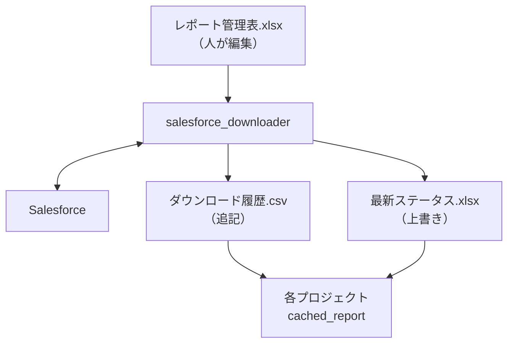
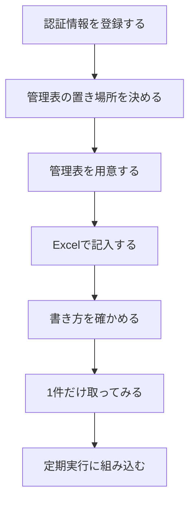

# Salesforce レポートの集約取得（salesforce_downloader）

各プロジェクトが個別に Salesforce からレポートを落としていると、**どのプロジェクトが
どのレポートを、どれくらいの頻度で取っているのか**が分からなくなる。取得をここへ集約し、
何を取っているかは**管理表（Excel）**に、いつ何を取ったかは**履歴（CSV）**に集める。

```
レポート管理表.xlsx（人が編集）        ダウンロード履歴.csv（プログラムが追記）
        ↓                                      ↑
  comken.services.salesforce_downloader  ──→ Salesforce
        ↓
  各プロジェクト（cached_report / download_scheduled）
```

以下は上の構成に「最新ステータス.xlsx」を加えて Mermaid の `graph TD` で描き直したもの。



---

## 使う側

```python
from comken.services.salesforce_downloader import (
    cached_report,
    cached_report_path,
)

CUSTOMER_LIST = "1001"    # 管理表の「ID」。意味の分かる名前を付ける
SALES_RESULT = "1003"

# 定期取得は download_scheduled() をスケジュール駆動で呼ぶ。
# 中身を読みたいプロジェクトは本日キャッシュを cached_report() で受け取る。
by_code = cached_report(SALES_RESULT).index("顧客コード")
# 中身が要らずファイルパスだけ欲しいときは cached_report_path()
print(cached_report_path(CUSTOMER_LIST))   # 本日の固定キャッシュのパス
```

**プロジェクトのコードに Salesforce の URL もレポート ID も書かない。** 書くのは管理番号だけ。
参照先の Salesforce レポートを差し替えても、`CUSTOMER_LIST = "1001"` はそのままでよい。

戻り値は `Table`（`comken.core.table.model.Table`）。`index()` / `filter()` /
`replace()` / `append()` など、`Table` の API がそのまま使える。CSV / Excel の
読み込みは中で吸収するので、利用側は中身の形式を意識しなくてよい。
ファイルパスだけ欲しいときは `cached_report_path()` を別関数として用意している
（戻り値は `Path`）。

`download_scheduled()` がなぜ `Table` ではなく `list[Path]` を返すかは、
その docstring（自動生成/API.md には未収録。`service.py` のソースを直接参照）
に理由がある。`cached_report()` が自動的に取りに行かない理由はそちらにも
無く——**ここで自動的に取りに行くと、定期取得が動いていないことに誰も
気づかなくなる**ため。

### 2つの関数の使い分け

| | 意味 | Salesforce へ問い合わせるか |
|---|---|---|
| `download_scheduled()` | **今この瞬間に、有効な全レポートをまとめて取りに行く** | **行く**（定期取得の入口） |
| `cached_report(ID)` | **本日の定期取得キャッシュを受け取る** | **行かない**（無ければ例外） |

急いでその場の最新値が必要なときは `download_scheduled()` をスケジュール外で
直接実行する。Downloader 自身には「今すぐ取りに行く」だけの関数を残さない
（定期取得が動いていないことに誰も気づかなくなるため）。

定期キャッシュを1日に複数回更新したいときは、呼び出す側のスケジューラから
`download_scheduled()` を必要な時刻に実行する。Downloader 自身には複雑な
スケジュール（土日祝を除く等）を持たせない——呼び出す側と二重に持つと必ずズレるため。

---

## はじめて使うとき（通しの手順）

**配置した直後に1回だけやる作業。** 順番に意味があるので、上から進める。

下の手順は上から流す一本道。各ステップの見出しをそのままノード名にしている。



### 1. 認証情報を登録する

Salesforce につなげないと、あとの確認が全部できない。**ここが先**。

```bat
python -m comken cred import 認証情報.json
```

登録できたら、つながるかを確かめる（**副作用のないコマンド**）。

```bat
python -m comken sf check
```

### 2. 管理表の置き場所を決める

**先に決める。** 場所は `comken.services.salesforce_downloader/_paths.py` の
`MASTER_PATH` に書いてあり、**配置のときに書き換えるファイルのひとつ**
（→ [配置するときの設定](#配置するときの設定)）。

### 3. 管理表を用意する

**管理表（Excel）は非エンジニアが手動で用意・編集する。** ライブラリ側は雛形を
自動生成する `init` コマンドを提供していない。雛形が必要な場合は、
`ReportEntry.create_template()` を Python から直接呼んで作成できる
（サンプルは [管理表（master_table）](master-table.md) を参照）。

管理表の1行目（見出し）は次のとおり。各列の意味は「記入方法」シートを用意するなら
そこに書く。

| 列 | 例 |
|---|---|
| ID | `1001` |
| グループ名 | `営業事務グループ` |
| 担当者 | `山田` |
| 概要 | `顧客一覧` |
| Salesforce URL | `https://.../Report/00O.../view` |
| 保存先 | `\\server\A\input` |
| 有効 | `○` |
| 0件あり | `×` |
| 備考 | （任意） |

### 4. Excel で記入する

書き方の要点は次のとおり:

- **`Salesforce URL` は、レポートを開いたときのアドレスをそのまま貼る**（ID を抜き出さない）
- **`ID` は社内で決める管理番号**。Salesforce のレポート ID ではない
- **`保存先` のフォルダは先に作っておく。** 無いとエラーになる
  （打ち間違いに気づけるよう、**勝手には作らない**）

### 5. 書き方を確かめる

```bat
python -m comken sfdl check "\\実際のサーバー\share\tools\salesforce\レポート管理表.xlsx"
```

**Salesforce へはつながない。** 記入内容の検査だけなので、何度でも安全に流せる。

### 6. 1件だけ取ってみる

いきなり定期実行に入れず、**1件で通しを確かめる**。管理表に書いた管理番号を渡す。
`download_scheduled()` をそのまま 1 回流すと、管理表の全件を 1 度だけ取って
くれる（定期実行と「1 件確認」を兼ねる）。

```python
from comken.services.salesforce_downloader import download_scheduled

saved = download_scheduled("動作確認")
print(saved)  # 保存されたファイルのパスのリスト
```

ここまで通れば、**保存先にファイルができ、履歴（CSV）に1行増えている**。

### 7. 定期実行に組み込む

`download_scheduled()` を、タスクスケジューラや RPA 基盤から定期的に呼ぶ。
**時刻を決めるのは呼び出す側**で、管理表には時刻を持たせない
（→ [定期取得](#定期取得)）。

---

## 管理表（Excel）

**設定の正は Excel。** 内部 DB は持たず、初回読み込み後は解決済みパスでキャッシュされる（プロセスが生きている間は同じ管理表を読み直さない）。 管理表の編集を反映するにはプロセスを起動し直す。

### 雛形を作る（任意）

**管理表（Excel）は非エンジニアが手動で用意・編集する。** ライブラリ側は雛形を
自動生成する CLI コマンドを提供していないが、ライブラリ機能として
`ReportEntry.create_template()` を持つ。雛形が必要な場合は Python から
直接呼ぶ。

```python
from comken.services.salesforce_downloader.master import ReportEntry
from comken.services.salesforce_downloader.master import EXAMPLES

ReportEntry.create_template("レポート管理表.xlsx", EXAMPLES)
```

記入例2行と、各列の書き方をまとめた**「記入方法」シート**が入った状態で作られる。
「記入方法」シートの先頭には、編集者へ向けた次の案内が置かれている。

> この表に行を足すだけで、新しいレポートを取得できます。プログラム（コード）を
> 直す必要はありません。

**すでにあるファイルは上書きしない**（記入済みの管理表を消さないため）。

### 編集したあとに確かめる

```bat
python -m comken sfdl check レポート管理表.xlsx
```

```
読めました: レポート管理表.xlsx
  登録 12 件（有効 8 件 / 無効 1 件）

同じ Salesforce レポートを指している管理番号があります:
  00O5g00000FGHIJ: 1002（売上実績）、1005（売上実績・別集計）
```

`check` が保守用コマンドである理由（業務の定期実行ではない、書き方の誤りは取得時にも
止まるが編集直後に気づけた方が早い等）は `cli.py` のモジュール docstring を参照
（モジュール docstring のため自動生成/API.md には載らない。ソースを直接開く）。

### 列

シート名は `管理表`。1行目が見出し。列の宣言は
`comken.services.salesforce_downloader/master.py` にあり、読み込み・検証・雛形生成の
仕組みは [管理表（master_table）](master-table.md) が持つ。

| ID | グループ名 | 担当者 | 概要 | Salesforce URL | 保存先 | 有効 | 0件あり | 備考 |
|---|---|---|---|---|---|---|---|---|
| 1001 | 営業事務グループ | 山田 | 顧客一覧 | https://.../Report/00O5g00000ABCDE/view | `\\server\A\input` | ○ | × | |
| 1002 | 経理グループ | 佐藤 | 売上実績 | https://.../Report/00O5g00000FGHIJ/view | `\\server\B\input` | ○ | ○ | |

| 列 | 何を書くか |
|---|---|
| **ID** | 社内で決める管理番号（`1001`, `CUST-01` など）。**Salesforce のレポート ID ではない**。前ゼロ（`0001`）や記号入りも使える |
| **グループ名** | このレポートを管理している社内の部署・グループ名。**記録用で、comken の判定・パス決定・スケジュール判定には関与しない** |
| **担当者** | このレポートの担当者名。**記録用で、comken の判定には関与しない** |
| **概要** | 人が読んで分かる説明。保存するファイル名にも使う |
| **Salesforce URL** | レポートを開いたときのアドレスを**そのまま貼る** |
| **保存先** | 落としたファイルを置くフォルダ |
| **有効** | `○` か `×`。**雛形ではドロップダウンから選べる**。行は消さない（履歴との対応が残る） |
| **0件あり** | その日のデータが 0 件になることがあるレポートなら `○`。`×` のときに 0 件だとエラーになります（[「0 件の扱い」](#0-件の扱い) 参照） |
| **備考** | 編集者の覚え書き（任意） |

### Salesforce のレポート ID は入力させない

URL を貼れば `report_id_from_url()` が取り出す。ID を人が抜き出す工程を挟むと**そこで
写し間違いが起きる**うえ、「どのレポートか」を確かめるには結局 URL を開くことになる。

### ID は Salesforce のレポートが変わっても変えない

`1001 → Report X` を `1001 → Report Y` に差し替えても、**利用側のコードは変えない**。
管理番号は「同じ意味のデータ」を指す論理的な番号で、参照先とは独立している。管理番号は
**文字列**として扱う（前ゼロ `0001` や意味のある記号 `CUST-01` などを許可するため）。

### 同じレポートを複数の管理番号が指している場合

エラーにはせず、定期取得のときにログへ出す（意図している場合もあるため）。
コードから調べることもできる。

```python
from comken.services.salesforce_downloader import load_master, shared_report_ids

shared_report_ids(load_master(MASTER_PATH))
# → {"00O5g00000FGHIJ": ["1002", "1003"]}   "1002" と "1003" が同じレポートを見ている
```

---

## 保存されるファイル

```
<保存先>\1001_顧客一覧_20260814_091530_123456.csv
<保存先>\1002_売上実績_20260814_091530_123456.csv
```

ファイル名の組み立て方（管理番号を先頭に置く理由・概要を入れる理由）は
`provider.file_path_of()` の docstring を参照（自動生成/API.md には未収録。
ソースを直接開く）。時刻はマイクロ秒まで付け、同じ日に複数回取得しても
前のファイルを残す。万一名前が衝突した場合も連番を付け、既存ファイルを
上書きしない（`service._reserve_path()` の docstring参照。こちらも同様に
未収録）。

**拡張子は常に `.csv`**。本日の固定キャッシュ（`cached_report()` /
`cached_report_path()` が指すファイル）も同じ `.csv` で読み書きされる。

- **0 行のときは、`0件あり` 列の指定で動きが変わる。** `×` のときは何も作らず失敗
  （`EmptyReportError`）。`○` のときは空ファイルを作る。Downloader が返す `Table` は
  列なしの空 Table として返るので、利用側は 0 件をそのまま扱える
  （[「0 件の扱い」](#0-件の扱い) 参照）
- **保存先のフォルダが無ければ作らない。** 書き間違いのことが多く、勝手に作ると
  誰も読まない場所へ置き続けることになる
- 書き込みは一時ファイル（`~` で始まる）経由で置き換える。複数のプロジェクトが同時に
  呼んでも、読んでいる最中のファイルが半端な状態にならない

### 0 件の扱い

レポートによっては「その日たまたま該当データが無い」が普通に起きる。
そういうレポートで毎回 `EmptyReportError` が出ると**誤報が続いて、本物の失敗も
「また 0 件か」で流されるようになる**。一方で、0 件は「管理表が別のレポートを
指してしまっている」設定ミスの可能性もあるため、**黙って無視するのも危ない**。

この 2 つのバランスを取るため、**0 件がありうるかどうかは管理表の `0件あり` 列で
宣言する**（`○` か `×`）。**履歴の回数から自動判定はしない**——設定ミスで毎日 0 行の
レポートほど早く「正常」に分類されてしまうため。観測（履歴）と宣言（管理表）の
役割を分け、人が判断したうえで管理表に書く。

| `0件あり` | 0 行のときの動き | 履歴の `成否` | 履歴の `原因区分` |
|---|---|---|---|
| `×`（既定） | `EmptyReportError` を送出。ファイルは作らない | 失敗 | `データなし` |
| `○` | 空ファイルを作る。利用側は `read() == []` を受け取る | 成功 | （空） |

**既定値は `×`**（厳しい側に倒れる）。書き忘れると従来どおり 0 件で失敗する
＝**誤報が出るだけでデータは失われない**。`○` にするか `×` のままかは、運用する人が
レポートごとに決める。

- 普段はデータがあるが、たまたま 0 件の日もある → `○`
- 普段は必ずデータがある（無いならレポートか管理表が間違っている）→ `×` のまま

ヘッダー行は敢えて入れない（Salesforce のメタデータからしか取れず、
`report.get()` は `list[dict]` 形式で返すため）。0 バイトのファイルでも `Table` は
例外を出さず空 Table を返すので、利用側は「0 件ならループが 0 回」を自然に書ける。

---

## 履歴（CSV）

**管理表とは別のファイルにする理由**（書く主体が人とプログラムで違うものは分ける）は
`history.py` のモジュール docstring を参照（自動生成/API.md には未収録。ソースを直接開く）。

記録する列（順序はこの通り）:

```
実行日時, 管理番号, スケジュールキー, 概要, レポートID, URL, プロジェクト, 成否,
Salesforce取得結果, 保存結果, 保存先, ファイル名, 取得件数, 処理秒数,
原因区分, エラーコード, エラー内容
```

`download_scheduled()` 1 本になったので、トリガ列（以前の「実行方式」）は廃止した。

**`スケジュールキー`** はその取得を起動したスケジュール行のキー（管理表「スケジュール」
シートの `スケジュールキー` 列と同じ値）。判定の詳細（重複実行を防ぐ根拠データである
こと、失敗履歴は dedup 判定に使わないこと）は `history.schedule_succeeded_today()`
の docstring を参照（自動生成/API.md には未収録）。スケジュール行に紐付かないレポートの
取得（後方互換）は空文字。

`Salesforce取得結果` と `保存結果` は **3状態** を取る（`成功` / `失敗` / 空）。
空はその段階まで到達しなかったことを表す。`エラーコード` には例外クラス名が入り、
メッセージの本文で対処が引ける。

**`原因区分`** は失敗のときだけ入り、誰が動くべきかを5つの値で示す（成功時は空文字）。
例外クラス名との対応表を持たず、履歴の3状態（`Salesforce取得結果` / `保存結果`）
と例外の種類だけから機械的に決めている。

| 区分 | どういう失敗か | 履歴を見た人がやること |
|---|---|---|
| `設定` | 管理表の書き方が悪い、保存先のフォルダが無いなど（取得段階に入る前に落ちる） | **管理表を直す** |
| `Salesforce` | 問い合わせや通信の失敗 | **時間をおいて再実行**。続くなら Salesforce 管理者へ |
| `データなし` | `0件あり` が `×` なのに 0 件だった | **本当に 0 件の日なら**管理表を `○` に。**そうでなければ指している Salesforce レポートが違わないか確認する** |
| `ファイル` | 保存・共有サーバー・権限まわりの失敗 | **共有サーバーとアクセス権を確認** |
| `プログラム` | comken 側の想定外（バグ） | **作った人へ連絡** |

5区分の判定順（狭い条件から順に評価）と、`download_scheduled()` が握りつぶす例外の
範囲との対応は `service._failure_row()` の docstring を参照
（内部関数のため自動生成/API.md には載らない。ソースを直接開く）。

`データなし` が 0 件を一意に指す理由: 取得成功（`True`）を確定してから保存の `try` に入る
までの間に発生しうる例外は `EmptyReportError` だけ。`EmptyReportError` は保存の `try` を
開く**前**に `raise` されるため、この経路で `saved_to_file` は必ず `None` のままである。
つまり `True + None` という組合せは 0 件失敗しか取り得ず、例外クラス名を書かずに
段階で特定できる。

| 何が起きたか | 成否 | Salesforce取得結果 | 保存結果 | 原因区分 | エラーコード |
|---|---|---|---|---|---|
| 保存先フォルダが無い | 失敗 | （空） | （空） | `設定` | `ReportFolderNotFoundError` |
| Salesforce への問い合わせが失敗 | 失敗 | 失敗 | （空） | `Salesforce` | 送出された例外のクラス名 |
| 取得できたが 0 件だった（`0件あり` が `×`） | 失敗 | **成功** | （空） | `データなし` | `EmptyReportError` |
| 取得できたが CSV 書き込みが失敗 | 失敗 | 成功 | 失敗 | `ファイル` | 送出された例外のクラス名 |
| `TypeError` など comken 側の想定外 | 失敗 | 失敗 | （空） | `プログラム` | `TypeError` |
| 正常終了 | 成功 | 成功 | 成功 | （空） | （空） |

0 行のときに `Salesforce取得結果 = 成功` になるのが要点。**Salesforce との通信は成功して
いて、レポートの中身が空だった**ことを区別するため（通信障害と空データの区別が付く）。

**履歴は必須。** 見出し作成・1行追記・読み取りは同じ排他ロックを使う。別プロセスが
同時実行しても行の途中を読まず、一定時間ロックを取れない場合や書込みに失敗した場合は
専用例外（`HistoryLockTimeoutError` / `HistoryWriteError`）で処理を止める。既存履歴の
見出しが現在の列定義と完全一致しない場合も、列ずれした行を追記せず
`HistoryHeaderMismatchError` で止める。

### キャッシュが無い場合

`cached_report()` の例外には、本日の固定キャッシュを置く正確なパスとファイル名が表示される。
急いで復旧するときは Salesforce からCSVを手動取得し、その表示どおりの場所へ置いてから、
同じ `python main.py` を再実行する。手動配置したファイルの登録や履歴化は行わない。

この履歴から、あとで次のことが分かる。

- **どのプロジェクトが、どのレポートを、どれくらいの頻度で使っているか**
- **同じ Salesforce レポートを複数のプロジェクトが取りに行っていないか**
- Salesforce へ実際に何回問い合わせたか（＝ API をどれだけ使っているか）
- 失敗がいつ・何回起きているか、どの段階で失敗したか

`cached_report()` は履歴を検索しない。管理表から本日の固定キャッシュパスを計算し、
その1ファイルだけを確認する。フォルダ全体を走査しないため、時刻付き保管ファイルが
増えても読み取り時間は増えない。

---

## 最新ステータス（Excel）

`download_scheduled()` のたびに、管理表の全エントリについて履歴 CSV から最新
（実行日時が最大）の行を引いて 1 ファイルへ**上書き**生成する。人が読む用の帳票で、
**プログラムだけが上書きする**（人は編集しない）。詳細は `latest_status.py` の
モジュール docstring を参照（自動生成/API.md には未収録。ソースを直接開く）。

**履歴と役割が違う。** 履歴は「全実行の記録」で 1 レポートの最新だけ見たい
業務側からは探しにくい。最新ステータスは「管理表 × 履歴の最新行」を 1 シート
にまとめるので、**「今どのレポートが落ちているか」を一覧で把握できる**。
履歴 CSV には時系列で残るので、後の調査は履歴で行う。

```
レポート管理表.xlsx（人が編集）        ダウンロード履歴.csv（プログラムが追記）
        ↓                                      ↓
        └──────────── write_latest_status() ────┘
                            ↓
              最新ステータス.xlsx（上書き生成）
```

書き出される列:

| 管理番号 | 概要 | 最新実行日時 | 成否 | 原因区分 | エラー内容 |
|---|---|---|---|---|---|

- 履歴が無い管理番号の扱い・`Color.PINK` での塗りつぶしの詳細は
  `write_latest_status()` の docstring を参照（自動生成/API.md には未収録）。
  帳票を開いた瞬間に「どの管理番号が落ちているか」が視覚で分かる
- ファイルへ書き込む経路で例外が出ても、`download_scheduled()` の成否判定には
  影響させない（`ScheduledDownloadFailedError` は本体結果で決まる）。
  帳票の書き損ねはログに warning を出すだけ

直接呼ぶ必要はない。`download_scheduled()` の最後に自動で上書きされる。
別のタイミングでも起こしたいときは、直接呼んでもよい。

```python
from comken.services.salesforce_downloader.latest_status import write_latest_status

write_latest_status()  # 既定のパス（_paths.LATEST_STATUS_PATH）へ書き出す
```

---

## 定期取得

**定期実行そのものは comken に置かない。** 実行される単位は個別プロジェクトの仕事で、
comken に置くのは呼ばれる側だけにする。

定期実行のプロジェクト側で、これを呼ぶだけでよい。

```python
import logging

from comken.services.salesforce_downloader import download_scheduled

PROJECT_NAME = "Salesforceレポートダウンローダー"   # 履歴の「プロジェクト」列に残る名前

logger = logging.getLogger(__name__)


def run() -> None:
    saved = download_scheduled(PROJECT_NAME)
    logger.info("%d 件を取得しました。", len(saved))
```

`download_scheduled()` の戻り値は `list[Path]`（保存できたファイルのパス）。中身を読みたい
プロジェクトは `cached_report()` を1件ずつ使う。

### タスクから実行時フィルタを渡す

タスク固有の条件でレポートを実行するときは `filters_by_report` を使う。キーは
Salesforce のレポートIDではなく、管理表の管理番号。指定しなかったレポートは
保存済み条件のまま実行される。実行時フィルタは元のSalesforceレポート定義を変更しない。

```python
from comken.services.salesforce_downloader import download_scheduled

PROJECT_NAME = "Salesforceレポートダウンローダー"
SALES_RESULT = "1003"

FILTERS_BY_REPORT = {
    SALES_RESULT: [
        {
            "column": "CREATED_DATE",
            "operator": "greaterThan",
            "value": "2026-09-01",
        }
    ]
}

download_scheduled(
    PROJECT_NAME,
    filters_by_report=FILTERS_BY_REPORT,
)
```

フィルタ1件の形式は `sf.report.get(..., filters=...)` と同じ
`column` / `operator` / `value`。管理表に無い管理番号を書いた場合は、条件を黙って
無視せず `ReportNotRegisteredError` で止める。

この辞書は、全レポートをSOQLへ移行するときの `WHERE` 句の材料でもある。そのため
実行時条件を `if` 文や文字列結合へ散らさず、管理番号ごとの辞書にまとめる。
ただし `tools/dump_soql_drafts.py` が自動取得できるのは Salesforce に保存された
レポート定義だけであり、この実行時フィルタは別途SOQLへ合成する必要がある。

**1件失敗しても残りは続ける——ただし想定した失敗に限る。** 5本のうち1本が落ちたときに
全部やり直すと、手で用意する手間が5本ぶんになる。`ComkenError`（メッセージ本文に対処が
載っている想定内の失敗）と `OSError`（共有サーバー断・権限など運用上の失敗）は
1件ずつ拾って残りを続ける。それ以外の例外（`TypeError` など）は**想定していない
（comken 側のバグ）**ので、その場で落として気づかせる。`ScheduledDownloadFailedError`
（＝「1件取れませんでした」）の顔で出てくると、非エンジニアが「もう一度実行してみる」を
繰り返すだけになるため。失敗は履歴（`原因区分` 列）とログに残る。

### スケジュール管理表（曜日・時刻の振り分け）

「レポート管理表」の `有効` なレポートを、**どの曜日・どの時刻に**
取得するかは、**「スケジュール」シート**（レポート管理表と同じブック内の別シート）で
管理する。ダウンロード対象と実行タイミングは同じファイルに置くことで、運用者が
1つのブックだけ開けば確認できるようにする。

スケジュールは「1行につき1つの取得ルール」として管理する。同じレポートを月・水・金に
取得する場合は、「スケジュール」シートに3行登録する。

| スケジュールキー | レポートキー | 取得頻度 | 曜日 | 取得時刻 | 取得間隔（分） | 日付 | 祝日対応 | 有効 |
|---|---|---|---|---|---|---|---|---|
| S001 | R001 | 毎週 | 月 | 09:00 |  |  | 取得しない | ○ |
| S002 | R001 | 毎週 | 水 | 09:00 |  |  | 取得しない | ○ |
| S003 | R001 | 毎週 | 金 | 09:00 |  |  | 取得しない | ○ |
| S004 | R001 | 1時間ごと |  | 09:00 | 60 |  |  | ○ |
| S005 | R002 | 毎月 |  | 06:00 |  | 月末 | 取得しない | ○ |
| S006 | R003 | 毎月 |  |  |  | 第2営業日 | 取得しない | ○ |

「取得時刻」列は「毎日」「毎週」「毎月」「1時間ごと」すべてに共通の実行開始時刻で、
「1時間ごと」のときはこの列が開始時刻を兼ねる（「取得開始時刻」列は存在しない）。
「1時間ごと」で間隔内に確実に1回は終わらせたい、という終了時刻の概念は無い（「開始を
過ぎたら、その日のうちに取れればよい」という運用要件）。

**「取得時刻」列は空欄にできる**（`S006` がこの例）。空欄の意味と、「1時間ごと」では
必須のままである理由は `ScheduleRule.is_due()` の docstring（自動生成/API.md）を参照。

「日付」列は「毎月」のときだけ使い、次のいずれかを書く:

- `1`〜`31` の数字（その日）
- `月末`（月の最終営業日ではなく、暦上の月末日）
- `第2営業日` のように `第N営業日`（N は1以上の整数。月初から数えてN番目の営業日。
  `comken.core.holidays` の祝日カレンダーで判定する。N がその月の営業日数を
  超える設定ミスがあった場合はエラーで止めず、その月は対象外としてログに警告を残す）

**同じレポートに複数の該当スケジュール行がある場合、取得時刻が一番遅い行だけが
対象になる。** 例えば「毎日 9:00」「毎日 13:00」の2行があり、9時の分がまだ
成功していないまま13時になると、9時の行と13時の行の両方が条件を満たすが、
9時の行は「なかったこと」にして13時の行だけを取得する（同じ中身のレポートを
1日に2回取る意味がないため）。運用上は「9時に失敗したら13時にリトライする」
という意図で複数行を並べることを想定している。

雛形（`create_schedule_template()`）で生成した「スケジュール」シートには、条件付き
書式で「曜日」「日付」列をグレーアウトする仕掛けがある。詳細は
`_apply_schedule_conditional_formatting()` の docstring を参照
（内部関数のため自動生成/API.md には載らない。見た目のヒントのみで、
入力自体を禁止するものではない）。

Excel の生 dict から直接 `ScheduleRule` を組み立てることもできるが、運用では
`load_schedule()` 経由で読むのが基本:

```python
from comken.services.salesforce_downloader.schedule import load_schedule

rules = load_schedule()  # 引数なしなら MASTER_PATH を自動で読む
for rule in rules:
    print(rule.schedule_key, rule.report_key, rule.frequency)
```

雛形を新規作成・追記したい場合は `create_schedule_template()` を呼ぶ。
**この関数はレポート管理表がすでに存在する前提**（`ReportEntry.create_template()`
で先に `PY_管理表` シートを作ってから呼ぶ）で、既存のブックに
`PY_スケジュール` シートを追加する。

```python
from comken.services.salesforce_downloader.schedule_template import create_schedule_template

create_schedule_template(MASTER_PATH)  # 既存の管理表に「スケジュール」シートを追加
```

雛形に何が入るか（記入例・ドロップダウン・条件付き書式・「記入方法」シートへの追記・
`SheetAlreadyExistsError` になる条件）は `create_schedule_template()` の docstring
を参照（自動生成/API.md には未収録）。

なお、 `ScheduleRule.from_row()` を直接呼ぶ使い方も引き続き可能
（テストや、別のデータソースから組み立てるときに使う）:

```python
from datetime import datetime

from comken.services.salesforce_downloader.schedule import ScheduleRule

rule = ScheduleRule.from_row(
    {
        "スケジュールキー": "S001", "レポートキー": "R001", "取得頻度": "毎週",
        "曜日": "月", "取得時刻": "09:00", "祝日対応": "取得しない", "有効": "○",
    }
)
if rule.is_due(datetime.now(), holidays=set()):
    print("このレポートを取得する")
```

**このシートが管理表に無い管理表でも `load_schedule()` は空リストを返す
（後方互換）。** 「スケジュール」シートに何も書いていないレポートが曜日・時刻を
絞らず毎回走る理由は `load_schedule()` と `download_scheduled()` の docstring
を参照（どちらも自動生成/API.md には未収録。ソースを直接開く）。

### 利用プロジェクト側の設計判断

定期実行のバッチは利用プロジェクト側に置く。設計上の判断は次のとおり。

- **定期取得のバッチは利用プロジェクト側に置く。** comken は「実行される単位」を
  持たない
- **何を落とすかはコードに書かない。** レポート管理表で `有効` のものが対象で、
  増減は管理表を直すだけで済む
- **「今すぐ取りに行く」専用の API は comken に置かない。** 急ぐ取得は
  権限を持つ人が手動で Salesforce からダウンロードするか、呼び出し側で
  `download_scheduled()` をスケジュール外で実行する
- **「土日祝を除く」のようなスケジュールをこのバッチに持たせない。** それは
  呼び出す側の予定に既にあるため
- **失敗があれば例外で止める。** `ScheduledDownloadFailedError` が送出される。
  ログだけ出して正常終了すると、スケジューラから見て成功と区別が付かない
- **履歴の「プロジェクト」列に残る名前を定数（`PROJECT_NAME`）で持つ。** 誰が
  取ったかを後から追えるようにする

---

## SOQLレポート（2000件超のレポートを移行する）

Report API（`sf.report.get()` / `download_scheduled()`）は同期・非同期どちらも
**2000行が上限**（[docs/salesforce.md「レポート — 2000行の壁」](salesforce.md#レポート-2000行の壁)参照）。
3段構えの3段目「SOQLへ書き換え」に該当するレポートは、`comken/services/salesforce_downloader/soql_reports/`
の基盤を使って個別に実装する。

**このパッケージは「レポートのURLからSOQLで取れる状態にする」までの下準備ツール一式であって、
自動変換はしない。** レポートの列名とSOQLのフィールドAPI名は1対1に対応しないため、
最終的な `WHERE`句・`SELECT`句は人が読んで組み立てる。以下は最短で下準備を終える手順。

**手順1〜7を通しで実際に動くコードで確認したい場合は
[examples/advanced/soql_report_migration](../examples/advanced/soql_report_migration/) を参照。**
このフォルダには2つの実行方法がある:

- **`run.py`**（動作確認用）: 実際のSalesforce組織には接続せず、
  `python -m examples.advanced.soql_report_migration.run` だけでそのまま実行できる
  （疑似APIに差し替えている。詳細はそのファイルの冒頭コメント参照）
- **`production_main.py`**（本番用テンプレート）: モックを一切使わない、実際に
  Salesforceへ接続する本番コードそのもの。事前準備（組織の登録・DPAPIへの認証情報
  登録・保存先フォルダ）が済んでいなければ意図的に失敗する（そのファイルの冒頭
  コメントに手順あり）。実プロジェクトへ移すときは `main.py` にリネームしてコピーする

### 手順

#### 1. URLからレポートIDを取り出す

管理表に貼ってあるレポートURLをそのまま渡せる（IDだけ抜き出す工程は不要）。

```python
from comken.toolbox.salesforce.report import report_id_from_url

report_id = report_id_from_url(
    "https://example.my.salesforce.com/lightning/r/Report/00O5g00000ABCDEfgh/view"
)
# "00O5g00000ABCDEfgh"
```

#### 2. `describe()` でレポート定義（形式・フィルタ）を確認する

**レポートを実行しない**ため、2000行の上限も実行枠も消費しない。何度でも叩ける。

```python
with Solution() as sf:
    metadata = sf.report.describe(report_id)

metadata["reportMetadata"]["reportFormat"]        # "TABULAR" / "SUMMARY" / "MATRIX"
metadata["reportMetadata"]["reportFilters"]        # 絞り込み条件（次のステップで使う）
metadata["reportMetadata"]["reportType"]["type"]   # 主オブジェクト（例: "Opportunity"）
```

**`TABULAR`（明細）以外は個別対応が必要。** `SUMMARY`/`MATRIX` はグルーピング・集計を
持つため、SOQLでは`GROUP BY`・集計関数（`COUNT()`/`SUM()`等）で作り直す必要があり、
この手順の「列を1対1で移す」だけでは済まない。

#### 3. `describe_fields()` で列→フィールドAPI名の対応表を作る

**9割自動で埋めて、残りを可視化する道具。** 何十件もまとめて下書きしたいときは
`describe_fields_csv()` でCSVへ落とす（詳細は
[docs/salesforce.md「列-フィールド対応表」](salesforce.md#列-フィールド対応表describe_fields-describe_fields_csv)）。

```python
with Solution() as sf:
    fields_table = sf.report.describe_fields(report_id)
    # または: sf.report.describe_fields_csv(report_id, "fields.csv")
```

戻る `Table` の列: `列キー` / `表示名` / `対応フィールドAPI名` / `型` / `備考`。
`対応フィールドAPI名` が `(不明)` または `備考` に「複数候補あり」と出た列は、
Salesforceの設定画面（オブジェクトマネージャ）で手動確認する。

#### 4. `reportFilters` をSOQLの `WHERE` 句に変換する

`reportFilters` の各要素は `{"column": ..., "operator": ..., "value": ...}` の形
（**`"field"` ではない**。過去にこのキー名を取り違えていたことがあるので注意）。

演算子の対応関係は次のとおり（**一般的な知識に基づくもので、本物のSalesforce組織に対して
未検証。実際の `describe()` の返り値と突き合わせて確認すること**）:

| Reportの`operator` | 意味 | SOQLでの書き方 |
|---|---|---|
| `equals` | 等しい | `= 値` |
| `notEqual` | 等しくない | `!= 値` |
| `lessThan` | より小さい | `< 値` |
| `greaterThan` | より大きい | `> 値` |
| `lessOrEqual` | 以下 | `<= 値` |
| `greaterOrEqual` | 以上 | `>= 値` |
| `contains` | 含む | `LIKE '%値%'` |
| `notContain` | 含まない | `NOT (項目 LIKE '%値%')` |
| `startsWith` | で始まる | `LIKE '値%'` |
| `includes` | 複数選択リストのいずれかを含む | `INCLUDES(値1, 値2, ...)`（個別対応） |
| `excludes` | 複数選択リストのいずれも含まない | `EXCLUDES(値1, 値2, ...)`（個別対応） |
| `within` | 地理位置の範囲内 | `DISTANCE()`関数等で個別対応（1対1変換不可） |

`includes` / `excludes` / `within` はSOQL側の書き方がReport側と1対1にならないため、
機械的に変換せず個別に読んで組み立てる。

**手順3・4をまとめて、管理表の全件について`SELECT`/`WHERE`/`GROUP BY`のドラフトを
1本のCSVへ出す`tools/dump_soql_drafts.py`がある**（開発・移行支援ツールで、恒久的な
公開APIではない）。上の演算子対応表に加えて、`reportFilters`とは別枠の
`standardDateFilter`（期間フィルタ）のうち明示的な開始日・終了日
（`durationValue: "CUSTOM"`）だけを`WHERE`句へ変換する。相対期間（`THIS_MONTH`等）・
`includes`/`excludes`/`within`は機械変換せず、誤った完成SOQLとして扱わないよう
`BLOCKED` にする:

```bash
python tools/dump_soql_drafts.py
```

出力先は CLI 引数ではなく、ファイル冒頭の `OUTPUT_PATH` を直接書き換える
（既定 `soql_drafts_dump.csv`）。同じフォルダへ列対応の再利用用
`soql_field_mapping_catalog.csv` も作る。出力される列は
「管理番号 / 概要 / レポートID / URL / 状態 / SOQLドラフト / 備考 /
フィルタ詳細(生データ) / 集計・グルーピング詳細(生データ)」。状態は次の意味を持つ。

| 状態 | 意味 |
|---|---|
| `READY` | 自動変換でき、備考もない（`VALIDATE_SOQL=True`のときは実行検証にも成功） |
| `REVIEW` | SOQLは作れたが、不明なSELECT列など人の確認が必要 |
| `BLOCKED` | 未解決のフィルタ・演算子・論理式等があり、SOQL欄を空にした |
| `ERROR` | Report Describeや接続に失敗した |
| `INVALID` | `VALIDATE_SOQL=True`のとき、`READY`のはずのSOQLを実際にSalesforceへ投げたら拒否された |

`reportBooleanFilter` の番号式は `AND` / `OR` / 括弧 / `NOT` を保って展開する。
番号が未解決条件を参照する場合や式が不正な場合は `BLOCKED` になる。値は列の型を使い、
文字列・ID・参照は引用し、数値・Boolean・date/datetimeはSOQLの型に合わせる。

マッピングカタログは「サイトクラス / レポートタイプ / 列キー」で候補を蓄積する。
Salesforceの設定画面で確認した行は、`フィールドAPI名` と `型` を直して
`確認状態` を `確認済み` にする。次回から自動候補より優先して使われる。
SELECTに無くフィルタだけに現れる列キーもカタログへ残る。
同じキーで自動候補が食い違った場合は、後勝ちにせず `要確認` として止める。
確認済みの行は次回実行でも自動候補で上書きしない。カタログには組織固有の項目情報が
入るため、既定ファイル名は `.gitignore` の対象にしている。

`状態=READY` が保証するのは、**Salesforceに保存されたレポート定義を変換できたことまで**。
呼び出し側が `download_scheduled(filters_by_report=...)` で追加する実行時フィルタは
`describe()` から取得できないため、最終的なSOQLではその辞書も `WHERE` 句へ反映する。
`reportType.type` を実オブジェクトとして Object Describe できない複合・カスタム
レポートタイプは、誤った `FROM` 句を出さないよう `BLOCKED` にする。
最後の「フィルタ詳細(生データ)」は `reportFilters` を加工せずそのまま
`列=演算子:値` の一覧にしたもので、ドラフトの検証に使う。

**`crossFilters` は `WHERE Id IN/NOT IN (SELECT ... FROM ...)` の半結合へ自動変換を
試みる。** `primaryTableColumn`（`"$親.関係名"` の形と仮定）から子オブジェクト名を
推測し、親への参照フィールド名は `<親オブジェクト>Id` という標準的な命名を仮定する
（**この2つの推測はヒューリスティックで、本物の Salesforce 組織で未検証**。カスタム
オブジェクト・カスタムlookup項目では外れることが多い）。子オブジェクト側の絞り込み
条件（`criteria`）はこのレポートの列マッピングでは解決できないため自動変換せず、
生データを `/* criteria(要手動変換): ... */` というSQLコメントとしてそのまま
埋め込む。この変換を使った行は**状態が`READY`にはならず、必ず`REVIEW`止まりになる**
（「フィルタ詳細(生データ)」列にも`crossFilters: {...}`として生の辞書を残すので、
推測が外れていた場合はそちらで元データを確認する）。

**`SUMMARY` / `MATRIX` 形式は `groupingsDown`/`groupingsAcross`（グルーピング列）と
`aggregates`（集計列）から `SELECT`/`GROUP BY` の自動変換を試みる。** `aggregates`
のキー（`"s!Amount"` 等）の集計関数プレフィックス対応（合計=`s`、平均=`a`、最大=`mx`、
最小=`mi`、`"RowCount"`は`COUNT(Id)`）は Salesforce 公式ドキュメントに基づく一般知識で、
**本物の組織で未検証**。このため変換に成功しても状態は`READY`にはならず、必ず
`REVIEW`止まりになる。グルーピング列・集計列が1件も解決できない場合は`BLOCKED`のまま
（`SELECT`/`WHERE`を組み立てない）。集計・グルーピングの生データは常に
「集計・グルーピング詳細(生データ)」列でも確認できる。
**あくまで下書き**であり、`READY` 以外はそのまま`SoqlReport.soql()`に貼らない。
「備考」欄の指摘を解消し、必要ならカタログを確認済みにしてから手順5へ進む。
`状態`が`ERROR`または`INVALID`の行が1件でもある実行は終了コード1、
それ以外（`BLOCKED`を含む）は終了コード0になる。

**`VALIDATE_SOQL`（既定`False`）を`True`にすると、`READY`になったドラフトを
実際にSalesforceへ`LIMIT 1`付きで投げて構文・項目名を検証する。**
`describe()`はレポートを実行しないため気付けない、実フィールドAPI名の
誤り等をここで検出できる。1件ごとに追加のAPI呼び出しが増えるため、
300件近い一括実行では既定の`False`のまま様子を見て、絞り込んだ上で有効化する
運用を想定している。

#### 5. `SoqlReport` サブクラスとして実装する

`comken/services/salesforce_downloader/soql_reports/` 配下に**1レポート=1ファイル**で書く。

```python
# comken/services/salesforce_downloader/soql_reports/large_sales_report.py
from comken.services.salesforce_downloader.soql_reports.base import SoqlReport


class LargeSalesReport(SoqlReport):
    KEY = "9001"                                   # 社内で決める管理番号
    SUMMARY = "売上明細（SOQL、2000件超）"
    URL = "https://example.my.salesforce.com"       # site_for() が組織を解決する
    FOLDER = r"\\server\share\reports\売上明細"      # 存在しないとエラー（勝手に作らない）
    ALLOW_EMPTY = False                              # 0件を失敗として扱うか

    def soql(self) -> str:
        return (
            "SELECT Id, Name, Amount, CloseDate, StageName "
            "FROM Opportunity "
            "WHERE CloseDate >= 2024-01-01 AND StageName != 'Closed Won'"
        )
```

Excel の「スケジュール」シートとは独立しており、いつ呼ぶかは呼び出し側が決める。
詳細は `SoqlReport` の docstring（自動生成/API.md）を参照。

#### 6. `SOQL_REPORTS` へ登録する

**自動登録の仕組みは持たない。** `_registry.py` のタプルへ1行足す。

```python
# comken/services/salesforce_downloader/soql_reports/_registry.py
from comken.services.salesforce_downloader.soql_reports.large_sales_report import (
    LargeSalesReport,
)

SOQL_REPORTS: tuple[type[SoqlReport], ...] = (LargeSalesReport,)
```

#### 7. 動作確認する

```python
from comken.services.salesforce_downloader.soql_reports import download_soql_reports

saved = download_soql_reports()   # SOQL_REPORTS を全部取得・保存
```

挙動（履歴（history.csv）への記録が対象外である理由）は `runner.py` の
モジュール docstring を参照（自動生成/API.md には未収録）。1件失敗しても
残りは続けること・保存ファイル名の組み立て方（`download_scheduled()` と同じ）は
`download_soql_reports()` の docstring（自動生成/API.md）を参照。

### この手順が対象にしないもの

- `SUMMARY` / `MATRIX` 形式のレポート（グルーピング・集計はSOQLの`GROUP BY`で作り直す）
- 複合レポートタイプ（主オブジェクトが1つに定まらず `describe_fields()` の自動判定が効かない）
- スケジュール判定（呼び出し側のプロジェクトが決める）
- 履歴記録（現状は対象外）

---

## エラー

エラー名と対処法は [docs/ERRORS.md](ERRORS.md)（comken 全体の例外クラスの docstring
から自動生成、docstring が正）にまとまっている。Downloader 由来のものは
`ReportNotRegisteredError` / `ReportDisabledError` / `MasterDuplicateValueError` /
`MasterRowValueError` / `CachedReportNotFoundError` / `EmptyReportError` /
`ReportFolderNotFoundError` / `ScheduledDownloadFailedError` /
`ScheduleDuplicateKeyError` / `ScheduleRowValueError`（いずれも
`comken/exceptions/downloader.py`）。

`ScheduledDownloadFailedError` は**取得できたものを保存したうえで**送出する
（理由は docstring 参照）。直したあと再実行すれば、残りだけが落ちる。

---

## 配置するときの設定

管理表と履歴の場所は `comken.services.salesforce_downloader/_paths.py` に書いてある。
配置するときに実際の場所へ書き換える。

```python
SALESFORCE_DOWNLOADER_FOLDER = Path(r"\\実際のサーバー\share\tools\salesforce")

MASTER_FILENAME = "レポート管理表.xlsx"
HISTORY_FILENAME = "ダウンロード履歴.csv"
LATEST_STATUS_FILENAME = "最新ステータス.xlsx"

MASTER_PATH = SALESFORCE_DOWNLOADER_FOLDER / MASTER_FILENAME
HISTORY_PATH = SALESFORCE_DOWNLOADER_FOLDER / HISTORY_FILENAME
LATEST_STATUS_PATH = SALESFORCE_DOWNLOADER_FOLDER / LATEST_STATUS_FILENAME
```

**設定ファイルへ集約せず、使う場所に書く。** 理由と、共有サーバーで書き換えを守る方法は
comken 側のドキュメントを参照。

**利用側の API から `master_path=` / `history_path=` / `output_path=` を渡せない。**
この3つの定数は `_paths.py` で一元管理する。プロジェクト側に同名のパス定数を作ると、
管理表を直したのに出力先が変わらず、しかもエラーにもならない事故が起きる
（境界を破った典型例）。

---

## どこに書くか（索引）

| やりたいこと | 書く場所 |
|---|---|
| レポートを1本足す／やめる | 管理表（Excel）だけ。コードは触らない |
| 参照先の Salesforce レポートを差し替える | 管理表の「Salesforce URL」 |
| 保存先を変える | 管理表の「保存先」 |
| 取る時刻・曜日を変える、月末だけにする | 呼び出す側のスケジューラ |
| 取ったCSVを加工する・DBへ入れる・通知する | 利用プロジェクト |
| ファイル名の付け方を変える | `provider.py` の `file_path_of()` ← **全プロジェクトに効く** |
| 履歴に列を足す | `history.py` ← **全プロジェクトに効く** |
| 管理表に列を足す | `master.py` の `ReportEntry` |
| 管理表・履歴・最新ステータスの置き場所を変える | `_paths.py` の `MASTER_PATH` / `HISTORY_PATH` / `LATEST_STATUS_PATH` |
| Salesforce の認証・API の叩き方を変える | `comken/toolbox/salesforce/`（Downloader ではない） |
| 接続先の組織を足す | `comken/toolbox/salesforce/sites/` |
| 2000件超のレポートをSOQLで取る | `soql_reports/`（1レポート=1ファイル＋`_registry.py`へ登録） |

右列に「**全プロジェクトに効く**」と書いているのは、軽く触ってよい場所と、触ると全
プロジェクトへ影響する場所を**見た目で区別するため**。各ファイル docstring の
「このファイルが持つもの／ここに書かないもの」がこの境界を定義する正本で、
ここ（docs）は索引に徹する。責任範囲の説明が2箇所にあると片方だけ直されて食い違うため。

### 境界を破った事故の例

- **保存先をプロジェクト側の定数にも書いてしまった。** 管理表を直したのに出力先が変わらず、
  エラーにもならない（履歴には書いたとおりに動いた記録が残る）— `service.py` の
  `MASTER_PATH` / `HISTORY_PATH` と、管理表の「保存先」の2箇所を見比べる必要がある
  ことに気づくまで、誰も原因にたどり着けない
- **「このプロジェクトのときは別フォルダへ保存」を Downloader に持ち込んだ。** 全プロジェクトの
  分岐判定が1か所に集中し、Downloader 自体がプロジェクトを識別することになる —
  ダウンロードの共通化の目的（どのプロジェクトが何を取っているか分かる）を自分で壊す

