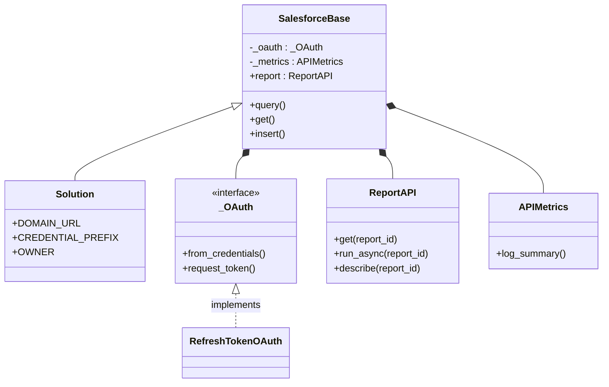
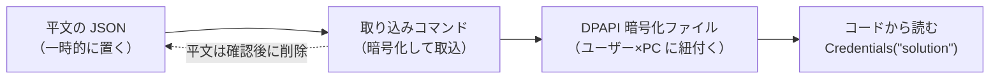

# comken.toolbox.salesforce

[README（ドキュメントの入口）へ戻る](../README.md)

認証方式を社内へ説明するときは、公式資料と判断理由をまとめた
[Salesforce authentication decisions](開発/salesforce-authentication.md) を参照する。

背景: Salesforce Solution 組織 1つから、レポートとレコードを API で取得したい。
本書には現行仕様と、保守に必要な設計理由だけを記載する。
関連: [ライブラリ開発規約](開発/ライブラリ開発規約.md)

> [!note] 組織名の書き方
> このリポジトリは公開しているため、**実際の組織名・サイト名は書かない**。
> 本書では `Solution` の仮名を使い、組織名・URL・レポート ID は配置時に書き換える
> （社内ライブラリの実名を書かないのと同じ扱い）。

---

## 認証フロー

### 用語: 画面は Consumer、コードは client

同じものが場所によって3通りの名前で出てくる。**値は同じ**なので、対応だけ押さえる。

| どこ | 名前 | 例 |
|---|---|---|
| Salesforce の画面（ECA の設定） | **Consumer Key / Consumer Secret** | 画面からコピーする |
| comken のコード変数名 | **client_id / client_secret** | `RefreshTokenOAuth` の引数名 |
| DPAPI のキー名 | **api_client_id / api_client_secret** | `Credentials("solution").api_client_id` |
| ローテーション API のレスポンス | **consumerKey / consumerSecret** | `rotation.py` が受け取る |

comken のコード（変数名・引数名）は `client_id` / `client_secret` に統一している
（OAuth の標準的な呼び名）。**DPAPI の保存キーだけ `api_` を付けている**
（Salesforce 専用の認証情報だと分かるようにするため。他のサイトの認証情報と
名前が混ざらない）。Salesforce 側の名前が出てくるのは**画面からコピーするときと、
ローテーション API のレスポンスを読むときだけ**で、`rotation.py` が境界で
`client_id` へ変換している。

認証方式（Client Credentials / Refresh Token）による名前の違いは**ない**。

### 既定は Refresh Token Flow

組織クラスをそのまま使えばこの方式になる。

Client Credentials Flow は `client_secret` だけでアクセストークンを取れてしまうため、
**本番では使わない**（判断の根拠は [Salesforce 認証の判断根拠](開発/salesforce-authentication.md)）。

> [!note] 補足（2026-09-08）
> Client Credentials Flow は社内の運用上もう使えないため、comken からも
> コード（`oauth_credentials.py` / `ClientCredentialsOAuth`）を削除した。
> 開発中だけ Client Credentials Flow を使う節は、歴史的記録として残している。

`request_token() -> (access_token, instance_url)` を実装する認証方式は
将来差し替えられるよう、`auth` 引数で渡せる形にしてある（既定は Refresh Token）。

```python
from comken.toolbox.credentials import save_credential
from comken.toolbox.salesforce.auth.oauth_refresh import RefreshTokenOAuth
from comken.toolbox.salesforce.sites import Solution

PREFIX = "solution"  # DPAPI に保存したときのサイト名

def save_rotated_token(new_token: str) -> None:
    # ローテーションで返ってきた新しい refresh_token を DPAPI へ書き戻す
    save_credential(PREFIX, "api_refresh_token", new_token)

auth = RefreshTokenOAuth(
    client_id="Consumer Key の値",   # 画面の Consumer Key をここへ
    refresh_token="DPAPIから取得した値",
    domain_url="https://example.my.salesforce.com",
    client_secret="Require Secret for Refresh Token Flow が有効な場合のみ",
    on_refresh_token=save_rotated_token,
)
with Solution(auth=auth) as sf:
    records = sf.query("SELECT Id FROM Account")
```

初回だけ `RefreshTokenOAuth.authorization_url()` の URL をブラウザで開き、戻された `state` を
照合してから `exchange_code()` へ code を渡す。ライブラリはローカル HTTP サーバーや
ブラウザを勝手に起動しない。レスポンスに新しい refresh token が含まれた場合は
`on_refresh_token` が呼ばれるので、その場で DPAPI へ保存する。コールバックを省略すると
プロセス内だけ更新され、次回起動時に古い token を使う点に注意する。

### 開発中だけ Client Credentials Flow を使う

初回の対話的な認可を挟まずに動かせるので、動作確認の回転が速い。
**本番では使わない**（→ [判断の根拠](開発/salesforce-authentication.md#2-なぜ-refresh-token-flow-を既定にするのか)）。

> [!note] 補足（2026-09-08）
> Client Credentials Flow は社内の運用上もう使えないため、comken からも
> コード（`oauth_credentials.py` / `ClientCredentialsOAuth`）を削除した。
> この節は歴史的記録として残している。

認証を `auth=` で差し替える仕組みは将来別の方式（JWT など）を生やす余地として
残してあり、`Solution()` の既定経路（Refresh Token）と独立に扱える。

### Client Credentials Flow を使うときの落とし穴

- **My Domain の URL 必須。** 同じドキュメントに
  「`login.salesforce.com` と `test.salesforce.com` はサポートされない」と明記がある
- 接続アプリ側で「クライアントクレデンシャルフローを有効化」＋
  **実行ユーザー（Run As）の指定**が要る。未指定だと `invalid_grant` になる
- 実行ユーザーに「API の有効化（API Enabled）」権限が要る
- 接続アプリの作成直後は反映まで数分かかる

### アクセストークンの有効期限は「測らない」

有効期限は固定値ではなく、**接続アプリのセッションポリシー → 未設定ならユーザーのプロファイル
→ それも未設定なら組織のセッション設定**、の順で決まる
（[Manage Session Policies for a Connected App](https://help.salesforce.com/s/articleView?id=xcloud.connected_app_manage_session_policies.htm&language=ja)）。

つまり**コード側で残り秒数を計算する意味がない**。次の方針にする。

1. 起動時に1回トークンを取る
2. `401`（`INVALID_SESSION_ID`）が返ったら、**その場で1回だけ取り直して同じリクエストを再送**
3. `expires_in` は見ない・保存しない

再送は1回だけに限る（2回連続で 401 なら設定不備なので、リトライで隠さず落とす）。

### 将来 JWT に移る場合

JWT ベアラーフローも**リフレッシュトークンを発行しない**ので、上の制約は同じく満たす。
違いは「client_secret がネットワークを流れない」点と、`cryptography` / `PyJWT` が要る点。
オフライン環境への持ち込み可否が未確定のため**今は採らない**が、
認証を独立クラスにしておき、通った時点で差し替えられるようにする。

---

## クラス設計

### 方針: 認証とレポートは「持たせる」、組織は「継承する」

```
SalesforceBase                     HTTP の土台。_request() が唯一の通り道
  ._oauth   : _OAuth               トークン取得（JWT 版に差し替え可）
  ._metrics : APIMetrics           計測
  .report   : ReportAPI            レポート API
  .query() / .get() / .insert() …  SOQL・CRUD
  │
  └─ Solution(SalesforceBase)      URL・認証情報名・OWNER・組織固有の処理を持つ
```

以下は上の構造を Mermaid の classDiagram にしたもの。継承は `<|--`、合成（has-a）は `*--` で表す。



`OWNER` は「プロジェクト名 / 担当者」の形式で必ず書く（起動時に検査される）。
ライブラリへ昇格したクラスは `OWNER = "comken"` にする。昇格の基準は
[ライブラリ開発規約](開発/ライブラリ開発規約.md#サイト組織クラスを昇格させる基準) を参照。

**なぜレポートを継承にしないか。** `ReportAPI` を `SalesforceBase` のサブクラスにすると、
`Solution` は `ReportAPI` ではないためレポートを呼べず、多重継承に追い込まれる。
持たせる形なら `sf.report.get(...)` と `sf.query(...)` が同じインスタンスから出る。

**なぜ認証を継承にしないか。** OAuth は「Salesforce の一種」ではなく「トークンを取る部品」。
継承すると `ReportAPI` まで認証コードを引き継いで責務が混ざる。
合成にしておけば JWT 版の差し替えが `_oauth` の入れ替えだけで済む。

**なぜ組織は継承にするか。** 基底は HTTP・認証・共通操作の土台であり、直接使わない。
組織固定の URL・認証情報名・レポート ID と固有処理の置き場としてサブクラスを使う。
その意図を名前でも示すため、実装名を `Salesforce` から `SalesforceBase` へ改めた。

**なぜ URL を config.ini に置かないか。** My Domain は実行環境で変わる設定ではなく、
レポート ID と同じく組織に固定された値である。`DOMAIN_URL` クラス定数に置けば、
呼び出し側で組織と URL を取り違えず、組織の情報を1か所に集約できる。

**なぜ入口を1つにしたか。** 認証情報は常に DPAPI から読むため、秘密を直接渡す入口と
DPAPI から読む別コンストラクタを併存させる意味がない。通常は `Solution()` だけを使い、
テストや JWT への差し替えに限って `auth=` を渡す。

### 使い方のイメージ

```python
from comken.toolbox.salesforce.sites import Solution

with Solution() as sf:
    rows = sf.report.get("00O000000000001")
    ...
```

レポート URL を管理表などから読む場合は、URL から接続先の組織とレポート ID を判定できる。
未登録の組織や ID を含まない URL は例外になるため、誤った組織へ接続したまま処理を続けない。

```python
from comken.toolbox.salesforce.report import report_id_from_url
from comken.toolbox.salesforce.sites import site_for

report_url = "https://example.my.salesforce.com/lightning/r/Report/00O000000000001/view"
site = site_for(report_url)
report_id = report_id_from_url(report_url)

with site() as sf:
    rows = sf.report.get(report_id)
```

---

## レポート — 2000行の壁

### 事実

同期・非同期の**どちらも 2000 行が上限**。

> **The API returns up to the first 2,000 report rows. You can narrow results using filters.**
>
> — [Requirements and Limitations — Reports and Dashboards REST API](https://developer.salesforce.com/docs/atlas.en-us.api_analytics.meta/api_analytics/sforce_analytics_rest_api_limits_limitations.htm)

**非同期にすれば 2000 行を超えられる、というのは誤り。**
非同期の利点は「重いレポートで HTTP タイムアウトしない」ことと実行枠
（同期 500 回/時、非同期 1200 回/時）であって、行数制限の解除ではない。

### 方針: 3段構え

| 段 | やること | 適用 |
|---|---|---|
| 1. 検知して止める | レスポンスの `allData` が偽なら**例外で止める** | 常時・全レポート |
| 2. フィルタ分割 | 日付等で区切って複数回実行し結合 | 1区間が 2000 行に収まるうち |
| 3. SOQL へ書き換え | 1区間でも超えるものだけ `query()` に置換 | 出てきたものから1本ずつ |

**1段目を既定で例外にするのが肝。** 件数が日によって変わるため、
「今日は 1998 件で通り、明日 2001 件で黙って 3 件欠ける」が最も危ない。
欠損した帳票が出るより、止まって気づく方が安い。
承知の上で切り捨てたい場面だけ、引数で警告に落とせるようにする。

公式が「filters で絞れ」と書いているとおり、2段目は正攻法。
3段目を先回りで全部やる必要はない。**計測（後述）が移行対象を教えてくれる**。

### レポート形式

明細（TABULAR）以外は `factMap` の構造が変わり、そのまま読むと**無言で空を返す**。
`reportFormat` を見て、明細以外は明示的にエラーにする。
実際にどの形式かは触れば分かるので、事前に決め打ちしない。

### 用語の整理:「Analytics API」と「Reports and Dashboards REST API」

`sf.report.*()` が叩いているのは公式ドキュメント上の **Reports and Dashboards REST API**（`/services/data/vXX.X/analytics/reports/...`）で、Salesforce は同じものを「**Analytics API**」と呼ぶことがある。
混同しやすいので、先に区別を固定する。

- **ここで言う「Analytics API」 = Reports and Dashboards REST API**（comken が使うもの）。
  上限 2000 行・同期 / 非同期などの話は全部これ。
- **CRM Analytics**（旧 Einstein Analytics / Tableau CRM）は**別ライセンス製品**で、
  comken はそちらを使っていない・使えない。検索するとこの製品が先に出てきて混乱する。

`sf.report.run()` 系が「Analytics API の権限がない」「Analytics API へのアクセスが
拒否された」といった文面のまま 401 / 403 で失敗する場合、それは comken が
**間違ったエンドポイントを叩いた**のではなく、Reports and Dashboards REST API
そのものへのアクセスを拒否されたという意味。
このときは `SalesforceReportAccessDeniedError` が送出される（メッセージの文言では
判定せず、HTTP ステータスコードだけで判定する）。

> 対処は管理者に次の3点を確認してもらう:
> 1. 実行ユーザーの Profile / Permission Set に「API Enabled」権限があるか
> 2. 対象のレポート・レポートフォルダへのアクセス権があるか
> 3. 組織の Edition・ライセンスが Reports and Dashboards REST API に対応しているか
>    （一部の制限ライセンスでは使えない）

### 定義だけ取る（describe）

`describe(report_id)` でレポートを**実行せず**に定義を取れる。
`get()` / `run_async()` と違い、2000 行の上限も実行枠も消費しない。
上の 3 段構えで「3. SOQL へ書き換え」を検討するとき、移行先 SOQL の
下書き材料として使う。

> **列名の対応は自動ではない。** レポートの列名は `ACCOUNT.NAME` のような
> レポート用名前で、SOQL のフィールドパスとは1対1ではない。
> 人が対応表を当てて書き換える必要がある。

#### 列-フィールド対応表（`describe_fields` / `describe_fields_csv`）

「3. SOQL へ書き換え」の下書きを何十件もまとめてやりたいとき、
**`describe_fields(report_id)`** で「レポートの列」と「実フィールド API 名」
の対応表を `Table` で取れる。さらに **`describe_fields_csv(report_id, path)`** で
そのまま CSV へ落とせる。

**完全な自動変換ではなく、9 割自動で埋めて残りを可視化する道具**として
設計している。Salesforce の Reports API は列と実フィールドの対応を保証しない
ため、レポートの表示名と主オブジェクトのフィールド表示名を突き合わせて
**一致したぶんだけ**実 API 名・型を埋める。一致しない列は黙って外さず、
「対応フィールドなし」「複数候補あり」と備考に書く。多対1の結合や
氏名のようなレポート専用列は実フィールドが無いため、無理に埋めようと
しない方針（誤った候補を押し付けないことを優先するため）。

```python
with Solution() as sf:
    for report_id in report_ids:
        sf.report.describe_fields_csv(report_id, f"fields_{report_id}.csv")
```

返却される `Table` の列: **列キー / 表示名 / 対応フィールドAPI名 / 型 / 備考**。
`detailColumns` にある表示列だけでなく、`reportFilters` だけに現れる列、
`SUMMARY`/`MATRIX` 形式の `groupingsDown`/`groupingsAcross`（グルーピング列）、
`aggregates`（集計対象列）も含む。グルーピング列・集計列の表示名は
`groupingColumnInfo`/`aggregateColumnInfo`（`detailColumnInfo` とは別枠）から
引く。同じ接続中に同一オブジェクトを複数レポートで使う場合、Object Describe は
オブジェクト単位でキャッシュして再利用する。
「対応フィールドAPI名」が引けなかった行は空ではなく **`"(不明)"`** を入れる
（「調べたが空」と「調べていない」を区別できない問題を防ぐため）。
主オブジェクトの Object Describe が 404 等のときは例外にせず、全列を
`(不明)` ＋理由の備考で返す（複合レポートタイプで主オブジェクト名が
実在の sObject と一致しないケースを、道具として壊さず扱うため）。
Object Describe の 401 / 403 は Analytics API とは別の権限系統なので、
`SalesforceReportAccessDeniedError` には変換せず `SalesforceRequestError`
のまま送出する。

---

## Bulk API 2.0 の Query ジョブ（重い SOQL の逃げ道）

**この機能は本物の Salesforce 組織に対して未検証。** ジョブ作成・状態確認・
結果取得のエンドポイントとレスポンス構造は Salesforce の公式リファレンスに
基づいて実装しているが、実際のレスポンスで想定と違う点が見つかったら、
`comken/toolbox/salesforce/bulk_query.py` を修正すること。

`SalesforceBase.query()` は SOQL を同期で送り、`nextRecordsUrl` を辿って
全件取得する。**行数の上限はない**が、同期 REST の1リクエストごとの処理の
ため、重いクエリ（複雑な絞り込み・大きいテーブルのフルスキャンなど）は
HTTP タイムアウトに当たりやすい。そのような場合に Bulk API 2.0 の Query
ジョブを使う。Bulk API は「ジョブを作って完了を待つ非同期方式」のため、
重いクエリでもタイムアウトしにくい。

```python
from comken.toolbox.salesforce.sites import Solution

with Solution() as sf:
    # timeout_seconds の既定は600秒。大量データの抽出を想定
    table = sf.bulk_query.run("SELECT Id, Name FROM Account")

    # CSV へ直接保存することもできる（ReportAPI.run_csv() と同じ形）
    sf.bulk_query.run_csv(
        "SELECT Id, Name FROM Account",
        "accounts.csv",
    )
```

### `query()` との使い分け

**`bulk_query` は「行数の上限を超えるため」の道具ではない。** `query()` も
行数の上限はないので、行数だけを理由に `bulk_query` へ切り替える必要はない。
使い分けの基準は「1リクエストが HTTP タイムアウトに当たるほどクエリが重いか」
であり、それに当たる（または当たりそうな）クエリだけ非同期の `bulk_query`
に切り替える。

### 書き込み系（Ingest）は別の節

`bulk_query` は**読み取り専用**。書き込み系（insert / update / upsert /
delete）は次の「Bulk API 2.0 の Ingest ジョブ」節の `bulk_ingest` か、
`DataLoaderCLI`（docs/dataloader.md）を使う。

### エラー

- `SalesforceBulkQueryFailedError`: ジョブが `Failed` / `Aborted` で終わったとき
- `SalesforceBulkQueryTimeoutError`: `timeout_seconds` 以内にジョブが完了しなかったとき（既定600秒）

### 未検証の前提

実装は comken のテストで HTTP をモックして確認しているが、レスポンスの
前提（結果 CSV の2ページ目以降にも1行目のヘッダー行が含まれる、次ページが
無いときは `Sforce-Locator: null` になる、など）は本物の組織では未検証。
実際の挙動が違っていたら `comken/toolbox/salesforce/bulk_query.py` を
修正すること。

---

## Bulk API 2.0 の Ingest ジョブ（一括変更）

**この機能は本物の Salesforce 組織に対して未検証。** ジョブ作成・データ
アップロード・状態確認・成功/失敗結果取得のエンドポイントとレスポンス構造は
Salesforce の公式リファレンスに基づいて実装しているが、実際のレスポンスで
想定と違う点が見つかったら、`comken/toolbox/salesforce/bulk_ingest.py` を
修正すること。

`SalesforceBase.insert()` / `update()` / `upsert()` / `delete()` は同期で
1件ずつ REST API を送る。**件数が多くなると同期 REST のHTTPタイムアウトに
当たりやすい**（重いバリデーション・トリガの連鎖など）。そのような場合に
Bulk API 2.0 の Ingest ジョブを使う。Bulk Ingest は「ジョブを作って完了を
待つ非同期方式」のため、件数が増えてもタイムアウトしにくい。

```python
from comken.toolbox.salesforce.sites import Solution

with Solution() as sf:
    # 1) 一括作成（insert）
    result = sf.bulk_ingest.insert(
        "Account",
        [{"Name": "取引先A"}, {"Name": "取引先B"}],
    )

    # 2) 外部 ID で upsert（一致すれば更新、なければ作成）
    result = sf.bulk_ingest.upsert(
        "Account",
        "ExternalId__c",
        [{"ExternalId__c": "A1", "Name": "取引先A（更新）"}],
    )

    # 失敗行があったときだけ中身を見る。例外ではない（下記「設計判断」参照）
    for failed_row in result.failed.to_rows():
        print(failed_row["sf__Id"], failed_row["sf__Error"])
```

### `DataLoaderCLI` との使い分け

`DataLoaderCLI`（docs/dataloader.md）は Salesforce が配布している
デスクトップアプリ版 Data Loader を**サブプロセスで呼び出す**方式で、
デスクトップアプリのインストールが前提になる。`BulkIngestAPI` は
Salesforce の REST API を**直接叩く**ため、デスクトップアプリの
インストールは不要。ブラウザでデータ変更できない環境
（Data Import Wizard がない組織など）からの移行先として使える。

### 設計判断: 失敗行は例外にしない

`BulkIngestResult.failed` が空でないとき、ライブラリは例外を**送出し
ない**。ジョブ自体は正常終了しつつ一部の行が失敗することは仕様上
起こり得るので、`DataLoaderResult` / `bulk_query` と同じく**呼び出し側
が `len(result.failed)` を見て判断する**形にしている。`SalesforceBulkIngestFailedError`
が送出されるのはこれとは別の状況で、**ジョブ自体が `Failed` / `Aborted`
で終わった場合**（CSV の形式不正・対象オブジェクトが存在しない等、
個々の行ではなくジョブ全体を実行できなかった場合）に限る。

### `dry_run()` に対応する

`comken.runtime.dry_run()`（`with dry_run():`）の中で呼ぶと、実際の
HTTP 呼び出しが1回も発生せず、空の `BulkIngestResult` を返す。

### エラー

- `SalesforceBulkIngestFailedError`: ジョブが `Failed` / `Aborted` で終わったとき（メッセージに `errorMessage` の内容を含める）
- `SalesforceBulkIngestTimeoutError`: `timeout_seconds` 以内にジョブが完了しなかったとき（既定600秒）

### 未検証の前提

実装は comken のテストで HTTP をモックして確認しているが、レスポンスの
前提（結果 CSV の2ページ目以降にも1行目のヘッダー行が含まれる、次ページが
無いときは `Sforce-Locator: null` になる、`errorMessage` フィールドで
失敗理由が返る、など）は本物の組織では未検証。実際の挙動が違っていたら
`comken/toolbox/salesforce/bulk_ingest.py` を修正すること。

## 計測

`_request()` が唯一の通り道なので、そこ1点で全部拾える。

| 取るもの | 用途 |
|---|---|
| 呼び出し回数（組織別・呼び出し元別） | 使用量の把握 |
| 呼び出し元コンポーネント | どこが API を食っているか。`component` 引数で分類する |
| リトライ回数（401 再認証 / 5xx / 制限超過を区別） | 不安定さの検知 |
| 所要時間 | 呼び出し元ごとの合計秒数 |
| **レポートの切り捨て発生** | **SOQL 化すべきレポートの洗い出し** |

> [!note] リトライは実際に行う
> 「リトライ回数」を数えるからには、数えるだけで終わらせない。
> **401 は取り直して1回だけ**やり直し（2回目の 401 は設定不備なので隠さずエラーにする）、
> **5xx と 429 は待ち時間を伸ばしながら最大3回**やり直す。4xx はやり直しても
> 直らないので即エラー。数えているのに一度もやり直していない、という嘘の計測を作らない。

もう1つ、自前カウントより信頼できる情報源がある。レスポンスヘッダーの
`Sforce-Limit-Info: api-usage=1234/15000` で、**組織の 24 時間 API 消費量が実測で取れる**。
上限に対する割合が分かるので、自前カウントと併せて記録する。

出力は**ログのサマリと CSV 追記の両方**。CSV があると、消費量の推移と切り捨て発生を
日次で追えるようになり、「どのレポートから SOQL 化するか」が実測で決まる。

---

## 認証情報の保存

平文 JSON を置いて読む形にはできないため、**DPAPI で暗号化した 1 ファイル**に取り込む。
保存と読み込みは `comken.toolbox.credentials` に集約する。

```
平文の JSON      →  取り込みコマンド  →  DPAPI 暗号化ファイル  →  コードから読む
（一時的に置く）      （暗号化して取込）    （ユーザー×PC に紐付く）   Credentials("solution")
                      平文は確認後に削除
```

以下は上の流れを Mermaid の `graph LR` にしたもの。



- 平文JSONをまとめて取り込む。配布時に手入力を挟まないため
- JSON はシステム名ごとに項目をまとめる形式（`{"solution": {"api_client_id": ...}}`）に
  して、同じ入れ子構造のまま保存する。組織ごとに client_id / client_secret が別なので、
  システム名で分けられる形が要る。項目名に `api_` を付けているのは、Salesforce の
  認証情報だけに使う名前だと分かるようにするため（他のサイトの認証情報と混ざらない）
- 取り込みは**まとめて 1 回書く**。1 件ずつ保存すると件数ぶん復号と暗号化を繰り返し、
  途中で失敗すると一部だけ入った状態になる
- **平文 JSON は既定では消さない。** `--delete-source` を付けたときだけ消す。
  DPAPI は登録したユーザーでしか復号できないので、実行アカウントが違うと
  「読めない」と気づく前に元の値を失う。`list` で読めることを確かめてから消す
- DPAPI は**同じ Windows ユーザー × 同じ PC** でしか復号できない。
  登録した本人と実行アカウントが違うとハマる（一番多い事故）。
  原因を区別できないので、確認する順番を書いた `CredentialDecryptionError` にまとめた
- 組織クラスの初期化を唯一の入口にした。`CREDENTIAL_PREFIX` から api_client_id /
  api_client_secret を読むので、**呼び出し側のコードに秘密の値が現れない**。
  別の登録へ切り替える場合だけ `prefix=` を渡す

### 何を守っていて、何を守っていないか

- **機密境界は DPAPI であって、ファイルの ACL ではない。** 保存先はユーザープロファイル内
  （`%USERPROFILE%\.rpa\`）で、ACL は明示的に絞っていない。暗号文をコピーされても
  中身は読めないが、**消す・差し替えるのは防げない**（可用性は守っていない）
- **書き手が1つであることが前提。** 読んで足して書き戻す流れなので、2つのプロセスが
  同時に書くと後から書いたほうが勝つ。取り込みは人が1回だけ実行する運用なので、
  ロックは持たせていない。アトミック置換が守るのは「途中で落ちても壊れない」ことだけ
- **「復号できない」と「中身が壊れている」は別の例外に分けた**
  （`CredentialDecryptionError` / `CredentialStoreCorruptedError`）。
  前者は実行アカウントを直す、後者は取り込み直す、と対処が違うため

複数台への配布が必要になったら、公開鍵ハイブリッド方式を足す余地がある。
ただし `cryptography` 依存が JWT と同じ関門に当たるため、
**まずローカル保管で動かし、配布が現実の問題になってから**にする。

---

## つないで確かめる（コマンド）

秘密の値はコマンドラインに渡さない。先に DPAPI へ登録し、そこから読ませる。

```bat
:: 1. 登録（開いた画面で solution / api_client_id・api_client_secret を入れる。平文のファイルは作らない）
python -m comken cred gui

:: 2. つないでみる
python -m comken sf report --report-id 00O...
```

既定では `Solution.CREDENTIAL_PREFIX` の `api_client_id` / `api_client_secret` が
自動で引かれる。`--domain` で URL を指定すれば `site_for()` が対応する組織クラスへ
自動解決する。別の登録を試すときだけ `--prefix` にシステム名を渡す。
**DPAPI は「登録した Windows ユーザー × その PC」
でしか復号できない**ので、実際に動かす PC・アカウントで登録する。

| コマンド | すること | Salesforce 側への影響 |
|---|---|---|
| `report` | レポートを実行し、行数と列名を出す（`--rows N` で中身も） | なし（読むだけ） |
| `rotate --stage-only` | 新しい secret を発行するところまで | **発行される**が切り替わらない |
| `rotate` | DPAPI へ保存して切り替える | **旧 secret は猶予後に無効** |

`rotate --stage-only` は、**REST API から consumer secret を回せるか**と
**応答の項目名**を実機で確かめるためにある（公開資料で確認できていないため）。
`--stage-only` は staged POST までで止めるが、Salesforce 側で**新しい secret が発行される**
点に注意。値そのものは画面に出さず、項目名と桁数だけを表示する。
v1.0.0 で `check --app-id` は削除済み（ECA の `consumerId` だけ取れても用途が限られるため）。

## 実装を使うときの早見

前半の設計判断を、利用側から引ける形にまとめる。背景と制約の説明は前半を正とする。

1インスタンスが1組織を受け持つ。認証は OAuth 2.0 クライアントクレデンシャルフローで、
**ユーザー名・パスワード・セキュリティトークン・リフレッシュトークンを使わない**
（このフローはリフレッシュトークンを発行しないため、保管も更新も発生しない）。

```python
from comken.toolbox.salesforce.sites import Solution

with Solution() as sf:
    accounts = sf.query("SELECT Id, Name FROM Account")    # 行数の上限なし・ページ送り自動
    new_id = sf.insert("Account", {"Name": "新規取引先"})
    sf.update("Account", record_id=new_id, data={"Name": "更新後"})

    rows = sf.report.get("00O000000000001")                # レポートは上限 2000 行

    sf.metrics.log_summary()                               # 使用量を最後にまとめて出す
```

My Domain は `Solution.DOMAIN_URL` に置く。`login.salesforce.com` ではこのフローは動かない。

### 事前に管理者へ依頼すること

1. RPA 専用のインテグレーションユーザーを作る（「API の有効化」権限）
2. 接続アプリを作り、OAuth 有効化・スコープ `api`・
   **「クライアントクレデンシャルフローを有効化」**にチェック
3. 接続アプリのポリシーで**実行ユーザー（Run As）**に 1 のユーザーを指定
   （未指定だと `invalid_grant` になる）
4. Consumer Key / Consumer Secret を受け取る

### レポートの 2000 行制限

レポート API は**同期・非同期のどちらも 2000 行が上限**で、非同期にしても超えられない。
上限で切り捨てられた場合は既定で `SalesforceReportTruncatedError` を送出して**止める**
（欠けたデータのまま処理が進むのを防ぐため）。

```python
# 期間で区切って回避する
rows = sf.report.get(
    "00O000000000001",
    filters=[{"column": "CREATED_DATE", "operator": "greaterThan", "value": "2026-01-01"}],
)

# それでも足りないときは SOQL に置き換える（行数の上限がない）
rows = sf.query("SELECT Name, Amount FROM Opportunity WHERE CreatedDate > 2026-01-01T00:00:00Z")
```

### 組織（サイト）ごとのクラス

組織は My Domain の URL と固有処理をまとめるため、1組織につき1クラスにする。
現在は Solution / SolutionSandbox 2組織の雛形が `comken/toolbox/salesforce/sites/` に入っている。

```python
from comken.toolbox.salesforce.sites import Solution

with Solution() as sf:
    rows = sf.report.get("00O...")

# 別の DPAPI 登録へ切り替える場合だけ指定する
with Solution(prefix="solution_test") as sf:
    rows = sf.report.get("00O...")
```

組織クラスは `CREDENTIAL_PREFIX` をサイト名として、DPAPI に保管した
api_client_id / api_client_secret を読む（[credentials](credentials.md#credentials)）。
コードにも config.ini にも秘密の値が現れない。

各クラスには `CREDENTIAL_PREFIX`（認証情報のキー名の頭）・`DOMAIN_URL`（My Domain）・
`OWNER`（プロジェクト名 / 担当者）を持たせる。よく使うレポートを固有メソッドで
包みたいときは `REPORT_*` 定数と、それを読む薄いメソッドをそのクラスへ足す
（雛形には含めない——使わないレポートIDを埋めても保守の負債にしかならないため）。
共通の操作は `SalesforceBase` にあるので、書くのは**その組織でしか通じないもの**だけ。
`OWNER` はライブラリ管理者が重複を把握するために必須で、空だと起動時に
`SiteOwnerRequiredError` で止まる。
計測の組織名は指定しなければクラス名になるので、ログで組織を見分けられる。

**`Solution` と URL は仮の値。** このリポジトリは公開しているため、
実際の組織名や値は書かず、配置時に `DOMAIN_URL`・`CREDENTIAL_PREFIX` を
書き換える（Salesforce は comken 自前の `comken/toolbox/salesforce/` を使うため、
社内ライブラリの名前は出てこない）。

書き込み系（`insert` / `update` / `upsert` / `delete`）は `dry_run` を尊重する。
使い方の一覧は [README](../README.md#モジュール一覧)、
認証の判断根拠は [salesforce-authentication.md](開発/salesforce-authentication.md) を参照。

---

## 関連

- [README](../README.md) — ライブラリ全体の概要と環境構築
- [公開 API](自動生成/API.md) — 型ヒント付き署名・引数・戻り値・例外
