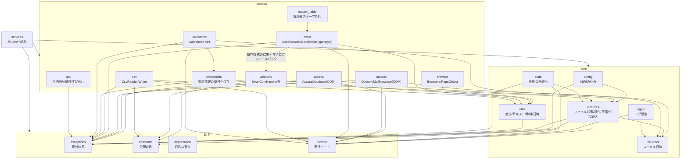

# comken 仕様書（エンジニア向け）

各モジュールの使い方（コード例）は README.md、コーディング規約は CONVENTIONS.md を参照。
この文書はライブラリの設計方針・ユースケース・設計判断を記録する。

## 目次

1. [概要と設計方針](#1-概要と設計方針)
2. [全体構成](#2-全体構成) … モジュール一覧・依存関係
3. [ユースケース](#3-ユースケース)
4. [主要な設計判断](#4-主要な設計判断)
   - 4.1 config.ini は非機密のみ・大文字
   - 4.2 ブラウザ設定は config.ini ではなくクラス変数
   - 4.3 ExcelReader / ExcelWriter と ExcelComHandler の使い分け
   - 4.4 見つからない・失敗はデフォルトで例外
   - 4.5 NAS 上の Excel を同時更新する場合の制約
   - 4.6 例外は1つの失敗につき1クラス
   - 4.7 Excel の読み取りを共通基底に置く
   - 4.8 公開 API は最小限
   - 4.9 シート操作は Sheet に集約する
   - 4.10 テーブルは定義を壊さず、中のデータを操作する
   - 4.11 ログ設定は持たない
   - 4.12 日時は PC のローカルタイムゾーンで扱う
   - 4.13 Access は CSV 直接出力を主役にする
   - 4.14 Access は既定でローカルコピーを開く
   - 4.15 元 DB を更新する場合は、ローカルコピーを書き戻さない
   - 4.16 元 DB を直接開く前に日時付きバックアップを取る
   - 4.17 Outlook は Classic のみ対応し、送信しない
   - 4.18 補助関数より本体が受け入れる
   - 4.19 社内ライブラリの呼び出しは comken が吸収する
   - 4.20 キーで引く操作は「1件」と「複数件」をメソッドで分ける
   - 4.21 config.ini が無ければ example から作り、そこで止める
   - 4.22 config.ini のセクション名・キー名は大文字を強制する
   - 4.23 MAPPING セクションは列名をデータとして保持する
   - 4.24 state.ini は設定と分離し、dry-run では書かない
   - 4.25 Excel 転記は列位置版と列名版を分ける
   - 4.26 Salesforce は読み取りが主用途で、書き込みは Data Loader に任せる
   - 4.27 部品と仕組みを toolbox / services に分ける
   - 4.28 レポート取得を集約し、管理表と履歴で見えるようにする
   - 4.29 Excel の表を設定として使う仕組みを分ける
   - 4.30 層を「直下 / core / toolbox / services」の4段にする
5. [例外体系](#5-例外体系)
6. [動作環境・依存](#6-動作環境依存) … 必須・オプション依存の一覧
7. [テスト](#7-テスト) … カバー範囲・契約テスト・未テスト領域
8. [参照・運用](#8-参照運用)
   - 配置時に書き換える3ファイル
   - 参照方式（共有サーバーを直接参照）
   - 開発とリリース … 日々の開発・リリース手順・ロールバック・共有サーバーの注意
   - 互換性ポリシー
   - パッケージ名の確定

---

## 1. 概要と設計方針

社内業務自動化（Excel・CSV・ブラウザ・Windows 操作）の共通処理を集めたライブラリ。
マクロ（VBA）で行っていた業務の Python 移行を主な用途とする。

| 方針 | 内容 |
|---|---|
| 可読性最優先 | 短く賢いコードより、半年後に読めるコード。bool 引数よりメソッド名で意味を表す |
| 非エンジニア協業前提 | エラーメッセージに対処法を含める。設定値は config.ini で管理する |
| オフライン環境で動く | 社内 BO 環境では pip が使えない。依存は最小限にし、標準ライブラリを優先 |
| 失敗は早く・明確に | 必要なファイルがなければ即例外。エラーを握りつぶさない |
| YAGNI | 3箇所で同じ処理が出るまで共通化しない（今後絶対使うものは例外） |

---

## 2. 全体構成

層の定義は §4.30 を参照。



| モジュール | 層 | 責務 | 依存 |
|---|---|---|---|
| `exceptions` | 直下 | ライブラリ固有の例外定義（`ComkenError` 基底） | なし |
| `constants` | 直下 | `Encoding` / `Color` / `FileFormat` / `SortBy` の公開定数 | なし |
| `deprecation` | 直下 | 公開 API の旧名を使ったときに移行先を警告する | 標準のみ |
| `runtime` | 直下 | 実行モード（debug: 処理時間を DEBUG ログ / dry_run: 外部影響のある操作をスキップ）。バージョンは comken.__version__（定義はここ1箇所。pyproject は dynamic version で参照） | なし |
| `core.config` | core | config.ini を `config.SECTION.KEY`（大文字）で読む | 標準のみ |
| `core.logger` | core | 日付別ファイルとコンソールへのログ設定 | runtime・core.utils.clock |
| `core.state` | core | state.ini への処理状態の保存・読み込み | exceptions・runtime・core.utils.files |
| `core.utils` | core | 差分比較・テキスト・リトライ・待機・日時取得 | 標準のみ |
| `core.utils.clock` | core | PC のローカルタイムゾーン付き現在時刻・今日の日付 | 標準のみ |
| `core.utils.files` | core | ファイル検索・操作・圧縮・標準フォルダ・命名方式 | 標準のみ |
| `toolbox.credentials` | toolbox | Windows DPAPI による認証情報の暗号化保存・読み込み・JSON 取り込み | pywin32・exceptions・core.utils.files |
| `toolbox.csv` | toolbox | CSV の読み書き・検索・索引化 | 標準のみ |
| `toolbox.excel` | toolbox | Excel 読み書き（openpyxl）。既存数式の結果・マクロは windows へフォールバック | openpyxl |
| `toolbox.access` | toolbox | Access マクロ・VBA・保存済みクエリ実行、テーブル／クエリの CSV 出力・逐次読み取り | pywin32・Microsoft Access |
| `toolbox.outlook` | toolbox | Classic Outlook の受信メール読み取り・下書き作成 | pywin32・Classic Outlook |
| `toolbox.windows` | toolbox | Excel COM・ウィンドウ・レジストリ操作 | pywin32 |
| `toolbox.browser` | toolbox | Edge WebDriver・Page Object 基盤 | selenium |
| `toolbox.salesforce` | toolbox | Salesforce API の認証・データ操作・レポート実行・認証情報ローテーション | requests・toolbox.credentials・exceptions・runtime・core.utils.clock |
| `toolbox.rpa` | toolbox | 社内 RPA 基盤の処理を遅延 import して呼び出す | 社内ライブラリ・exceptions |
| `toolbox.master_table` | toolbox | 管理表（Excel）のスキーマ DSL | toolbox.excel・exceptions |
| `services.salesforce_downloader` | services | 管理表（Excel）に沿ったレポート取得と履歴の記録 | toolbox.excel・toolbox.csv・toolbox.salesforce |

原則: **上のモジュールは下（基盤）に依存してよいが、基盤は業務モジュールに依存しない。**

ログの設定（出力先・フォーマット・レベル）は社内の共通ライブラリ側で行う。
comken と利用プロジェクトは `logging.getLogger(__name__)` を使うだけでよい。

---

## 3. ユースケース

| ID | 業務シナリオ | 使用モジュールの流れ |
|---|---|---|
| UC1 | NAS 上の当日 Excel を加工して出力 | `FileFinder.today` → `ExcelWriter`（大容量は自動ローカルコピー）→ 加工 → `save` |
| UC2 | CSV を Excel 帳票へキー突合転記 | `CsvReader.index` → `Sheet.transfer_by_letter` → `save`（PW付き保存が必要なら `ExcelComHandler` 版） |
| UC5 | 既存 VBA マクロを段階的に移行 | `ExcelComHandler.run_macro`（マクロを残したまま前後処理を Python 化）|
| UC6 | 2つのデータの差分チェック | `CsvReader.rows` ×2 → `diff_rows` → 差分を Excel / ログ出力 |

---

## 4. 主要な設計判断

### 4.1 config.ini は非機密のみ・大文字

- **config.ini に置くのは「非エンジニアが自分で変える値」だけ**。
  エンジニアしか触らない固定値は Python コードに書く。両方を config.ini に入れると
  「触ってよい値」と「触ってはいけない値」が混ざり、渡された人がどれを変えてよいか
  判断できなくなる。**config.ini を見せる相手を決めることが、そのまま置き場所の基準になる**
  - この基準で判断した例: プロジェクト名（RPA 基盤へ渡す名前）はエンジニアしか触らないので
    コードに置く。列の対応表は、環境によって変わるなら config.ini、
    どの環境でも同じ業務ルールならコードに置く
- パスワード・トークン・個人情報などの機密値は config.ini や git に含めず、
  社内の既存の管理方法を使う
- セクション名・キー名は大文字で書き、Python 側の `config.SECTION.KEY` と表記を一致させる
  （小文字が混じっていると読み込んだ時点で `ConfigLowerCaseNameError`。理由は 4.22）
- 自動変換する型: `true`/`false`→bool、`[a, b, c]`→list、絶対パス→Path、整数→int、小数→float
  （変換順・詳細は README の型変換表）。`yes`/`no`/`on`/`off` は変換しない（`1`/`0` の曖昧さ回避）。
  先頭ゼロの数字（電話番号・社員番号）と `nan`/`inf` は桁落ち・不正値を避けて文字列のまま返す

### 4.2 ブラウザ設定は config.ini ではなくクラス変数

`DRIVER_PATH` / `WAIT_SECONDS` 等はプロジェクト固有ではなく環境共通のデフォルトであるため、
`BrowserOptions` のクラス変数として持ち、プロジェクトはサブクラスで差分だけ上書きする。

**サイトごとに1ブラウザを起動し、タブでは分けない。** ダウンロード先・起動オプション・
ログイン状態はいずれもブラウザ単位で決まるため、タブで複数サイトを扱うと
「サイトAのCSVがサイトBのフォルダに落ちる」といった取り違えが構造的に避けられない。
またタブでは並列にならない（WebDriver は1接続で逐次処理するため）。
メモリは1ブラウザあたり 200〜400MB 増えるが、社内システムを数個扱う規模では問題にならない。

**入口は `Browsers` に一本化し、サイトが1つでも複数でも書き方を変えない。**
サイトを増やす操作を `launch` の1行追加に収めることで、最初に1サイトで書いたコードが
そのまま育つ。ダウンロードフォルダ・ログイン状態・ログのファイル名は `launch` で付けた
名前ごとに自動で分離するため、増やしたときに設定を見直す必要がない。

**`with` を必須にする。** `with` なしで起動できると、途中で例外が出たときに Edge の
プロセスが残り、次の実行でドライバーの更新まで妨げる。`Browsers` も `BrowserSession` も、
`with` の外で使うとブラウザを起動する前に例外で止める（弾かれた時点では何も起きていない）。

**同期が基本で、`start` / `wait` を書いたところだけ非同期にする。** 利用者には Python
初学者も含まれるため、既定の挙動は「上から順に動く」に揃える。重い画面の読み込み中に
別サイトを進めたい場合だけ `start` で先に始め、結果が要る場所で `wait` する。
`parallel` はこの2つを並べた短縮形として残す。
なお同一セッションを複数スレッドから同時に操作した場合は、待たせずに
`ConcurrentSessionUseError` で止める（黙って別の画面を操作するより早く気づけるため）。

### 4.3 ExcelReader / ExcelWriter と ExcelComHandler の使い分け

- 読み取りだけなら `ExcelReader`、書き込みを伴う場合は `ExcelWriter`（openpyxl。Excel 不要・高速）
- **comken は数式を自動で入れない。** openpyxl は数式を書けるが計算も検証もしないため、
  正しさを確かめるには Excel に再計算させる必要がある。そのための COM での開き直し、
  エラー検出、検査範囲の決定は、値の転記に対して割に合わないコストになる
- 計算は Power Query や、プログラムが触らない範囲（人が用意した数式列・集計シート）で行い、
  プログラムは値の書き込みと転記に徹する
- 既存ブックの数式の計算結果を Python 側で読むときは `read_computed_rows()` を使う
- VBA マクロ・パスワード付き保存が必要なときも `ExcelComHandler`（COM。Excel 必須）
- `ExcelWriter` は必要時に内部で COM へ自動フォールバックする

### 4.4 見つからない・失敗はデフォルトで例外

`FileFinder.today/latest/dated` 等は見つからない場合に即例外
（業務スクリプトは「なければ止まって人に知らせる」が正解のため）。
続行したい場合のみ `required=False` を指定する。例外メッセージには具体的な対処法を含める。

### 4.5 NAS 上の Excel を同時更新する場合の制約

大きなブックはローカルにコピーしてから開くため、読み込み後に他の PC が元のブックを
更新しても、その変更を検出せずに上書き保存する。同じブックを複数の PC が同時に更新する
運用では、プロジェクト側で排他制御を用意すること。

### 4.6 例外は1つの失敗につき1クラス

呼び出し側がメッセージ文字列を解析せず、例外の型だけで失敗内容を判別・個別捕捉できるようにする。
カテゴリ基底はまとめて捕捉する用途に限り、直接送出しない。

### 4.7 Excel の読み取りを共通基底に置く

`ExcelReader` は読み取り専用、`ExcelWriter` は読み書き用とする。読み取り処理を対等な別部品にすると、
読み書きが混在する処理で同じブックを二重に開くことになるため、共通の読み取り処理は
`ExcelBase` に置き、Writer からも同じブックをそのまま読めるようにする。

### 4.8 公開 API は最小限

共有サーバーを全プロジェクトが直接参照するため、一度公開した名前は長期に支える必要がある。
利用側が直接必要とする具象クラス・関数だけを各パッケージの `__all__` に載せ、
基底クラスなどの実装詳細は公開しない。

### 4.9 シート操作は Sheet に集約する

セル書き込み、書式、キー突合転記、構造化テーブルなどシートに対する操作は `Sheet` に置き、
ブックに対する操作だけを `ExcelWriter` に置く。入口が2経路あると、書式を付けるときだけ
書き方が変わるなど一貫しなくなるためである。

### 4.10 テーブルは定義を壊さず、中のデータを操作する

テーブル名の変更・削除は持たない。openpyxl では構造化参照が追随せず、参照していた数式が
`#NAME?` になるためである。テーブルの作成は新規レポートで必要なため残す。業務で頻度の高い
中のデータの追記・全消去・洗い替えは、テーブル名を変えず数式を壊さないため提供する。

### 4.11 ログ設定は持たない

出力先・書式・レベルの設定は社内の共通ライブラリが一元管理する。comken は
`logging.getLogger(__name__)` でログを出すだけとし、利用側のログ設定を上書きしない。

変更点: RPA 基盤を通さない単体実行向けに、明示的に呼ぶ `setup_logging()` を追加した。
import 時の自動設定は利用側の設定を壊すため行わず、root logger が設定済みなら何も変更しない。

### 4.12 日時は PC のローカルタイムゾーンで扱う

業務上の「今日」は実行 PC の日付である。UTC のままでは日本時間の 0:00〜9:00 に日付が
1日ずれるため、`now()` はローカルタイムゾーン付き日時、`today()` はその日付を返す。
Windows のオフライン環境でタイムゾーンデータを追加配布しないため、`ZoneInfo` は使わない。

### 4.13 Access は CSV 直接出力を主役にする

Access の整形結果は数十万件になるため、Python で全件を読み込まず、
`DoCmd.TransferText` で Access 自身に CSV を書き出させる `export_csv()` を主役にする。
Python で各行を処理する必要がある場合だけ、COM の往復を減らすバッチ取得を内部で行う
ジェネレータ `rows()` を使う。

### 4.14 Access は既定でローカルコピーを開く

Access はネットワーク越しに直接開くと遅く、他の利用者の排他に阻まれ、接続断やクラウド同期で
破損する可能性があるため、既定で一時フォルダへコピーしてから開く。整形結果は中間生成物であり、
元 DB に残す必要がないという業務前提に基づく。元 DB を更新するマクロや VBA を実行する場合は
`local_copy=False` を指定する。

### 4.15 元 DB を更新する場合は、ローカルコピーを書き戻さない

「ローカルにコピーして更新し、終わったら元の場所へ上書きで戻す」方式は**採用しない**。
更新が必要なときは `local_copy=False` で元 DB を直接開き、Access のエンジンに任せる。

書き戻し方式を採らない理由:

| 問題 | 内容 |
|---|---|
| 他人の更新が丸ごと消える | ファイル単位で上書きするため、作業中に別の人が入力した内容が、行単位ではなく**データベースごと**失われる。Access は複数人で同時に使う前提の道具であり、ファイル全体の置き換えとは相容れない |
| 速度の利点が消える | 書き戻しでは結局ファイル全体をネットワークへ書くことになる。数百 MB の DB では、読むときに節約した時間を書き戻しで使い切る |
| 最後に失敗する | 誰かが開いていると元ファイルを置き換えられない。**すべての処理が終わったあとで**失敗するため、やり直しの手戻りが最大になる |
| 破損の窓が広がる | 大きなファイルをネットワーク越しに書いている最中に接続が切れると、元の DB が壊れる |

例外は「**自分だけが使う DB で、他の誰も触らないと保証できる**」場合に限られる。
ただしその場合は、そもそも共有フォルダに置く必要があるかを先に検討する。

なお、更新結果を共有 DB に戻すことが目的なら、**戻さずに済む形**を先に検討する。
出力を CSV / Excel として別に出す、あるいは結果専用の DB を分ける方が、
排他・破損・速度のいずれの問題も起こさない。

### 4.16 元 DB を直接開く前に日時付きバックアップを取る

元 DB を直接開く場合は、開く前に日時付きのバックアップを元 DB と同じフォルダの
`backup/` へ取り、既定で7日間残す。元 DB と同じアクセス権限の範囲に置き、顧客情報の
管理範囲を各実行 PC へ広げないためである。git の管理範囲外になることは副次的な利点である。
数百 MB の DB はネットワーク越しのコピーに時間がかかる。巨大な DB では `backup_dir` で
ローカルフォルダを指定できるが、顧客情報がローカルに残ることを理解したうえで選ぶ。
元 DB と同じ障害ドメインのため、サーバー障害や誤削除では控えも一緒に失われる。
この控えは書き込み中の切断による DB 破損からの復旧用であり、本格的な世代保全は
サーバー側のバックアップに依存する。OneDrive などの同期フォルダでは控えも同期対象となり、
容量と帯域を消費する。
バックアップは破損の確率を下げるものではなく、壊れたときに戻せるよう被害を抑えるためのもの。
処理が成功しても消さないのは、不整合が後日発覚することがあるためである。

同名で上書きせず世代を残す。壊れた DB で正常な控えを上書きしてしまう事故を防ぐためである。
自動での書き戻しは、正常なデータを古い控えで壊しうるため行わない（4.13 と同じ理由）。
復旧は状況を確認した人が手でコピーする。

---

### 4.17 Outlook は Classic のみ対応し、送信しない

Outlook は Classic のみ対応する。New Outlook は COM を持たないため自動操作できず、
Graph API は認証とネットワークが必要でオフライン社内では使えないため代替を用意しない。
また Outlook は利用者が開いているものを操作するため、Excel / Access と違い
`DispatchEx` と `Quit()` を使わない。送信は誤送信が取り返しつかないため実装せず、
下書き作成までとする。

---

### 4.18 補助関数より本体が受け入れる

利用者に変換や前処理をさせるくらいなら、公開メソッド側で入力を受け入れる。
例えば Excel の列は `"A"` / `"AA"` / 数値のいずれでも指定できるようにする。
その結果、列記号の変換関数を公開する必要がなくなり、公開 API を減らせる。
**「補助関数を公開する」より「本体が気を利かせる」方を選ぶ。**

### 4.19 社内ライブラリの呼び出しは comken が吸収する

社内 RPA 基盤は import パスにバージョンが入っている（`社内ライブラリ名.vXXXX.rpa`）。
各プロジェクトに直接書くと、バージョンが上がるたびに全プロジェクトの import 行を
書き換えることになる。comken は共有サーバー上の1か所を参照する運用なので、
`comken/toolbox/rpa.py` で包めば **comken を差し替えるだけで全プロジェクトが追随する**。

社内ライブラリの import は、`importlib` ではなく**素の `from ... import` を関数の中に置く**。
保守する人が Python に詳しいとは限らないため、動的 import の間接さより素直さを優先する。
関数の中に置くのは、社内ライブラリが無い PC でも `comken` 自体を読み込めるようにするため
（自宅・テストで import が通る）。

**このリポジトリは公開しているため、社内ライブラリの実名は書かない。**
`example_libs.v0000` という仮の名前にしておき、配置時に実際の名前へ書き換える。
実名を書き戻さないこと。

社内のツールは RPA 基盤を通して動かすものと、単体で動かすものがある。雛形は単体実行を
既定にし、`setup_logging()`でログを設定してから`main()`を呼ぶ。RPA基盤から動かす場合の
書き方は、同じ`main.py`の末尾にコメントで示す。雛形を2つに分けると`config.ini.example`や
``が二重管理になるため、1つにまとめる。

プロジェクト名（RPA 基盤へ渡す名前）は `tools/new_project.py` が作成時に差し込む。
エンジニアしか触らない値なので `config.ini` には出さない。

ログの出力先など「毎回書かされる決まり文句」は `_prepare()` に集める。
呼び出し側を変えずに、全プロジェクトへ一度に効かせられる。

社内ライブラリの正式版が出ればこの仕組み自体が不要になりうるため、
**消すときに触る場所を `comken/toolbox/rpa.py` の先頭に列挙してある**。
comken の他のモジュールはこのファイルに依存させない。

### 4.20 キーで引く操作は「1件」と「複数件」をメソッドで分ける

`index()` は突合の lookup を作るためのもので、キーが1件に決まることが前提である。
重複を黙って後の行で上書きすると、**転記の結果が静かに変わって気づけない**ため、
`CsvRowDuplicateKeyError` で止める。重複が普通のデータは `group_by()` で束ねる。

`allow_duplicates` のようなフラグは持たせない。フラグでは「重複を許す」としか言えず、
**どう扱うか（後勝ちにするのか、全件返すのか）が読めない**うえ、全件返す形にすると
戻り値の型が `dict[str, dict]` から `dict[str, list[dict]]` へ変わる。
**引数で戻り値の型が変わる**のは補完も効かず、規約の「bool 引数よりメソッド名で意味を表す」に反する。

なお `transfer_by_letter` は「Excel の各行のキーで lookup を引いて、その行に書く」ものなので、
1つのキーに複数行を割り当てることはできない。同じキーの行を全部出したい場合は、
転記ではなく `group_by()` / `filter()` で取り出して `write_table()` で書き出す。

### 4.21 config.ini が無ければ example から作り、そこで止める

`config.ini.example` はあるのに `config.ini` を作り忘れる、という失敗が多い。
かといって作って**そのまま動かすと、ダミーの値のまま別のフォルダを読み書きしうる**。
そこで **example からコピーして作り、確認を促して止める**（`ConfigCreatedFromExampleError`）。
2回目の実行からは通常どおり動く。作り忘れの受け皿はここ1か所に集約し、
プロジェクト生成時（`tools/new_project.py`）には config.ini を作らない。

### 4.22 config.ini のセクション名・キー名は大文字を強制する

`config.SECTION.KEY` の形でアクセスするため、読み込み時に大文字へ揃えている。
小文字で書いても読み込み自体は成功してしまい、**小文字のままアクセスしたときに
初めて「そんなセクションはない」と言われる**ため、書いた場所から遠いエラーになる。
読み込んだ時点で `ConfigLowerCaseNameError` にして、直す場所を直接指す。

### 4.23 MAPPING セクションは列名をデータとして保持する

セクション名が `MAPPING` で終わる場合だけ、キーの大文字検証・大文字化と値の型変換を行わず、
`Config.mapping()` から `dict[str, str]` として返す。通常のキーは
`config.SECTION.KEY` で参照する識別子なので、大文字強制により表記ゆれを早期に検出できる。
一方、マッピングのキーは `受注No` のような実際の列名というデータであり、綴りや型を変えると
転記元と一致しなくなるため、同じ規則を適用しない。動的な列名は補完対象として有用でないため、
スタブには列挙せず `mapping()` の型だけを出力する。

### 4.24 state.ini は設定と分離し、dry-run では書かない

`config.ini` は人が書く設定、`state.ini` はプログラムが書く前回処理位置などの状態とする。
両者を分けるのは、人が調整した設定をプログラムが上書きし、原因の分からない挙動になるのを
防ぐためである。状態が無い初回実行は正常なので、ファイルが無ければ空のまま続行する。

dry-run で処理済みファイル名などを保存すると、本番時に処理済みと誤判定される。
試運転が本番の挙動を変えないよう、dry-run 中の `State.set()` はログだけを出して保存しない。

INI として壊れたファイルを空の状態として扱うと、「前回の続きから再開」が静かに失敗する。
そのため `StateFileCorruptedError` で止め、利用者に内容の確認または退避を求める。

### 4.25 Excel 転記は列位置版と列名版を分ける

`Sheet.transfer_by_letter()` は、ヘッダーがない帳票や列位置が仕様として固定された帳票向けに、
転記先を列番号・列記号で指定する。`Sheet.transfer_by_mapping()` は、非エンジニアが列を挿入する
可能性がある通常の帳票向けに、キー列と転記先をヘッダー名で解決する。列の挿入に強くするため、
1つのメソッドへ無理に統合せず、用途を名前で区別する。

`transfer_by_mapping()` の対応表は `{転記元の列名: 転記先の列名}` とする。
config.ini の `左 = 右` を「元 = 先」と読める向きに合わせ、`Config.mapping()` の戻り値を
変換せず渡せるようにする。`transfer_by_letter()` も `{転記元の列名: 転記先の列記号}`
に揃える。向きが逆だと、対応表を取り違えても正常終了して誤った列へ書く危険があるためである。
これはヘッダーの有無に応じて `CsvReader.first()` と `cell()` を使い分ける思想と同じである。

列不足で途中まで書き換わったブックを残さないよう、キー列・全転記先列・lookup の全行にある
転記元列を、転記開始前に検証する。dry-run は個々のシート操作ではなく `ExcelWriter.save()` が
保存を止める既存の責務分担に従う。

転記は過去に「列名版と列記号版で `{転記元: 転記先}` の向きが逆になっていて、
取り違えてもエラーにならず正常終了する」という静かな事故を起こした。
openpyxl 版（`Sheet`）と COM 版（`ExcelComHandler`）は別実装で、**メソッド名と
シグネチャを揃えていても、中身が二重になっていると同じ事故が片方だけ再発する**。
そこで照合キーの正規化と列名の検証を `core/utils/transfer.py` に抜き出して、
両系統が同じ関数を経由するようにした。
`excel` から `windows` へ / `windows` から `excel` へ依存させないため、
共通部分は `core/utils/`（どちらにも依存されない基盤）に置く。

### 4.26 Salesforce は読み取りが主用途で、書き込みは Data Loader に任せる

業務側の運用は**レポートからデータを引くこと**が中心で、レコードの追加・更新は
Salesforce 公式の **Data Loader** を使う（2026-08-14 に確定）。comken の
`insert` / `update` / `upsert` / `delete` は実装済みだが、当面は使われない見込み。

そのため、機能を足すならレポート取得側（2000行の壁の回避・列名の扱い）に寄せる。
書き込み側は現状維持とし、使う予定が無いまま拡張しない。

### 4.27 部品と仕組みを toolbox / services に分ける

置き場所は**「そのモジュールをどう説明できるか」**で決める。

| 場所 | 基準 |
|---|---|
| 直下 | 何を操作するかに関係なく使う（exceptions / constants / runtime / deprecation） |
| `toolbox` | 「〜を操作する／〜と通信する」で説明できる部品 |
| `services` | 社内の管理表・管理番号・保存先の規約を知らないと説明できない仕組み |

**社内固有かどうかでは分けない。** 社内 RPA 基盤のラッパー（`toolbox/rpa.py`）は社内にしか
存在しないが「呼び出すための部品」なので toolbox に入る。Salesforce の組織クラス
（`toolbox/salesforce/sites/`）も同じ。社内固有を基準にすると、sites が salesforce
クライアントから切り離せず破綻する。

土台を直下に残すのは、**Excel を使わないプロジェクトも通る**ため。`dry_run` や
`constants` が `toolbox` に沈むと、道具を使わない利用側まで toolbox を経由することになる。

**実行される単位は置かない。** 定期実行のバッチは個別プロジェクトの仕事で、ライブラリには
呼ばれる側だけを置く（`services` に業務用の `__main__.py` を作らない理由）。

### 4.30 層を「直下 / core / toolbox / services」の4段にする

`toolbox` に部品を集めすぎて「外に触らない部品」と「外を触る道具」が混ざった状態
になったため、4.27 を refined して4段にした。

- **直下** — 何にも依存しない共通語彙（例外・定数・実行モード・旧名警告）。全層が使う
- **core** — 直下にだけ依存する部品。外にあるものは触らない
  （logger / state / config / utils / utils.clock / utils.files）
- **toolbox** — 外にあるもの（Excel・CSV・ブラウザ・Salesforce 等）を触る道具。
  直下・core・同層に依存してよい
- **services** — 社内の決まりに沿って toolbox を組み合わせた仕組み。
  すべてに依存してよい

層の定義と同層依存の例外一覧は `tests/test_layers.py` を正本とする。

`credentials`（DPAPI とファイルを触る道具）と `master_table`（Excel の構造 DSL）は
**外を触るので toolbox** に置く。直下や core からは触らない（依存方向が逆になるため）。

`from comken import config` のようなエイリアスは維持する（実装は `comken.core.config`
だが、利用側がよく打つ行なので短く保つ）。`python -m comken.config` は
`python -m comken.core.config` に変わった。

### 4.28 レポート取得を集約し、管理表と履歴で見えるようにする

各プロジェクトが個別に Salesforce からレポートを落としていると、**どのプロジェクトが
どのレポートをどれくらいの頻度で取っているか**が分からない。取得を
`services/salesforce_downloader` に集約し、何を取るかは管理表（Excel）に、
いつ何を取ったかは履歴（CSV）に集める。

- **管理番号は Salesforce のレポート ID ではない。** 社内で決める論理的な番号で、
  参照先のレポートを差し替えても利用側のコード（`CUSTOMER_LIST = 1001`）は変えない
- **レポート ID を人に入力させない。** 管理表には URL をそのまま貼り、
  `report_id_from_url()` が取り出す。人が ID を抜き出す工程で写し間違いが起きる
- **`download_report()` は必ず Salesforce へ行く。** 今日すでに取っていても取り直す。
  呼んだ側が最新を求めているのだから、黙って前のものを返さない
- **`get_scheduled_report()` は取りに行かない。** まだなら例外にする。ここで自動的に
  取りに行くと、定期取得が動いていないことに誰も気づかなくなる
- **本日の定期取得が済んだかは履歴で判定する。** 保存先に今日のファイルがあっても、
  定期取得で置かれたのか個別に取ったのか手で置いたのかは区別が付かない
- **管理表と履歴は別ファイルにする。** 人が Excel で編集するものと、プログラムが追記する
  ものを同じファイルにすると、開いている間に保存できず履歴が飛ぶ。履歴を CSV 追記に
  するのは、複数プロジェクトが同時に呼んでも壊れないため
- **複雑なスケジュールを持たせない。** 「土日祝を除く」のような予定は**呼び出す側に
  もともとある**ので、両方に持つと必ずズレる。1日に何度も要るものは
  `download_report()` を呼ぶ

**戻り値は `CsvReader` にした。** `download_report()` / `get_scheduled_report()` は
保存したファイルを `comken.toolbox.csv.CsvReader` で返す。利用側が `read_rows()` /
`index()` / `filter()` をそのまま使え、`CsvWriter` の文字コードを意識しなくて済む。
`download_scheduled()` だけ `list[Path]` のままで、reader を返さない（定期取得の
呼び出し側は読まず「取らせる」だけなので、reader を並べても使い道がない）。
ファイルパスが要るときは `CsvReader.path`（遅延読み込みなので読込みは走らない）。

**履歴CSVは段階別の3状態で書く。** 「`Salesforce取得結果`」「`保存結果`」「`エラーコード`」
の3列を加え、どの段階で失敗したかを残す。0 行のとき `Salesforce取得結果=成功` /
`保存結果=空` / `エラーコード=EmptyReportError` になるのが要点で、通信障害と
「レポートの中身が空」を履歴から区別できる。

**責任境界をファイル docstring に明示する。** 各ファイルのモジュール docstring の末尾に
「`このファイルが持つもの`」「`ここに書かないもの`」の定型ブロックを置く。半年後に
「ちょっとだけ直したい」と思った人がファイルを開いた瞬間に、ここに書いていいのか・別の
場所に書くべきかが分かるようにする。境界が曖昧だと動く場所に書かれ責任がぐちゃぐちゃに
なる。早見表は `docs/salesforce-downloader.md` の「どこに書くか（索引）」に集約し、
責任範囲の説明は docstring を正本とする（2箇所に書くと片方だけ直されて食い違うため）。

**利用側から `master_path=` / `history_path=` を渡せない。** 管理表・履歴の置き場所は
`service.py` のモジュール定数 `MASTER_PATH` / `HISTORY_PATH` で一元管理する。
利用側に同名のパス定数を作らせると、管理表を直したのに出力先が変わらず、しかも
エラーにもならない事故が起きる。

同じ Salesforce レポートを複数の管理番号が指している場合は**検出して知らせるだけ**にする
（保存先を分けたいなど、意図している場合もあるため）。

**履歴に「原因区分」を持たせ、4値で誰が動くかを示す。** `設定` / `Salesforce` /
`ファイル` / `プログラム` の4値（成功時は空文字）で、運用する人が履歴だけから
「管理表を直すのか」「Salesforce 管理者へ連絡するのか」を判断できるようにする。
**例外クラス名との対応表は持たない**。例外を増やすたびに更新漏れが起き、
`docs/ERRORS.md` と二重管理になるため。代わりに、履歴にすでに書いている3状態
（`Salesforce取得結果` / `保存結果`）と例外の種類だけから4行で機械的に決める。

1. `ComkenError` でも `OSError` でもない → `プログラム`（comken 側のバグ）
2. `保存結果=失敗` → `ファイル`（共有サーバー・権限）
3. `Salesforce取得結果` が `None` でない → `Salesforce`（問い合わせ失敗または 0 行）
4. それ以外（取得段階に入る前に落ちた）→ `設定`

**`download_scheduled()` が握りつぶす例外の範囲と、判定1の条件はまったく同じ**にする
（= `ComkenError` / `OSError` 以外はその場で落とす）。同じ判断を2箇所で別々に書かない
ためで、`download_scheduled()` が `ScheduledDownloadFailedError` に変換して握りつぶして
しまう範囲と、履歴で「`プログラム`」（＝作った人へ連絡）と書く範囲がズレない。

**0 件を管理表で宣言させる。** レポートによっては「その日たまたま該当データが無い」が
普通に起きる。そういうレポートで毎回 `EmptyReportError` が出ると**誤報が続いて、
本物の失敗も「また 0 件か」で流されるようになる**。一方で、0 件は「管理表が別の
レポートを指してしまっている」設定ミスの可能性もあるため、**黙って無視するのも危ない**。
この 2 つのバランスを取るため、**0 件がありうるかどうかは管理表の `0件あり` 列で
宣言する**（`○` / `×`）。

**履歴の回数から自動判定はしない。** 設定ミスで毎日 0 行のレポートほど早く
「正常」に分類されてしまうため。観測（履歴）と宣言（管理表）の役割を分け、
**人が判断したうえで管理表に書く**。プログラムが履歴の集計結果から勝手に
「`○` だとみなす」のは、誤った分類を自動的に確定してしまう最悪のパターンになる。

**`0件あり` 列だけ既定値 `×` を持たせる。** リポジトリには「意味が反転する列には
既定値を持たせない」（`enabled` から既定値を外した）という判断があるが、この列は逆。
- 書き忘れると `×` になり、**厳しい側（エラー）へ倒れる**。誤報が出るだけで
  データは失われない（運用側で `○` に直せば正しくなる）
- **既定値のある列は、見出しごと無くても読める**。列を足した瞬間に既存管理表が
  すべて読めなくなり全プロジェクトの業務が止まる事故を防ぐ（既定値の無い列は
  `master_table` 側で必ずエラーになるため）

`choices=("○", "×")` で一覧外の文字を弾き、`default=False` で空欄を通す。
「`choices` と既定値の空欄」が両立するかどうかは `master_table` 側の既存経路で
自然に成立する（空欄 → `_EMPTY` → default 適用、`choices` チェックは値が
書かれたときに走る）。`allow_empty` は意味どおり `bool` で受ける。bool 列に2つの
`choices` がある場合、雛形は1つ目を True、2つ目を False の表記として書き出すため、
Python 側を文字列型にして `○` / `×` の表示へ合わせる必要はない。

**原因区分に `データなし` を足して 5 区分にする。** 0 件を管理表で宣言できるように
なったため、`0件あり` が `×` のまま 0 件だったケースは「失敗」だが「通信障害」とは
別の区分にする必要がある（`データなし`）。`True + None`（取得は成功、保存には
進んでいない）の組合せは `EmptyReportError` しか取り得ず、例外クラス名を引かずに
段階で特定できる。

```python
def _classify_cause(error, fetched_from_salesforce, saved_to_file):
    if not isinstance(error, (ComkenError, OSError)):
        return "プログラム"
    if saved_to_file is False:
        return "ファイル"
    if fetched_from_salesforce is True and saved_to_file is None:
        return "データなし"
    if fetched_from_salesforce is False:
        return "Salesforce"
    return "設定"
```

**失敗のログは `_download()` 内で完結させる。** 「原因区分」を計算しているのは
`_download()` なので、ログ出力も同じ場所で行う。例外オブジェクトへ `_comken_download_cause`
属性を一時的に後付けして `download_scheduled()` 側で読む仕掛けは**やめた**——非エンジニア
には読み解けず、計算と表示が別の場所にあると「なぜこの値が出るか」を追えなくなる。
「値を計算した場所が、その値を使う」のを原則とする。

### 4.29 Excel の表を設定として使う仕組みを分ける

「どのレポートを取るか」「どのファイルをコピーするか」のように**行が増えていく設定**は
config.ini より Excel の表が扱いやすい。この読み込み・検証・雛形生成を
`comken.toolbox.master_table` に分け、**使う側は列を宣言するだけ**にした。

```python
@dataclass(frozen=True)
class Item(MasterRow):
    key: int = column("ID", unique=True, help="社内で決める管理番号")
    mode: str = column("方式", choices=("毎日", "手動"))
    enabled: bool = column("有効", default=True)
```

**列の定義を1か所にするため。** 分ける前は「読み込み結果の dataclass」と「列名の定数」を
別々に持っており、片方だけ直すと**Excel を編集したのに読まれない**という分かりにくい
失敗になった。宣言を1つにすれば、雛形・読み込み・検証・記入方法シートが必ず同じ列を見る。

**辞書で読まない。** `read_rows_as_dicts()` でも読めるが、使う側が毎回 `row["名前"]` と
文字列で書くことになり、打ち間違いが実行時まで分からない。

**Python の名前は英語、Excel の見出しは日本語。** `column()` の第1引数が見出しなので、
コードの命名規約を崩さずに、スペースを含む見出し（`Salesforce URL`）も扱える。

**toolbox に置く理由。** 「Excel の表を読む部品」であり、社内の取り決め（どんな列か）は
使う側が宣言する。toolbox 内で `excel` に依存するが、toolbox には元から層がある
（`excel → utils`、`salesforce → credentials`）ので、一方向である限り問題にしない。

## 5. 例外体系

```
ComkenError                 ← まとめて捕捉する場合はこれ
├── UnsupportedFileSuffixError    ← 対応外の拡張子
├── AccessError
│   └── AccessFileNotFoundError / AccessBackupError / AccessLocalCopyError
│       / AccessRoutineError / AccessSourceNotFoundError
├── OutlookError
│   └── ClassicOutlookNotAvailableError / OutlookFolderNotFoundError
│       / OutlookAttachmentNotFoundError
├── ExcelError
│   ├── ExcelFileNotFoundError / SheetNotFoundError / SheetAlreadyExistsError
│   ├── LastSheetDeletionError / MacroError / RowTransferError
│   ├── InvalidTableNameError / TableAlreadyExistsError / TableNotFoundError
│   └── EmptyHeaderCellError / ExcelHeadersTooFewError / FileFormatMismatchError
├── CsvError
│   └── EncodingDetectionError / CsvHeadersTooFewError / CsvCellReferenceError / CsvNoDataRowsError
│       / CsvRowNotFoundError / CsvRowDuplicateKeyError
├── CredentialError
│   └── InvalidCredentialNameError / CredentialNotFoundError / CredentialDecryptionError
│       / CredentialStoreCorruptedError / CredentialImportError
├── BrowserError
│   ├── DriverStartError / BrowsersNotStartedError / BrowsersClosedError
│   ├── SessionNotStartedError / SessionClosedError / ConcurrentSessionUseError
│   ├── SessionNameConflictError / SessionNotFoundError / ElementNotFoundError
│   └── PopupTabNotOpenedError / DownloadTimeoutError
├── InvalidColumnError
├── ColumnNotFoundError
│   ├── ExcelColumnNotFoundError / CsvColumnNotFoundError / KeyColumnNotFoundError
│   └── TransferKeyColumnNotFoundError / TransferDestinationColumnNotFoundError
│       / TransferSourceColumnNotFoundError
├── RpaError
│   └── RpaLibraryNotFoundError
├── SalesforceError
│   ├── SalesforceAuthError / SalesforceConnectionError / SalesforceRequestError
│   ├── SalesforceExternalIdMissingError
│   ├── SalesforceCredentialRotationError
│   └── SalesforceReportTruncatedError / SalesforceReportFormatError
│       / SalesforceReportIdNotFoundError / SalesforceReportExecutionError
├── ConfigError
│   └── ConfigFileNotFoundError / ConfigCreatedFromExampleError
│       / ConfigLowerCaseNameError / ConfigSectionNotFoundError
└── StateError
    └── StateFileCorruptedError / StateLowerCaseNameError / StateValueTypeError
```

方針:
- 素の `ValueError` / `Exception` は投げない（呼び出し側で判別できるようにする）
- 1つの失敗ごとに個別例外を作り、メッセージはその `__init__` で組み立てる
- メッセージは「何が・どこで・どうすればよいか」を含める（非エンジニアが読む前提）
- 行処理のエラーは行番号を含めて再送出する（`transfer_by_letter` 等）
- COM は往復のたびにプロセス間通信が発生するため、セル単位ではなく
  `Range.Value` で2次元配列を一括に読み書きする

---

## 6. 動作環境・依存

| 項目 | 内容 |
|---|---|
| Python | 3.11 以上。実行環境は 3.14 であり、`unzip` が使う3.11の機能について旧版向け互換コードを持つ理由がないためである |
| OS | Windows（windows / browser は Windows 専用） |
| 必須依存 | openpyxl, selenium, pywin32, requests |
| Outlook 操作 | 従来版（Classic）Outlook が必要。New Outlook は非対応 |
| 参照方法 | 共有サーバーに置き、各プロジェクトの `実行.bat` が実行中だけ `PYTHONPATH` を設定して直接参照（8章参照。`pip install` はしない） |


---

## 7. テスト

- `tests/` に pytest。実行: `python -m pytest tests -q`
- 現在の結果: **825 passed / 17 skipped**
- config / csv / excel（openpyxl）/ utils / files / exceptions / runtime / 文書コード例をカバー
- **未テスト領域**: Excel COM（`ExcelComHandler`）・Selenium 実機（`browser` は配線のみモックでテスト）。
  外部環境が必要なため、実機での動作確認で担保する

---

## 8. 参照・運用

### 配置時に書き換える3ファイル

**このリポジトリは公開しているため、社内の名前・URL・共有フォルダのパスは仮名で書いてある。**
配置するときに、次の3か所を実際の値へ書き換える。

| ファイル | 何を |
|---|---|
| `comken/toolbox/rpa.py` | 社内 RPA 基盤の import 行（2か所） |
| `comken/toolbox/salesforce/sites/sandbox.py` | 組織の My Domain・認証情報の接頭辞・レポート ID |
| `comken/services/salesforce_downloader/service.py` | 管理表と履歴の置き場所 |

**設定ファイルへ集約しない。値は使う場所に書く。** 一度 `settings.ini` へ、次に
`settings.py` へ集約してみたが、どちらも良くなかった。

- **ini にすると、設定がコードと ini に散る。** どちらを見ればよいか分からなくなる
- **1つの Python ファイルに集めても、書き換えるファイルは減らない**（`rpa.py` は
  import 文なので必ず残る）。減らないうえに、`Sandbox` の URL が `Sandbox` から離れる。
  **クラスの値はそのクラスにあるほうが、探さずに済む**

**書き換え忘れは必ずエラーになる**（社内ライブラリが見つからない・組織へつながらない・
管理表が見つからない）ので、仮名のまま黙って動いて間違った結果を出すことはない。

**共有サーバーでは、この3ファイルを切り替えから守る**（配置時に1回だけ）。

```bat
git update-index --skip-worktree comken/toolbox/rpa.py
git update-index --skip-worktree comken/toolbox/salesforce/sites/sandbox.py
git update-index --skip-worktree comken/services/salesforce_downloader/service.py
```

comken 側でこの3ファイルを変えたときはタグの切り替えが止まるので、そのときだけ
`--no-skip-worktree` で解除して手で合わせ、また設定し直す。

プロジェクトごとに変わる値（入力フォルダ・出力先など）は各プロジェクトの `config.ini` へ。
ここに書くのは「comken を1回配置したら、そのまま変わらない値」だけにする。

各プロジェクト側の comken の場所（`実行.bat` 等の3か所）は**Python が起動する前**に
使われるので、コードには置けない。こちらは `tools/set_comken_root.py` でまとめて書き換える
（→ README「comken の場所を変えたとき」）。恒久登録（`setup_comken.bat`）を
してあれば、そもそも書き換えるものが無くなる。

### 参照方式: 共有サーバーを直接参照

comken は共有サーバー上の1か所に置き、各プロジェクトはそこを**直接 import する**。
ローカルへのコピー・同期は行わない（配布作業そのものをなくした）。

```
共有サーバー \\server\share\tools\comken   ← comken の git チェックアウト（main / リリースタグに保つ）
     │  各 PC は PYTHONPATH でここを指す（コピーしない）
     ▼
各プロジェクト                              ← import comken が共有サーバーの実体を直接読む
```

各プロジェクトの `実行.bat` に、共有サーバーのリポジトリルートを `COMKEN_ROOT` として設定する。
バッチが実行中だけ `PYTHONPATH` に追加するため、各 PC の環境変数を事前設定する必要はない。

```bat
set "COMKEN_ROOT=\\server\share\tools\comken"
set "PYTHONPATH=%COMKEN_ROOT%;%PYTHONPATH%"
```

これだけで、どのプロジェクトからでも `import comken` が共有サーバーの最新版を読む。
robocopy 同期・`pip install`・実行.bat の同期処理は不要（`実行.bat` は main.py を起動するだけの
薄いものにするか、無くてもよい）。

| 事象 | 挙動 |
|---|---|
| 共有サーバーの comken を更新した | 次に import した瞬間から全プロジェクトが最新版で動く（同期待ちなし） |
| 共有サーバーにアクセスできない | **import が失敗する**（ローカルコピーを持たないため）。共有サーバーの可用性に依存する |
| 起動速度 | import のたびにネットワークを読むためローカル実行より遅い。大きなデータファイルは従来どおり `local_copy()` でローカルに引く |

> **旧・ローカル同期方式との違い（受け入れた代償）:** 直接参照は「配布作業ゼロ・常に最新」が利点。
> 一方で、起動のたびにネットワークを読むので遅く、**共有サーバーが落ちると全プロジェクトが止まる**。
> この代償を受け入れた上での方式。共有サーバーは高速・高可用に保つこと。

> **バイトコードキャッシュ:** 共有サーバーが読み取り専用だと `__pycache__` を書けず、
> import のたびに再コンパイルが走って遅くなる。共有側を書き込み可にするか、各 PC で
> `setx PYTHONPYCACHEPREFIX %LOCALAPPDATA%\comken-pycache` を設定してキャッシュをローカルに逃がす。

**開発と本番の分離:** 共有サーバーのチェックアウトは常に main（またはリリースタグ）に保つ。
開発は手元のクローンで行い（ブランチ自由）、中央リポジトリ（NAS の bare リポジトリ等）経由で共有する。
**共有サーバーで develop 等をチェックアウトしない**こと（その瞬間に全プロジェクトへ伝播する）。

各PCで恒久的に参照する場合は、リポジトリ直下の`setup_comken.bat`を1回実行し、
現在のWindowsユーザーの`PYTHONPATH`へリポジトリルートを追加する。既存値を保持し、重複は
追加しない。共有フォルダの移動時は古い値をユーザー環境変数から削除して再実行する。

更新は共有サーバーのチェックアウトで `git pull` する。**社内固有の値を書いた2ファイル
（`comken/settings.py` と `comken/toolbox/rpa.py`）は `git update-index --skip-worktree` で
保護しておく**（配置時に1回だけ）。手元の書き換えが pull で消えず、うっかり push することもない。
comken 側でこの2ファイルを変えたときは pull が止まるので、そのときだけ解除して手で合わせる。

以前は `deploy.py` で BO 用フォルダへコピーする方式も併存していたが、**共有サーバーで git が
使えるので廃止した**（2026-08-14）。コピー方式だと `settings.py` と `rpa.py` が配置のたびに
上書きされ、社内固有の値を毎回書き直すことになる。参照方式を1つに絞るほうが、
「今どれが本番か」で迷わない。

**バージョンを上げる操作は配置に含めない。** 上げるのはリリース手順（次節）の仕事で、
テストとレビューを終えた状態のものを配るだけにする。配置のたびに`__version__`を書き換えると、
コミットされていない変更を作ったまま配ることになり、「配った版がどのコミットか」が
DEPLOYMENT.txt を見ないと分からなくなる。

### 開発とリリース

**開発は手元のクローン、共有サーバーはリリースしたタグだけを指す。** 共有サーバーを
更新した瞬間に、次に import した全プロジェクトへ伝播するため、「いつ切り替わるか」を
人が決められる形にする。

```
手元のクローン（F:\dev\original_libs）          共有サーバー（\\server\share\tools\comken）
    master に開発をコミット                          v0.7.0 を checkout したまま
        ↓ リリースするとき                              ↓ 更新すると決めたときだけ
    __version__ を上げ、タグを打って push    ──→    git fetch && git checkout v0.8.0
```

**master に直接コミットしてよい。** 1人で開発しているので、develop ブランチを分けても
「どちらが最新か」を管理する手間が増えるだけになる。**共有サーバーがタグを指しているので、
master に何をコミットしても本番には流れない。**

#### 開発中（毎日）

1. 手元のクローンで master にコミットする（ブランチを切ってもよい）
2. `python -m pytest -q` と `python -m ruff check .` を通す
3. push する（バックアップと、Codex に見せるため）

**実プロジェクトで試したいときは、そのコマンドプロンプト限りで開発版を指す。**

```bat
set PYTHONPATH=F:\dev\original_libs
python main.py
```

ウィンドウを閉じれば元（共有サーバー）に戻る。**`setx` でユーザー環境変数を書き換えない**
（戻し忘れると、その PC が永久に開発版で動き続ける）。検証は管理者の PC だけで行う。

#### リリースするとき

| # | 手順 | コマンド |
|---|---|---|
| 1 | バージョンを上げる | `comken/__init__.py` の `__version__` を1行変更（**定義はここだけ**） |
| 2 | テストと lint | `python -m pytest -q` / `python -m ruff check .` / `python -m ruff format --check .` |
| 3 | 生成物を作り直す | `python tools\export_for_chat.py`（API.md・ERRORS.md） |
| 4 | コミットしてタグを打つ | `git commit` → `git tag v0.8.0` → `git push && git push --tags` |
| 5 | 共有サーバーを切り替える | 共有サーバーで `git fetch --tags` → `git checkout v0.8.0` |

**5 をやるまで本番は変わらない。** 1〜4 は好きなときにやってよい。

**バージョン番号の付け方**（X.Y.Z）:

| 上げる桁 | いつ | 例 |
|---|---|---|
| Z（パッチ） | バグ修正のみ | 0.7.0 → 0.7.1 |
| Y（マイナー） | 機能追加（既存コードはそのまま動く） | 0.7.1 → 0.8.0 |
| X（メジャー） | 互換性が壊れる変更 | 原則やらない（互換性ポリシー参照） |

#### ロールバック

共有サーバーで前のタグに戻すだけでよい。次に import した時点で全プロジェクトが戻る。

```bat
git checkout v0.7.0
```

#### 共有サーバーで気をつけること

- **タグ（またはリリース済みの master）以外を checkout しない。** 開発中のブランチを
  置いた瞬間、その中身が全プロジェクトへ伝播する
- **社内固有の2ファイルは保護しておく**（配置時に1回だけ）

  ```bat
  git update-index --skip-worktree comken/settings.py
  git update-index --skip-worktree comken/toolbox/rpa.py
  ```

  タグを切り替えるときに、この2ファイルへ変更が入っていると checkout が止まる。
  そのときだけ `--no-skip-worktree` で解除し、手で合わせてから設定し直す

**リリース1回の影響範囲は大きい。** 公開 API の名前・引数は変えないのが原則で、
変えるなら旧名を `warn_renamed` 付きで残す（→ 互換性ポリシー）。全プロジェクトが常に
同じものを参照するため、黙って壊すと切り替えた瞬間に全ツールが止まる。

### 互換性ポリシー（共有サーバー方式の代償）

全プロジェクトが常に最新を参照する＝**古い comken に固定して逃げる手段がない**。
そのため公開 API の互換性は次のルールで守る。

このポリシーが効き始めるのは、共有サーバーへ配置し、利用プロジェクトが参照を始めた後である。
配置前は利用者がいないため、旧名を残す方が保守コストになる。公開 API の名前を整える変更は
この段階で済ませる。適用基準はバージョン番号ではなく、共有サーバーへ配置したかどうかである。

| ルール | 内容 |
|---|---|
| 原則、名前は変えない | 公開 API（クラス名・メソッド名・引数名）の変更は最後の手段 |
| 変える場合、旧名は削除しない | 旧名は動き続ける。黙って壊すことはしない |
| 旧名には警告を付ける | `comken/deprecation.py` の `warn_renamed(旧名, 新名)` を使う |

削除した名前は `comken/toolbox/browser/__init__.py` の `_REMOVED_NAMES` に登録してあり、
使うと書き換え先を示す `AttributeError` になる（素の ImportError で放り出さない）。

警告の仕様:
- `FutureWarning` を使う（`DeprecationWarning` はデフォルト非表示のため気づけない）
- 文言は「動作しますが、○○に書き換えてください」（非エンジニアが見ても不安にならない表現）
- Python の警告機構により、**同じ箇所からは1回の実行につき1度しか表示されない**（スパムにはならない）
- 警告を出し続ける期間: 全プロジェクトの移行を確認できるまで＝実質無期限。
  ただし全プロジェクトの grep で旧名の不使用を確認できたら、旧名と警告を削除してよい

### その他

- プロジェクト側のドキュメント構成（使い方.md / 仕様書.md / ERRORS.md）は CONVENTIONS.md を参照
