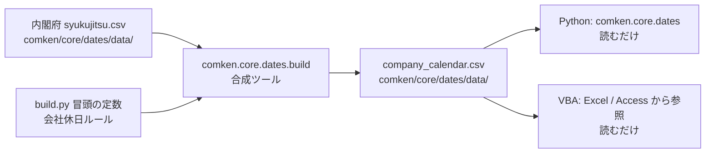

# comken.core.dates — 日付・営業日・年度

RPA 置き換えプロジェクトで「いま取るべきレポートか」を判定するために使う、
**会社用カレンダー CSV** ベースの営業日判定と、業務で使う日付計算
（月の初日・末日、yyyymmdd ⇔ 日付、年度）をまとめたライブラリ。

実装本体は `comken/core/dates/` 配下にある（外部ライブラリに依存しない）。
内閣府の祝日 CSV と会社休日ルールを合成した「会社用カレンダー CSV」を
`comken/core/dates/data/company_calendar.csv` に **git 管理下で同梱** しており、
**Python 実行時と VBA 側の両方が同じ 1 ファイルを読む**。自動ダウンロード機能は無い。

ライブラリは **既定カレンダー 1 本だけ** を公開する。利用者が独自のカレンダーを
組み立てる API は公開していない（差し替え口はテスト用の **非公開** 関数のみ）。
会社独自の休業日は `comken/core/dates/build.py` の冒頭で **コード直書き**
で表現する（`COMPANY_HOLIDAYS` / `COMPANY_HOLIDAYS_EXTRA`）。

国民の祝日と会社休日をマージして、`is_workday()` で「今日が営業日か」を
判定する。国民の祝日と会社休日が同じ日に重なった場合は **国民の祝日が先勝ち**
（生成ツールが 1 行に焼き込んでいる）。

## 目次

- [全体像](#全体像)
- [最短の使い方](#最短の使い方)
- [会社休日の定義](#会社休日の定義)
- [生成物（`company_calendar.csv`）](#生成物company_calendarcsv)
- [年 1 回の更新手順](#年-1-回の更新手順)
- [会社休日変更手順](#会社休日変更手順)
- [範囲外の扱い](#範囲外の扱い)
- [期限切れの警告](#期限切れの警告)
- [日付の計算](#日付の計算)
- [年度（fiscal_year）](#年度fiscal_year)
- [yyyymmdd 変換（format_yyyymmdd / parse_yyyymmdd）](#yyyymmdd-変換format_yyyymmdd-parse_yyyymmdd)
- [公開 API](#公開-api)
- [注意事項](#注意事項)

## 全体像



| 段階 | 知っていること | 知らないこと |
|---|---|---|
| 内閣府 CSV（`comken/core/dates/data/syukujitsu.csv`） | 国民の祝日の「公表値」 | 会社休日・最終的な生成物 |
| 生成ツール（`comken.core.dates.build`） | 内閣府 CSV の形式・会社休日ルール | 実行時の利用方法 |
| **生成物**（`comken/core/dates/data/company_calendar.csv`） | （国民の祝日＋会社休日を焼いただけ） | ー |
| 実行時（Python） | （生成物を読むだけ） | 内閣府 CSV・会社休日ルール |
| VBA | （生成物を読むだけ） | 内閣府 CSV・会社休日ルール |

内閣府 CSV の解析は **生成ツールだけ** が持つ（形式が変わって困るのは
生成ツールだけ）。実行時（Python・VBA 双方）は内閣府 CSV を知らずに
CSV を読むだけ。

## 最短の使い方

**推奨する書き方**は `comken.core` ファサードから `dates` を取り、
その関数を使う形です。関数を 1 個ずつ import する必要はありません。

```python
from datetime import date

from comken.core import dates

if dates.is_workday(date.today()):     # 既定カレンダーで判定
    ...  # レポートを取りに行く

# 翌営業日（Excel の WORKDAY(d, 1) と同じ）
tomorrow = dates.workday(date.today(), 1)
```

`dates.is_workday` / `dates.workday` / `dates.last_workday` /
`dates.is_holiday` / `dates.holiday_name` などは **既定カレンダー** を
そのまま使う。カレンダーを組み立てる API は公開していない。

## 会社休日の定義

会社の休業日は `comken/core/dates/build.py` の冒頭でコードで書く。

```python
# comken/core/dates/build.py
COMPANY_HOLIDAYS = {
    "年末年始休暇": ((12, 29), (12, 30), (12, 31), (1, 1), (1, 2), (1, 3)),
}
COMPANY_HOLIDAYS_EXTRA = ()  # その年だけの臨時休業。date(2026, 12, 28) のように足す
```

`COMPANY_HOLIDAYS` は **毎年繰り返す** 休み（年は書かない）。内閣府 CSV の
収録範囲（最初の年〜最後の年）に合わせて展開される。国民の祝日と重なった日は
**国民の祝日が先勝ち** で 1 行に焼き込まれる。`COMPANY_HOLIDAYS_EXTRA` は
その年だけの臨時休業で、名称は `会社休業日` になる。

休業日を追加するときは `build.py` 冒頭の定数を編集する。

- **複数日まとめて 1 つの名称** が要るときは、`COMPANY_HOLIDAYS` の 1 キーに
  `(月, 日)` を並べる（上の「年末年始休暇」のように）
- 年またぎ（12 月 → 1 月）も `(月, 日)` で書けばそのまま毎年適用される
- **その年だけ臨時の休み** を足したいときは `COMPANY_HOLIDAYS_EXTRA` に足す。
  古くなった年の行は消してよい（消しても過去の判定が変わるだけで、運用に
  影響しない）
- 編集したら `python -m comken holidays` を実行して
  `company_calendar.csv` を更新しコミットする

## 生成物（`company_calendar.csv`）

国民の祝日と会社休日を 1 ファイルに合成した「会社用カレンダー CSV」。
`comken/core/dates/data/company_calendar.csv` に **git 管理下** で置かれる。

| 列 | 形式 | 内容 |
|---|---|---|
| `date` | `YYYY-MM-DD` | 日付 |
| `name` | 文字列 | 国民の祝日名または会社休日名 |

- **文字コード**: UTF-8 BOM 付き。Excel で開いても文字化けしない。VBA の `Open` 文は ANSI（CP932）前提で読むため、**祝日名が化け、1行目に BOM が混ざる**。VBA からは下の `ADODB.Stream` の例のように UTF-8 を指定して読むこと（日付の列だけなら `Open` 文でも読めるが、1行目の BOM に注意）
- **並び順**: 日付昇順
- **国民の祝日と会社休日の重複**: 国民の祝日が先勝ちで 1 行だけ
- **土日との重複**: 振替は行わない（土日がそのまま休業）
- **生成物の中身は内閣府 CSV と会社休日ルールだけで決まり、呼ぶ日に依存しない**

### VBA から読むときの例

`comken/core/dates/data/company_calendar.csv` は UTF-8 BOM 付きなので、VBA では
`ADODB.Stream` で文字コードに UTF-8 を指定して読む（`Open` 文だと祝日名が化ける）。

```vba
' 祝日かどうかを返す例（Dictionary に読み込んで判定する）
Function LoadCalendar(ByVal csvPath As String) As Object
    Dim dict As Object, stm As Object, lines() As String, i As Long, parts() As String
    Set dict = CreateObject("Scripting.Dictionary")
    Set stm = CreateObject("ADODB.Stream")
    stm.Type = 2                 ' adTypeText
    stm.Charset = "UTF-8"        ' BOM 付きでも UTF-8 として読める
    stm.Open
    stm.LoadFromFile csvPath
    lines = Split(stm.ReadText, vbCrLf)
    stm.Close
    For i = 1 To UBound(lines)   ' 0 行目は見出し（date,name）
        If Len(lines(i)) > 0 Then
            parts = Split(lines(i), ",")
            dict(parts(0)) = parts(1)   ' キーは "2026-01-01" 形式の文字列
        End If
    Next i
    Set LoadCalendar = dict
End Function

' 使い方: If cal.Exists(Format(d, "yyyy-mm-dd")) Then ... （祝日・会社休日）
```

ファイルは git 管理下の正本で、共有サーバーのチェックアウト（リリースタグ）にある `company_calendar.csv` を、Python と同じパスのまま参照する。タグを切り替えるまで内容は変わらないので、Python と VBA は常に同じカレンダーを読む。
**収録範囲外の日付は「祝日ではない」扱いになる**（下の「範囲外の扱い」を参照）。

## 年 1 回の更新手順

内閣府は **毎年 2 月頃** に翌年分の祝日を公表する。更新は以下の流れで行う:

1. 開発機で内閣府の `syukujitsu.csv` をダウンロードする
   （URL: <https://www8.cao.go.jp/chosei/shukujitsu/syukujitsu.csv>）
2. `comken/core/dates/data/syukujitsu.csv` をダウンロードしたファイルで
   上書きする（文字コード CP932 のまま。中身を変換しない）
3. `python -m comken holidays` を実行して
   `comken/core/dates/data/company_calendar.csv` を再生成する
4. `syukujitsu.csv` と `company_calendar.csv` をまとめてコミットし、push する
5. リリースタグを打つ（共有サーバーのチェックアウトは**リリース済みのタグだけ**に保つ運用のため。`docs/ARCHITECTURE.md` の「パッケージ構成と配置・運用」を参照）
6. 共有サーバー側で、そのタグをチェックアウトして配布する（**ブランチをチェックアウトしない**）

## 会社休日変更手順

年末年始休暇の日付を変える等、会社休日ルールを変えるとき:

1. `comken/core/dates/build.py` 冒頭の `COMPANY_HOLIDAYS` /
   `COMPANY_HOLIDAYS_EXTRA` を直す
2. `python -m comken holidays` を実行する
3. `company_calendar.csv` の更新をコミットする

## 範囲外の扱い

`company_calendar.csv` の収録範囲（内閣府 CSV の最初の年〜最後の年）の
**外の日付** には、国民の祝日も会社休日も付かない（土日だけで営業日判定される）。
範囲を延ばすには内閣府 CSV を入れ替えて再生成する。

例:

| 日付 | 収録範囲内か | `is_holiday()` |
|---|---|---|
| 2026-05-04（みどりの日） | 内 | `True` |
| 2027-12-31（年末年始休暇） | 内 | `True` |
| 2028-05-03（憲法記念日相当） | **外** | `False` |
| 2028-12-31 | **外** | `False` |

期限切れ警告（後述）は「収録最終日」が今日に近づいたときに出るため、
2027 年分の内閣府 CSV を公表されたらすぐ取り込み直す運用が望ましい。

## 期限切れの警告

収録済み祝日のうち最も新しい日付（`company_calendar.csv` の最後の行）を
「収録最終日」とし、「今日」が収録最終日に近づいたら WARNING ログを出す。

| 状況 | 挙動 |
|---|---|
| 今日 < 収録最終日 − 30 日 | 警告なし |
| 収録最終日 − 30 日 <= 今日 <= 収録最終日 | WARNING ログを **同じ日に 1 度だけ** 出す |
| 今日 > 収録最終日 | 警告なしで動くが、`is_holiday()` は常に `False`（「祝日ではない」側） |

期限切れ後はあえて「祝日ではない」側に倒す——誤って「祝日扱い」にしてレポートを
取り逃すより、誤って「平日扱い」して RPA を走らせ、次回ログから気付く方が
被害が少ないため。

## 日付の計算

「今の時刻」と「今日」は `comken.core` ファサードから取る（[規約 §4「日時」](../CONVENTIONS.md#4-日時)）。
`datetime.datetime.now()` / `datetime.date.today()` を直接呼ばない。

```python
from datetime import date

from comken.core import now, today, month_start, month_end, parse_cell_date

now()                              # タイムゾーン付きの現在時刻（UTC をローカル変換）
today()                            # 今日の日付（date）
month_start(date(2026, 8, 20))     # → date(2026, 8, 1)
month_end(date(2026, 8, 20))       # → date(2026, 8, 31)
month_end(date(2024, 2, 15))       # → date(2024, 2, 29)（閏年も ``calendar.monthrange`` で正しく扱う）

parse_cell_date(date(2026, 4, 22))          # → date(2026, 4, 22)
parse_cell_date(datetime(2026, 4, 22, 12))  # → date(2026, 4, 22)（時刻を捨てる）
parse_cell_date("2026/04/22")               # → date(2026, 4, 22)
parse_cell_date("日付ではない")              # → None
parse_cell_date(None)                       # → None
```

`parse_cell_date` は読めなかった値を `None` で返す（例外にしない）方針なので、
「日付じゃない値を弾きたい」場合は呼び出し側で `None` を判定する。
逆に「明示的に変換を頼んだ入力が不正」なものは `parse_yyyymmdd()` 側の
`DateFormatError` で止める（下の yyyymmdd 変換を参照）。

## 年度（`fiscal_year`）

日本の会社慣習の **4 月始まり** 年度だけを扱う。欲しいのは年度番号だけで、
年度初日・末日や上期/下期・四半期は出さない（要件に出てこなかったため）。

```python
from datetime import date

from comken.core import fiscal_year

fiscal_year(date(2026, 4, 1))     # → 2026（4月はじまり）
fiscal_year(date(2026, 3, 31))     # → 2025（まだ前の年度）
fiscal_year(date(2026, 12, 31))    # → 2026
fiscal_year(date(2026, 1, 1))      # → 2025
```

| 引数 | 戻り値 |
|---|---|
| `datetime.date` | その日が属する年度の西暦 |
| `datetime.datetime` | 日付部分（`date()`）だけで判定 |

年度の開始月は `FISCAL_YEAR_START_MONTH`（既定 4）で参照できる。
これは **会社で変わる値ではない**（会社ごと設定ファイル化しない）ので、
コードに直書きしてある。

## yyyymmdd 変換（format_yyyymmdd / parse_yyyymmdd）

業務ファイル名・API のリクエスト・yyyymmdd で来る文字列など、**8 桁数字列**
と `datetime.date` の相互変換。和暦・日本語表記・Excel シリアル値は扱わない
（必要になったら別関数を足す）。

```python
from datetime import date, datetime

from comken.core import format_yyyymmdd, parse_yyyymmdd

format_yyyymmdd(date(2026, 10, 5))        # → "20261005"
format_yyyymmdd(datetime(2026, 10, 5, 12))  # → "20261005"（時刻は捨てる）

parse_yyyymmdd("20261005")                # → date(2026, 10, 5)
parse_yyyymmdd(" 20261005 ")              # → date(2026, 10, 5)（前後の空白は除去）
parse_yyyymmdd("20240229")                # → date(2024, 2, 29)（閏日は通る）

# 失敗は DateFormatError
parse_yyyymmdd("2026105")                 # → 7 桁なので DateFormatError
parse_yyyymmdd("2026-10-05")              # → 区切り文字付きは DateFormatError
parse_yyyymmdd("２０２６１００５")          # → 全角数字は DateFormatError
parse_yyyymmdd("20250229")                # → 存在しない日付は DateFormatError
parse_yyyymmdd("20260230")                # → 存在しない日付は DateFormatError
```

| 状況 | 例外 |
|---|---|
| 入力が 8 桁の数字列でない（桁過不足、区切り文字、全角、英字混入） | `DateFormatError` |
| 8 桁でも存在しない日付（`"20260230"` / `"20250229"` のような平年の閏日） | `DateFormatError` |
| 値が `None` かもしれない行を数える場面 | `parse_cell_date()` を使う（こちらは読めなければ `None`） |

`parse_yyyymmdd` は **明示的に変換を頼んだ** 入口なので、読めない値を黙って
`None` で返すと「渡した文字列が想定と違った」ことに呼び出し側が気付けない。
そのため例外で止める。

## 公開 API

| 名前 | 役割 |
|---|---|
| `now()` | タイムゾーン付きの現在時刻（この PC のローカル時刻）。`comken.today()` などに内部利用 |
| `today()` | この PC のローカルの今日の日付 |
| `month_start(d)` | `d` が属する月の 1日 |
| `month_end(d)` | `d` が属する月の最終日（閏年も `calendar.monthrange` で扱う） |
| `parse_cell_date(v)` | セルの値 → `date`。読めなければ `None`（例外にしない） |
| `fiscal_year(d)` | `d` が属する年度（4 月始まり）。`d` は `date` または `datetime` |
| `FISCAL_YEAR_START_MONTH` | 年度の開始月（既定 4） |
| `format_yyyymmdd(d)` | `date` / `datetime` → `"YYYYMMDD"` の 8 桁文字列 |
| `parse_yyyymmdd(s)` | `"YYYYMMDD"` → `date`。不正は `DateFormatError` |
| `is_holiday(d)` | 国民の祝日または会社休日に当たれば `True` |
| `holiday_name(d)` | 国民の祝日または会社休日の名称を返す（無ければ `None`） |
| `is_workday(d, *, skip_weekends=True)` | 国民の祝日＋会社休日＋土日を判定して `True`/`False` |
| `workday(d, n, *, skip_weekends=True)` | `d` から `n` 営業日後の日付（`n=0` なら `d` をそのまま、`n` が負なら前方向）。Excel の `WORKDAY(d, n)` 互換 |
| `count_workdays(start, end, *, skip_weekends=True)` | `start` から `end` までの**両端を含む**営業日数。Excel の `NETWORKDAYS(開始, 終了)` 互換 |
| `workday_on_or_after(d, *, skip_weekends=True)` | `d` 以降で最初の営業日（`d` を含む） |
| `workday_on_or_before(d, *, skip_weekends=True)` | `d` 以前で最初の営業日（`d` を含む） |
| `first_workday(d, *, skip_weekends=True)` | `d` の月の最初の営業日 |
| `last_workday(d, *, skip_weekends=True)` | `d` の月の最後の営業日 |
| `nth_workday(d, n, *, skip_weekends=True)` | `d` の月の第 `n` 営業日（`n` は 1 始まり） |
| `non_workdays_after(d, *, skip_weekends=True)` | `d` の翌日から、次の営業日の前日までの休みの日（連休）を日付順に返す。翌日が営業日なら空 |
| `non_workdays_before(d, *, skip_weekends=True)` | `d` の前日から、前の営業日の翌日までの休みの日を、`d` に近い順に返す |
| `warn_if_holidays_expiring_soon()` | 既定カレンダーの収録期限が近ければ起動時に WARNING を出す |
| `WORKDAY_SEARCH_LIMIT` | 「次の営業日」探索の上限日数（既定 30） |
| `EXPIRING_WARNING_DAYS` | 期限切れ警告を出すまでの日数（既定 30） |
| `HOLIDAYS_CSV_PATH` | 会社用カレンダーCSV のパス（git 管理下の正本） |
| `DateFormatError` | yyyymmdd⇔日付の変換失敗（読めない入力を弾く） |
| `HolidayError` 系 | 例外（`HolidayError` / `WorkdayNotFoundError`） |

`skip_weekends=False` にすると土曜・日曜でも祝日でなければ「営業日」と
判定する（振替休日を平日扱いしたいシナリオ用）。
このフラグは `workday_on_or_after` / `first_workday` など、
他の営業日オフセット計算にも同じキーワード専用で渡せる。

### 営業日オフセットの選び方

`workday(d, n)` は **Excel の `WORKDAY(d, n)` と同じ**。

- `n == 0` → `d` をそのまま返す
- `n > 0` → `d` から `n` 営業日後を返す（`d` が営業日でも翌営業日を起点に数える）
- `n < 0` → `d` から `|n|` 営業日前を返す

「`d` が営業日のとき `d` をそのまま返してほしい」場合は
`workday_on_or_after(d)` / `workday_on_or_before(d)` を選ぶ。
逆に `d` が営業日でも翌営業日に進めてほしいのが `workday(d, 1)`。
要件に合わせて使い分ける。

```python
from datetime import date
from comken.core import dates

# 月末の最終営業日（例: 月末が土日祝なら直前の営業日）
dates.last_workday(date(2026, 8, 20))

# 月初の営業日（例: 1日が土日祝なら翌営業日）
dates.first_workday(date(2026, 8, 20))

# 第 3 営業日
dates.nth_workday(date(2026, 8, 20), 3)

# 15 日、休みならその前の営業日
dates.workday_on_or_before(date(2026, 8, 15))

# 8/20 の「翌営業日」。Excel WORKDAY(d, 1) と同じ
dates.workday(date(2026, 8, 20), 1)
```

`workday_on_or_after(d)` は `d` が営業日なら `d` をそのまま返すが、
`workday(d, 1)` は `d` が営業日でも翌営業日を起点にして 1 営業日後を返す点で
挙動が違う。

| 関数 | `d` が営業日のとき | `d` が非営業日のとき |
| --- | --- | --- |
| `workday(d, 1)` | `d` の次の営業日 | `d` より後で最初の営業日 |
| `workday(d, -1)` | `d` の前の営業日 | `d` より前で最初の営業日 |
| `workday_on_or_after(d)` | `d` 自身 | `d` 以降で最初の営業日 |
| `workday_on_or_before(d)` | `d` 自身 | `d` 以前で最初の営業日 |

`nth_workday` は、`n` が月の営業日数を超える場合と、その月に
営業日が 1 日も無い場合のどちらも `WorkdayNotFoundError`。

## 注意事項

- **国民の祝日名・会社休日名は業務情報ではない**ため、ドキュメント・ログに
  出してよい（`docs/機能/csv.md` の「値そのもの」の禁止とは別）。
- 国民の祝日と会社休日が同じ日に重なった場合は**国民の祝日が先勝ち**
  （生成ツールが 1 行に焼き込んでいるため）。
- 収録範囲外の日付は国民の祝日も会社休日も付かない（`is_holiday()` が
  `False`）。範囲を延ばすには内閣府 CSV を入れ替えて再生成する。
- 会社用カレンダーCSV が壊れている・ヘッダーが違う・日付が解釈できない場合は
  `HolidayError` で止める（業務運用の場面）。
- **ネットワークには一切出ない。** `comken.core` は `requests` を import
  しないので、オフライン環境・社内 BO 端末でもそのまま動く。
- `parse_cell_date()` と `parse_yyyymmdd()` は目的が違う。
  `parse_cell_date()` は読めない値を `None` で返して呼び出し側で件数カウント
  する運用（Excel / CSV 列から読む場面）、`parse_yyyymmdd()` は明示的に
  変換を頼んだ場面で読めない入力を `DateFormatError` で止める
  （ファイル名・yyyymmdd 形式の入力）。両方必要な場面があり、片方では代替
  できないので、両方を持っている。

## 関連

- 内閣府: <https://www8.cao.go.jp/chosei/shukujitsu/syukujitsu.csv>
- comken 設計書: `docs/ARCHITECTURE.md`
- comken 例外階層: `comken/exceptions/__init__.py`
- 生成ツール: `comken/core/dates/build.py`（`python -m comken holidays`）
- 会社休日ルール: `comken/core/dates/build.py` 冒頭の `COMPANY_HOLIDAYS`