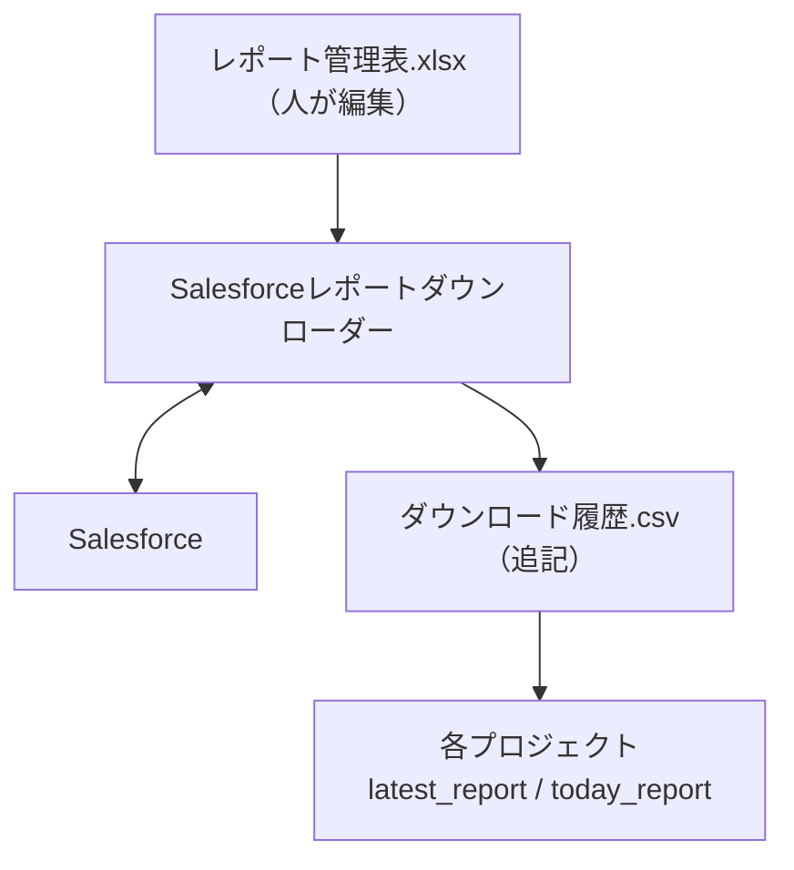

# Salesforce レポートの履歴と読取（salesforce_downloader）

> [!important] 2026-09: 「取る側」と「読む側」をはっきり分けた
> `download_scheduled()`（Salesforce へ実際に取りに行き、履歴へ書く処理）は
> `Salesforceレポートダウンローダー` リポジトリ（`src/`）にある。管理表・
> スケジュール・SOQL レポート・雛形もそちらのリポジトリ。
> **このページで書いているのは、comken 側に残っている「履歴の形式（共有
> 契約）」と「管理番号で取得済みレポートを引く読み取り関数」だけ。**
> 経緯は `comken/services/salesforce_downloader/__init__.py` の履歴メモを参照。

Salesforce の定期取得は「取る側」と「読む側」を分離し、**境界を履歴
（ダウンロード履歴.csv）** にした。取る側はプロジェクト（`Salesforceレポート
ダウンローダー`）にあり、comken は履歴の形式と、管理番号だけで取得済み
レポートを引く読み取り関数だけを残す。管理表を変えても他のプロジェクトは
変えなくてよい。

```
レポート管理表.xlsx（人が編集）        ダウンロード履歴.csv（プログラムが追記）
        ↓                                      ↑
  Salesforceレポートダウンローダー       ──→ Salesforce
        ↓
  各プロジェクト（comken.services.salesforce_downloader の latest_report 等）
```



---

## 使う側（履歴から取得済みレポートを引く）

```python
from comken.services.salesforce_downloader import (
    latest_report,
    today_report,
    has_today_report,
    latest_report_path,
)

CUSTOMER_LIST = "1001"    # 管理表の「ID」。意味の分かる名前を付ける
SALES_RESULT = "1003"

# 履歴が指す最新の取得ファイルを Table で受け取る
by_code = latest_report(SALES_RESULT).index("顧客コード")

# 今日の分だけ取りたいとき
if has_today_report(CUSTOMER_LIST):
    rows = today_report(CUSTOMER_LIST).to_rows()
else:
    # 定期取得が動いていない可能性 — 履歴の「成功」記録が無い
    ...

# 中身が要らずファイルパスだけ欲しいときは latest_report_path()
print(latest_report_path(CUSTOMER_LIST))
```

**プロジェクトのコードに Salesforce の URL もレポート ID も書かない。** 書くのは管理番号だけ。
参照先の Salesforce レポートを差し替えても、`CUSTOMER_LIST = "1001"` はそのままでよい。

戻り値は `Table`（`comken.core.table.model.Table`）。`index()` / `filter()` /
`replace()` / `append()` など、`Table` の API がそのまま使える。CSV / Excel の
読み込みは中で吸収するので、利用側は中身の形式を意識しなくてよい。
ファイルパスだけ欲しいときは `latest_report_path()` を別関数として用意している
（戻り値は `Path`）。

### 4 つの関数の使い分け

| | 意味 | いつ使うか |
|---|---|---|
| `latest_report_path(key)` | 履歴の最も新しい成功行が指すパスを返す（中身は読まない） | ファイル自体を別ツールに渡したいとき |
| `latest_report(key)` | 上記を `Table` で返す | 直近の（当日とは限らない）取得ファイルを読む |
| `today_report(key)` | **今日**成功した履歴のうち最も新しいものを `Table` で返す | 「今日のキャッシュ」が必要なとき。記録が無ければ `ReportNotDownloadedError` |
| `has_today_report(key)` | 今日成功した履歴があり実ファイルも残っていれば True（例外を出さない） | 定期取得が動いているかを履歴だけで判定したいとき |

**「今すぐ取りに行く」関数はここには無い。** 取得の実行（`download_scheduled()`）は
`Salesforceレポートダウンローダー` リポジトリ側にある。急ぎの取得は権限を持つ人が
Salesforce から手動ダウンロードするか、そちらのプロジェクトで `download_scheduled()`
をスケジュール外で直接実行する。

**`latest_report()` 系が自動的に取りに行わない理由**は、ここで自動的に
取りに行くと、定期取得が動いていないことに誰も気づかなくなるため。
「取っておいたものを受け取る」だけの関数として、利用側プロジェクトが必要なとき
だけ明示的に読む。

### 「今日取れているか」を履歴で判定する

`has_today_report()` は履歴だけを見て判定する。保存先に今日の日付のファイルが
あっても、それが定期取得で置かれたのか手で置いたのかは、履歴を正として履歴の
「成功」記録で判断する（ファイルの有無でも判定はしているが、履歴の判定が
真の根拠）。`ReportNotDownloadedError` のメッセージにも「Salesforceレポート
ダウンローダーの定期取得が動いているか、`ダウンロード履歴.csv` を確認する」
と書いてある。

---

## はじめて使うとき（読む側プロジェクトがやること）

履歴を読むだけのプロジェクト側で行う作業はほぼ無い。取る側プロジェクト
（`Salesforceレポートダウンローダー`）が管理表と履歴を置く場所を
`comken/services/salesforce_downloader/paths.py` の `HISTORY_PATH` に書いて、
共有サーバーに配置するだけで、読む側プロジェクトは `latest_report()` /
`today_report()` で取得済みファイルを受け取れる。

取る側・管理表・スケジュール・雛形・検査コマンドの説明は
`Salesforceレポートダウンローダー` リポジトリの README / docs を参照。

---

## 履歴（CSV）

**管理表とは別のファイルにする**（書く主体が人とプログラムで違うものは分ける）。

記録する列（順序はこの通り）:

```
実行日時, 管理番号, スケジュールキー, 概要, レポートID, URL, プロジェクト, 成否,
Salesforce取得結果, 保存結果, 保存先, ファイル名, 取得件数, 処理秒数,
原因区分, エラーコード, エラー内容
```

`download_scheduled()` 1 本になったので、トリガ列（以前の「実行方式」）は廃止した。

**`スケジュールキー`** はその取得を起動したスケジュール行のキー（管理表「スケジュール」
シートの `スケジュールキー` 列と同じ値）。重複実行を防ぐ根拠データで、失敗履歴は
dedup 判定に使わない。スケジュール行に紐付かないレポートの取得（後方互換）は空文字。

`Salesforce取得結果` と `保存結果` は **3状態** を取る（`成功` / `失敗` / 空）。
空はその段階まで到達しなかったことを表す。`エラーコード` には例外クラス名が入り、
メッセージの本文で対処が引ける。

**`原因区分`** は失敗のときだけ入り、誰が動くべきかを5つの値で示す（成功時は空文字）。
例外クラス名との対応表を持たず、履歴の3状態（`Salesforce取得結果` / `保存結果`）
と例外の種類だけから機械的に決めている。

| 区分 | どういう失敗か | 履歴を見た人がやること |
|---|---|---|
| `設定` | 管理表の書き方が悪い、保存先のフォルダが無いなど（取得段階に入る前に落ちる） | **管理表を直す** |
| `Salesforce` | 問い合わせや通信の失敗 | **時間をおいて再実行**。続くなら Salesforce 管理者へ |
| `データなし` | `0件あり` が `×` なのに 0 件だった | **本当に 0 件の日なら**管理表を `○` に。**そうでなければ指している Salesforce レポートが違わないか確認する** |
| `ファイル` | 保存・共有サーバー・権限まわりの失敗 | **共有サーバーとアクセス権を確認** |
| `プログラム` | comken 側の想定外（バグ） | **作った人へ連絡** |

`データなし` が 0 件を一意に指す理由: 取得成功（`True`）を確定してから保存の `try` に入る
までの間に発生しうる例外は `EmptyReportError` だけ。`EmptyReportError` は保存の `try` を
開く**前**に `raise` されるため、この経路で `saved_to_file` は必ず `None` のままである。
つまり `True + None` という組合せは 0 件失敗しか取り得ず、例外クラス名を書かずに
段階で特定できる。

| 何が起きたか | 成否 | Salesforce取得結果 | 保存結果 | 原因区分 | エラーコード |
|---|---|---|---|---|---|
| 保存先フォルダが無い | 失敗 | （空） | （空） | `設定` | `ReportFolderNotFoundError` |
| Salesforce への問い合わせが失敗 | 失敗 | 失敗 | （空） | `Salesforce` | 送出された例外のクラス名 |
| 取得できたが 0 件だった（`0件あり` が `×`） | 失敗 | **成功** | （空） | `データなし` | `EmptyReportError` |
| 取得できたが CSV 書き込みが失敗 | 失敗 | 成功 | 失敗 | `ファイル` | 送出された例外のクラス名 |
| `TypeError` など comken 側の想定外 | 失敗 | 失敗 | （空） | `プログラム` | `TypeError` |
| 正常終了 | 成功 | 成功 | 成功 | （空） | （空） |

0 行のときに `Salesforce取得結果 = 成功` になるのが要点。**Salesforce との通信は成功して
いて、レポートの中身が空だった**ことを区別するため（通信障害と空データの区別が付く）。

**履歴は必須。** 見出し作成・1行追記・読み取りは同じ排他ロックを使う。別プロセスが
同時実行しても行の途中を読まず、一定時間ロックを取れない場合や書込みに失敗した場合は
専用例外（`HistoryLockTimeoutError` / `HistoryWriteError`）で処理を止める。既存履歴の
見出しが現在の列定義と完全一致しない場合は、致命的に壊れた見出し（空の見出し・重複）が
CSV 系の例外（`CSVError`）で止められる。
致命ではない列ずれ（列数が違う／列名が一部欠落／順序が違う）は `migrate_row()` で
新構成に揃え直して読み込みを継続する。

**書き込み** は `append_history()`（共有書き込み）。`COLUMNS` の列名をキーにした
`Mapping` を渡すと、`HistoryFileLock` の中で1行追記する（無い列は空文字、`COLUMNS`
に無いキーは `InvalidTableInputError` 相当のエラー）。書き込み側の実装は
`Salesforceレポートダウンローダー` 側の `record()` がこの `append_history()` を
呼び出す形になる（境界を履歴にしたので、書き込みと読み込みで同じ「履歴の形式」と
同じ「ロック」を共有する）。

---

## 配置するときの設定

履歴の場所は `comken.services.salesforce_downloader/paths.py` に書いてある。
配置するときに実際の場所へ書き換える。取る側（`Salesforceレポートダウンローダー`）
もこの定数を import して書き込むため、書き換えるのはここ1か所だけでよい
（**管理表（`MASTER_PATH`）は 2026-09 にダウンロード側へ移したので、comken 側
のこのファイルにはもう無い**）。

```python
SALESFORCE_DOWNLOADER_FOLDER = Path(r"\\実際のサーバー\share\tools\salesforce")
HISTORY_FILENAME = "ダウンロード履歴.csv"
HISTORY_PATH = SALESFORCE_DOWNLOADER_FOLDER / HISTORY_FILENAME
```

**設定ファイルへ集約せず、使う場所に書く。** 理由と、共有サーバーで書き換えを守る方法は
comken 側のドキュメントを参照。

**利用側の API から `master_path=` / `history_path=` を渡せない。**
この定数は `paths.py` で一元管理する。プロジェクト側に同名のパス定数を作ると、
管理表を直したのに出力先が変わらず、しかもエラーにもならない事故が起きる
（境界を破った典型例）。

---

## どこに書くか（索引）

| やりたいこと | 書く場所 |
|---|---|
| レポートを1本足す／やめる | 管理表（Excel）だけ。コードは触らない（管理表はダウンローダー側） |
| 参照先の Salesforce レポートを差し替える | 管理表の「Salesforce URL」（ダウンローダー側） |
| 取得の履歴の列・読み取り方を変える | `history.py` ← **全プロジェクトに効く**（書き込みは Salesforceレポートダウンローダー） |
| 履歴の置き場所を変える | `paths.py` の `HISTORY_PATH` |
| 取ったCSVを加工する・DBへ入れる・通知する | 利用プロジェクト |
| 取得の実行を変える | Salesforceレポートダウンローダー（`src/service.py`） |
| Salesforce の認証・API の叩き方を変える | `comken/toolbox/salesforce/`（Downloader ではない） |
| 接続先の組織を足す | `comken/toolbox/salesforce/sites/` |
| 管理表・スケジュール・SOQLレポート・雛形・検査コマンド | Salesforceレポートダウンローダー |

右列に「**全プロジェクトに効く**」と書いているのは、軽く触ってよい場所と、触ると全
プロジェクトへ影響する場所を**見た目で区別するため**。各ファイル docstring の
「このファイルが持つもの／ここに書かないもの」がこの境界を定義する正本で、
ここ（docs）は索引に徹する。責任範囲の説明が2箇所にあると片方だけ直されて食い違うため。
