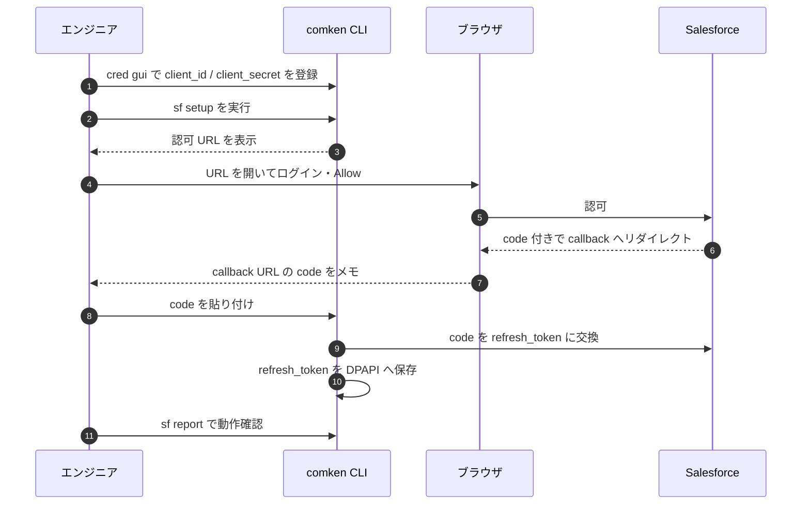

# Salesforce authentication decisions

この文書は、`comken.toolbox.salesforce` の認証方式を社内で説明するための判断記録です。
Salesforce の公式発表・仕様と、それを受けた comken 側の判断を分けて記載します。

最終確認日: 2026-08-13

## 結論

- 新規の連携アプリには **External Client App（ECA）** を使う。
- 無人バッチの認証は **Authorization Code + Refresh Token Flow**。**これが既定**で、
  組織クラスをそのまま使えばこの方式になる（`with Solution() as sf:`）。
- **Client Credentials Flow は本番で使わない。** ECA 側でも無効にする。
  `client_secret` だけでアクセストークンを取れてしまい、漏えいすると実行ユーザーとして
  操作されるため（→ 次の節）。
- 実行専用ユーザーを割り当て、権限はそのユーザー側で最小限にする。
- `client_id` / `client_secret` / `refresh_token` はコードや `config.ini` に書かず、
  Windows DPAPI で保管する。
- アクセストークンの期限を予測せず、401 を受けたときだけ再取得して1回再試行する。
- JWT Bearer Flow は将来の移行候補として残す。

## 最重要: secretが漏えいしたときの違い

comken は両方を実装していたが、**既定は Refresh Token Flow**
（`client.py` が `oauth_refresh` を import している）。
下の表がその理由で、**この差だけで既定を決めている**。

> [!note] 補足（2026-09-08）
> Client Credentials Flow は社内運用上もう使えないため、comken からも
> コード（`oauth_credentials.py` / `ClientCredentialsOAuth`）を削除した。
> 残している判断記録（漏えい時の挙動・既定採用の経緯）は、
> 「過去の判断を消さない」というリポジトリの慣習に基づきそのまま残している。

| 有効な認証フロー | `client_id + client_secret`だけが漏えい | 結果 |
|---|---|---|
| Client Credentials Flow | 2値だけでトークンを要求できる | **危険。実行ユーザーとしてアクセス可能** |
| Web Server / Authorization Code Flow + Refresh Token | `refresh_token`か新しい認可コードが別途必要 | 2値だけでは通常アクセスできない |
| JWT Bearer Flow | `client_secret`を使わず、秘密鍵署名が必要 | 2値だけではアクセスできない |

Refresh Token方式へ切り替える場合は、**Client Credentials Flowを無効にする**。同じECAで
Client Credentials Flowを有効にしたままでは、Refresh Tokenを併用しても、漏えいした
`client_id + client_secret`だけでアクセストークンを取得できる入口が残る。

社内要件が「ICSによるsecret更新を減らし、こちらでtokenを管理する」ことであれば、候補は次の構成。

1. Web Server / Authorization Code Flowを有効にする。
2. Client Credentials Flowを無効にする。
3. Refresh Token Rotationを有効にする。
4. `Require Secret for Refresh Token Flow`を有効にする。
5. client secretとrefresh tokenを別々に保護する。

この構成では、secret単独またはrefresh token単独の漏えいでは更新できず、両方が必要になる。
ただし、社内90日規定がclient secret自体に適用される場合の更新義務は別問題として残る。

Refresh Token Rotationは、使用するたびに古いrefresh tokenを無効化して新しいtokenへ交換する
仕組みであり、漏えいしたtokenの再利用期間を短くできる。一方、アクセストークンやrefresh tokenの
有効期限ポリシーはSalesforce管理者側の設定で決まり、クライアントプログラムが任意の秒数を指定
するものではない。

- [Rotate Refresh Tokens](https://help.salesforce.com/s/articleView?id=release-notes.rn_security_refresh_token_rotation.htm&language=en_US&type=5)
- [Manage OAuth Access Policies](https://help.salesforce.com/s/articleView?id=sf.connected_app_manage_oauth.htm&language=en_US&type=5)

## 1. なぜ External Client App なのか

### Salesforce の公式発表・仕様

Salesforce は Spring '26 から新規 Connected App の作成を制限しています。既存の Connected App
は継続利用できますが、新規開発では External Client App が推奨されています。

- [Enable OAuth Settings for API Integration](https://help.salesforce.com/s/articleView?id=connected_app_create_api_integration.htm&language=en_US)
- [New Connected Apps Can No Longer Be Created in Spring '26](https://help.salesforce.com/s/articleView?id=005228017&language=en_US&type=1)
- [External Client Apps](https://help.salesforce.com/s/articleView?id=xcloud.external_client_apps.htm&language=en_US&type=5)

ECA は、開発者が決めるOAuth設定と、各組織の管理者が決める実行ユーザー・セッションなどの
ポリシーを分離する仕組みです。

- [Secure Your Org with External Client Apps（Salesforce Developers Blog）](https://developer.salesforce.com/blogs/2025/01/secure-your-org-with-external-client-apps)

### comken 側の判断

今回の連携アプリは新規作成するため、旧方式を前提にせずECAを標準にします。組織ごとの管理者が
実行ユーザーとポリシーを管理できる点も、複数組織へ同じライブラリを配る構成と合っています。

補助解説:

- [External Client Apps in Salesforce Spring '26: A Practical Migration Guide](https://dev.to/dipojjal/external-client-apps-in-salesforce-spring-26-a-practical-migration-guide-37o0)

## 2. なぜ Refresh Token Flow を既定にするのか

### 一度は Client Credentials Flow を選び、撤回した

当初はこちらを採用していた。無人実行に最も素直に合うためで、判断の材料はこの表だった。

| 要件 | Client Credentials Flow での扱い |
|---|---|
| 夜間・無人実行 | ブラウザーでのログインや同意操作が不要 |
| Salesforce パスワードを保存しない | `client_id` / `client_secret` だけを使う |
| リフレッシュトークンを管理しない | 保管・失効監視・再同意の運用が不要 |
| 操作権限を説明できる | ECA に指定した実行ユーザーの権限として監査できる |

**この表は今も正しい。運用の手間だけで見れば Client Credentials Flow の方が軽い。**
撤回したのは、手間ではなく**漏えいしたときに何が起きるか**で決め直したため。

> [!note] 補足（2026-09-08）
> 実際の決め手は、上の「漏えい時の被害範囲」に加えて**運用上の理由がもう一つある**。
> `client_secret` の再発行には社内の IT システム部門への承認申請が必要で、
> Salesforce 側の secret ローテーション要件（30〜60 日程度の短い周期）に
> 合わせて毎回申請するのは手間が大きい。Refresh Token であれば、
> こちら側だけで完結する「パスワード変更」に近い運用ができ、
> IT システム部門への申請が要らない。**この運用上の理由と、上記の漏えい時
> 被害範囲の違いの両方が、Refresh Token Flow を既定にした決め手。**
> 「撤回したのは手間ではなく」という上の文は、**Client Credentials Flow
> 自体の日々の運用の手間（表内の4項目）と比べた話**であり、
> secret のローテーション申請という**別の運用コスト**は別途あった。

`client_id` と `client_secret` の2値が漏れた場合の違い:

| 有効なフロー | 2値だけが漏れたとき |
|---|---|
| Client Credentials Flow | **その2値だけでアクセストークンが取れる**。実行ユーザーとして操作できる |
| Refresh Token Flow のみ | `refresh_token` か新しい認可コードが別途要る。2値だけでは通常アクセスできない |

comken は秘密の値を DPAPI に置くが、**DPAPI は同じ Windows ユーザーなら復号できる**。
運用担当者の PC が侵害されたとき、被害が「値を読まれる」で止まるか
「Salesforce を操作される」まで届くかの差になる。ここは運用の手間より重いと判断した。

### 引き換えに受け入れたもの

- 初回に**対話的な認可が1回だけ必要**（`authorization_url()` で URL を作り、
  ブラウザーで承認して `exchange_code()` に渡す）
- `refresh_token` の保管と失効監視が増える
- 設定によっては更新時にも `client_secret` が要る

いずれも初回と例外時の作業で、日々の無人実行には出てこない。
Refresh Token Rotation を有効にすると、更新のたびに新しい token へ入れ替わる。
comken は受け取った新しい token を DPAPI へ**自動で書き戻す**ので、
運用としてやることは増えない。

### Client Credentials Flow を残してある理由（歴史的記録）

**開発中に手元で動かすときだけ**使う想定だった。初回の対話的な認可を
挟まずに済むため、動作確認の回転が速い。使うときは既定を上書きして
明示的に渡す。

> [!note] 補足（2026-09-08）
> Client Credentials Flow は社内の運用上もう使えないため、comken からも
> コード（`oauth_credentials.py` / `ClientCredentialsOAuth`）を削除した。
> 上記の「本番では使わない。ECA 側でも無効にする」という判断は**今も有効**で、
> 歴史的記録として残している。

> [!note] 補足（2026-09-10）
> 「開発中に手元で動かすときだけ使う」という前提は撤回。**開発中も使わない**
> （sf setup の初回認可が `sf setup` を実行するだけで自動化された（OAuthリダイレクト
> の自動受信・PKCE対応）ため、Client Credentials Flow で省ける手間自体が無くなった）。
> この節はコードが既に削除済みであることも含め、判断の経緯を残すための
> 歴史的記録に留める。

**本番では使わない。ECA 側でも無効にする。** 有効なまま残すと、
Refresh Token Flow を併用していても、漏えいした2値で入れる入口が残る。

### Salesforce の公式仕様

Client Credentials Flow は、ユーザーが画面でログインしないサーバー間連携用です。Salesforceでは
ECAに実行ユーザーを指定し、そのユーザーとしてアクセストークンを発行します。

- [Configure a Client Credentials Flow](https://help.salesforce.com/s/articleView?id=xcloud.configure_client_credentials_flow_for_external_client_apps.htm&language=en_US&type=5)
- [Configure Client Credential Flow Policies](https://help.salesforce.com/s/articleView?id=xcloud.policies_configure_client_credentials_flow_for_external_client_apps.htm&language=en_US&type=5)
- [OAuth 2.0 Client Credentials Flow for Server-to-Server Integration](https://help.salesforce.com/s/articleView?id=xcloud.remoteaccess_oauth_client_credentials_flow_ca.htm&language=en_US&type=5)

Salesforceのトークン資料では、リフレッシュトークンを要求できるフローとしてUser-Agent Flowと
Web Server Flowが説明されています。Client Credentials Flowは、必要時に同じ認証フローを再実行して
新しいアクセストークンを得る設計です。

- [OAuth Tokens and Scopes](https://help.salesforce.com/s/articleView?id=remoteaccess_oauth_tokens_scopes.htm&language=en_US&type=5)

## 3. なぜ Username-Password Flow ではないのか

Username-Password Flow は、Salesforce ユーザーのパスワードを自動処理環境へ置く必要が
あります。「パスワードを保管しない」という要件に反するため採用しません。

Refresh Token Flow を選んだ代償（長期トークンの保護・失効ポリシー・初回の対話的な認可）は
2章に書いたとおりで、設定によっては更新時にも client secret が必要です。

- [Manage OAuth Access Policies for a Connected App](https://help.salesforce.com/s/articleView?id=sf.connected_app_manage_oauth.htm&language=en_US&type=5)
- [Require Secret for Refresh Token Flow](https://help.salesforce.com/s/articleView?id=xcloud.shr_security_require_secret_for_refresh_token_flow.htm&language=en_US&type=5)

### 社内の90日変更規定との関係

SalesforceはClient Credentials Flowの公式説明で、consumer keyとconsumer secretを持つ者が
アクセストークンを取得できることと、secretを定期的に変更し、漏えい時は直ちに変更する必要を
案内しています。また、公式リリースノートでkey / secretのローテーション機能を公開しています。

- [OAuth 2.0 Client Credentials Flow for Server-to-Server Integration](https://help.salesforce.com/s/articleView?id=xcloud.remoteaccess_oauth_client_credentials_flow.htm&language=en_US&type=5)
- [Rotate the Consumer Key and Consumer Secret](https://help.salesforce.com/s/articleView?id=release-notes.rn_security_consumer_details_rotate.htm&language=en_US&type=5)

補助解説:

- [How to configure a Connected App for the OAuth 2.0 Client Credentials Flow?](https://www.sfdc-lightning.com/2023/08/How-to-configure-a-Connected-App-for-the-OAuth-2.0-Client-Credentials-Flow.html)

Salesforceは「定期的に」としており、90日という周期までは指定していません。社内規定の
「パスワード等を90日ごとに変更」がclient secretにも適用されるかは、社内の情報セキュリティ
担当へ確認する必要があります。適用される場合、comkenでも90日以内のローテーションが必要です。

Refresh Token Flowへ変更しても、この問題が必ず消えるわけではありません。Salesforceの
`Require Secret for Refresh Token Flow`を有効にした構成では、アクセストークンの更新時に
次の3つが必要です。

- `client_id`（consumer key）
- `client_secret`（consumer secret）
- `refresh_token`

つまり、アクセストークンとリフレッシュトークンだけでは更新できず、client secretを90日で
変える規定が適用されるなら、Refresh Token Flowでも同じローテーション作業が残ります。

ただし、これはSalesforce側の設定に依存します。`Require Secret for Refresh Token Flow`を無効に
できる構成ではrefresh時のsecretを省略できます。また、JWT Bearer Flowは`client_id`を使いますが、
共有`client_secret`の代わりに秘密鍵で署名します。したがって「全OAuth方式でclient secretが
絶対必須」ではなく、「現在のClient Credentials Flowと、secret必須設定のRefresh Token Flowでは
必須」と説明するのが正確です。

## 4. なぜJWT Bearer Flowを今すぐ使わないのか

JWT Bearer Flowもサーバー間連携に適しており、共有client secretの代わりに証明書と秘密鍵を
使えます。SalesforceはECA向けの設定手順を公開しています。

- [Configure OAuth 2.0 JWT Bearer Flow for External Client Apps](https://help.salesforce.com/s/articleView?id=xcloud.meta_configure_oauth_jwt_flow_external_client_apps.htm&language=en_US&type=5)

comkenでは認証処理を独立部品にしているため、将来JWTへ交換できます。ただし現時点では、
秘密鍵の配布・更新・失効、証明書の期限管理、オフライン環境への暗号ライブラリ導入について
社内運用が確定していません。まず既に利用可能な依存関係でClient Credentials Flowを運用し、
鍵管理の体制が決まった時点でJWT移行を再評価します。

## 5. secretの保管とローテーション

`client_secret` はコード、Git、`config.ini`、ログへ書きません。`comken.toolbox.credentials` がWindows
DPAPIで暗号化し、登録したWindowsユーザーとPCに紐付けて保存します。これは共有配布の仕組み
ではないため、実行PCごとに登録が必要です。

Salesforceはconsumer key / secretのローテーション機能を提供しています。ECAではConnect REST
APIからstaged credentialsを作成できるため、新旧資格情報を切り替える実装が可能です。

- [OAuth Staged Credentials — Connect REST API](https://developer.salesforce.com/docs/atlas.en-us.chatterapi.meta/chatterapi/connect_resources_oauth_credentials_staged_credentials.htm)
- [OAuth Credentials by Consumer ID — Connect REST API](https://developer.salesforce.com/docs/atlas.en-us.chatterapi.meta/chatterapi/connect_resources_credentials_by_app_and_consumer_id.htm)
- [Use REST API for Access to External Client App OAuth Credentials](https://help.salesforce.com/s/articleView?id=release-notes.rn_security_eca_use_rest_api_for_creds_ru.htm&language=en_US&type=5)

実装では「新しい資格情報を発行 → DPAPIへ保存 → 新資格情報で認証確認 → 旧資格情報を失効」の
順を守ります。保存や認証確認に失敗した場合は旧資格情報を残し、無人処理が同時に止まることを
避けます。

補助解説:

- [Salesforce External Client App key and secret rotation via REST API](https://lekkimworld.com/2025/09/24/salesforce-external-client-app-key-and-secret-rotation-via-rest-api/)

## 6. 管理者へ依頼する内容

1. 組織ごとにECAを作成する。
2. OAuthスコープは必要最小限にする。
3. Client Credentials Flowを有効化する。
4. API専用の実行ユーザーを指定する。
5. 実行ユーザーへ必要なオブジェクト・項目・レポートだけを許可する。
6. secretの共有方法とローテーション担当を決める。

## 関連文書

- [salesforce.md](../salesforce.md) — Salesforce連携全体の設計と使い方
- [credentials.md](../credentials.md) — comkenでの認証情報保管

---

# Refresh Token 認証のやり方 (how to)

開発環境で **Refresh Token Flow** の認証を通すまでの手順。
本番の無人実行に入る前に 1 度だけ実行する対話的なフロー。

## 0. 前提

- comken がインストールされている (本ドキュメントが同封の v0.10.0 以降)
- Salesforce 側で **External Client App (ECA)** が作成済み
  - 「OAuth 設定」ページで **Authorization Code + Refresh Token Flow を有効化**
  - 「Client Credentials Flow」は **無効化** (既定) — 共存させると secret 単独漏えいの入口が残る
  - 「Refresh Token Rotation」を有効化 (推奨)
  - 「Require Secret for Refresh Token Flow」を **無効化** (comken の既定)
  - Callback URL に `http://localhost:8080/callback` を設定 (後述の `http_server` 方式)
- comken を実行する Windows ユーザーと、ECA を作成した管理者が別の場合は事前に連携

## 手順全体の流れ

本セクション 1〜6 を 4 つの登場人物で通した全体像。



## 1. ECA の client_id / client_secret を DPAPI に登録

まず `client_id` と `client_secret` を comken の資格情報ストアに入れる。

```powershell
python -m comken cred gui
```

- **サイト名**: 組織クラス (例: `Solution`) の `CREDENTIAL_PREFIX`
  （デフォルトは組織名そのまま。`solution` / `solution_sandbox` など）
- **項目名**: `api_client_id`
- **値**: ECA の「Consumer Key」 (Salesforce 画面でコピー)
- 続けて **項目名 `api_client_secret`** を「Consumer Secret」で登録
  （`Credentials(prefix).api_client_id` / `.api_client_secret` で読める）

登録したかは `python -m comken cred list` で確認できる。

> [!note] 補足（2026-09-10）
> 項目名は `52adbdb`（DPAPI項目名に`api_`接頭辞を付ける）より前は
> `client_id` / `client_secret` / `refresh_token`（接頭辞なし）だった。
> その時期に登録した環境では `sf setup` が
> `認証情報が登録されていません: {prefix}.api_client_id` で失敗し、
> 「登録済みのキー名」に `{prefix}.client_id` が並ぶ形でつまずく。
>
> 値を画面に出さずに、その場で新しい項目名へ移行できる（同じ PC・同じ
> Windows アカウントで実行する）。

```python
from comken.toolbox.credentials import list_names, load_credential, save_credential, delete_credential

RENAMES = {
    "client_id": "api_client_id",
    "client_secret": "api_client_secret",
    "refresh_token": "api_refresh_token",
}
for site, field in list_names():
    if field in RENAMES:
        save_credential(site, RENAMES[field], load_credential(site, field))
        delete_credential(site, field)
        print(f"{site}.{field} -> {site}.{RENAMES[field]}")
```

実行後は `python -m comken cred list` で `api_client_id` / `api_client_secret`
に変わったことを確認してから、もう一度 `sf setup` を試す。

## 2. 初回認可 (authorization_url)

ブラウザで ECA に「comken がこの組織にアクセスしていい」と 1 回だけ承認する。

> [!note] PKCE（2026-09-10）
> Salesforce は Authorization Code Flow で PKCE（RFC 7636）を必須にしている。
> `authorization_url()` は毎回ランダムな `code_verifier` を生成して
> `code_challenge` を認可 URL に含め、`exchange_code()` へそのまま渡す
> （`AuthorizationRequest.code_verifier`）。呼び出し側で意識する必要はない
> （`sf setup` を含め、この文書の手順はそのまま通る）。

`comken.toolbox.salesforce.sites.SITES` に登録されている組織から、**番号または
組織名（大文字小文字を区別しない）で**選んで `setup` を実行する。`--domain`
や `--prefix` はこのコマンドでは使わない（組織はこのコマンド自身が選ばせるため）。

```powershell
python -m comken sf setup
```

対話選択をスキップしたいときは `--site <番号|組織名>` を渡す:

```powershell
python -m comken sf setup --site 1
```

実行すると:

1. 登録済みの組織が `1. ... 2. ...` の形で表示される。**番号か組織名を入力**する
2. 選択した組織の prefix で DPAPI から client_id / client_secret を読む
3. ECA の認可 URL を組み立てて画面に出し、ブラウザを自動で開く
4. `CALLBACK_URL` が `localhost`（既定）なら、承認後のリダイレクトを
   **自動で受け取り**、そのまま `refresh_token` を DPAPI へ保存する

コピペの手間は無い。ブラウザで Salesforce にログインし「Allow」（許可）を
押すだけで、あとは comken が自動で受け取って完了する。

このコマンドは 1 回実行するたびに「URL を表示 → ブラウザを開く → 自動で
受け取り → refresh_token を保存」までをまとめて行う。途中で止めたくなったら
`Ctrl+C` で中断すれば refresh_token は保存されない（途中で失敗したら
`<prefix>_refresh_token` は**未登録のまま**。手順 2 からやり直す）。

> [!note] 自動受け取りが失敗したとき
> ポートが他のプロセスに使われている等で自動受け取りに失敗した場合は、
> 「自動受け取りに失敗しました」と表示され、手動貼り付けに切り替わる。
> このとき貼り付けるのは **リダイレクトされた URL 全体**（アドレスバーを
> 選択してコピペしたもの）でよい（`code=` の後ろだけを切り出す必要はない。
> 認可コードは `=` を含むことが多く、切り出しは貼り間違いの元だったため
> 廃止した）。`CALLBACK_URL` が `localhost` でない組織（社内で公開した
> callback URL を使う場合）も、最初から同じ手動貼り付けになる。

## 3. refresh_token への交換（自動）

手順 2 の `setup` の中で自動的に行われる。ブラウザでの操作:

- 自動で開いたブラウザで、ECA を許可する組織のユーザーでログイン
- 「Allow」（許可）をクリック
- あとは自動。出力に
  `refresh_token を DPAPI に保存しました（<prefix>_refresh_token）` が出れば
  完了（別途 `cred gui` で登録し直す必要はない）

内部では `RefreshTokenOAuth.exchange_code(..., prefix=<prefix>)` を呼び、
受け取った refresh_token は `from_credentials` と同じ書き戻し先
（`<prefix>_refresh_token`）へ自動で DPAPI 保存される。書き戻し用の関数を
毎回手書きする必要はない。別の組織で `setup` を実行すれば、それぞれの
`<prefix>_refresh_token` に別々に保存される。

## 4. 動作確認

```powershell
python -m comken sf report --report-id 00O...
```

`--site` で組織を直接指定してもよい:

```powershell
python -m comken sf report --site 2 --report-id 00O...
```

- 0 エラーなら OK
- 401 が返ったら、`<prefix>_refresh_token` が **古い/期限切れ**の可能性。
  手順 2 からやり直す (手順 3 が DPAPI への保存まで自動で行うので、やり直すのはここまで)

## 5. 無人実行への移行

ここまでの設定が完了すれば、`Solution()` をそのまま使うスクリプトは
**誰もログインしていない状態でも** 動く:

```python
from comken.toolbox.salesforce.sites import Solution

with Solution() as sf:
    rows = sf.query("SELECT Id, Name FROM Account LIMIT 10")
```

`client_id` / `client_secret` / `refresh_token` のいずれかが **コードに現れない** ことが
この手順のゴール。**Windows DPAPI** に守られた値だけが、組織を操作する。

## 6. 失効時の対応

`refresh_token` を revoke / 失効させたい:

1. ECA 画面で「Revoke」操作
2. もしくは ECA を作り直す
3. **手順 2 からやり直す**

Refresh Token Rotation を有効にしている場合、**`comken` が新しい `refresh_token` を
受け取ったタイミングで DPAPI に自動で書き戻す** (`oauth_refresh.py` の
`_on_refresh_token_via_credentials()` / `_on_refresh_token_via_prefix()`)。
運用としてやることは増えない。

## 7. Client Credentials Flow を使う場合 (歴史的記録・現在は使わない)

Refresh Token Flow の **対になる形**で、初回認可が要らない代わりに
`client_secret` 単独で操作できる (本番で使わない理由は
`docs/開発/salesforce-authentication.md` の冒頭を参照)。

> [!note] 補足（2026-09-08）
> Client Credentials Flow は社内の運用上もう使えないため、comken からも
> コード（`oauth_credentials.py` / `ClientCredentialsOAuth`）を削除した。
> 「本番では使わない」という判断は今も有効で、節は歴史的記録として残している。

> [!note] 補足（2026-09-10）
> 「開発中だけ使う」という前提も撤回。**開発中も使わない。** `sf setup` の
> 初回認可が自動化された（OAuthリダイレクトの自動受信・PKCE対応）ため、
> このフローで省けていた手間自体が無くなった。

**本番でも開発中でも使わない。**

## 8. トラブルシュート

| 症状 | 確認 |
|---|---|
| `INVALID_CLIENT_ID` | `python -m comken cred list` で `<prefix>_client_id` を確認。ECA の Consumer Key と一致するか |
| `INVALID_CLIENT_SECRET` | 同様に `<prefix>_client_secret` を確認 |
| `INVALID_AUTH_CODE` | authorization_url で取得した `code` を 10 分以上放置した。手順 2 からやり直す |
| `invalid_grant` / `invalid_request`（PKCE 関連） | `authorization_url()` が返した `AuthorizationRequest` の `code_verifier` を `exchange_code()` に渡さず、別の実行の値を使い回した。1回の `sf setup` 実行内で完結させ、手順 2 からやり直す |
| `UNSUPPORTED_GRANT_TYPE` | ECA のフロー設定で Authorization Code + Refresh Token Flow を有効にしているか |
| `INVALID_REFRESH_TOKEN` | refresh_token を revoke 済み。手順 2 からやり直す |
| 401 が返る (refresh_token は新しい) | ECA で「Manage Refresh Tokens」を開き、過去トークンの状態を確認 |
| 連携アプリが見つからない | ECA のパッケージ / 組織を確認。`Solution.DOMAIN_URL` と一致するか |

