# comken 仕様書（エンジニア向け）

各モジュールの使い方（コード例）は README.md、コーディング規約は CONVENTIONS.md を参照。
この文書はライブラリの設計方針・ユースケース・設計判断を記録する。

## 目次

1. [概要と設計方針](#1-概要と設計方針)
2. [全体構成](#2-全体構成) … モジュール一覧・依存関係
3. [ユースケース](#3-ユースケース)
4. [主要な設計判断](#4-主要な設計判断)
   - 4.1 config.ini は非機密のみ・大文字
   - 4.2 ブラウザ設定は config.ini ではなくクラス変数
   - 4.3 Excel / Excel と ExcelCOMHandler の使い分け
   - 4.4 見つからない・失敗はデフォルトで例外
   - 4.5 NAS 上の Excel を同時更新する場合の制約
   - 4.6 例外は1つの失敗につき1クラス
   - 4.7 Excel の読み取りを共通基底に置く
   - 4.8 公開 API は最小限
   - 4.9 シート操作は Sheet に集約する
   - 4.10 テーブルは定義を壊さず、中のデータを操作する
   - 4.11 ログ設定は持たない
   - 4.12 日時は PC のローカルタイムゾーンで扱う
   - 4.13 Access は CSV 直接出力を主役にする
   - 4.14 Access は既定でローカルコピーを開く
   - 4.15 元 DB を更新する場合は、ローカルコピーを書き戻さない
   - 4.16 元 DB を直接開く前に日時付きバックアップを取る
   - 4.17 Outlook は Classic のみ対応し、送信しない
   - 4.18 補助関数より本体が受け入れる
   - 4.19 社内ライブラリの呼び出しは comken が吸収する
   - 4.20 キーで引く操作は「1件」と「複数件」をメソッドで分ける
   - 4.21 config.ini が無ければ example から作り、そこで止める
   - 4.22 config.ini のセクション名・キー名は大文字を強制する
   - 4.23 MAPPING セクションは列名をデータとして保持する
   - 4.24 state.ini は設定と分離し、dry-run では書かない
   - 4.25 Excel 転記は列位置版と列名版を分ける
   - 4.26 Salesforce は読み取りが主用途で、書き込みは Data Loader に任せる
   - 4.27 部品と仕組みを toolbox / services に分ける
   - 4.30 層を「直下 / core / toolbox / services」の4段にする
   - 4.31 utils を解体し、core は `_` を付けずに残す
   - 4.32 公開 API を「基本入口」と「部品」の2階層にする
   - 4.33 サイト／組織クラスには OWNER を必須にする
   - 4.34 デバッグモードは「開始/完了/中断」を出し、引数は出さず、`with debug():` だけで切り替える
   - 4.35 祝日判定は「内閣府 CSV + 会社休日」の和集合で持つ
5. [例外体系](#5-例外体系)
6. [動作環境・依存](#6-動作環境依存) … 必須・オプション依存の一覧
7. [テスト](#7-テスト) … カバー範囲・契約テスト・未テスト領域
8. [参照・運用](#8-参照運用)
   - 配置時に書き換える3ファイル
   - 参照方式（共有サーバーを直接参照）
   - 開発とリリース … 日々の開発・リリース手順・ロールバック・共有サーバーの注意
   - 互換性ポリシー
   - パッケージ名の確定

---

## 1. 概要と設計方針

社内業務自動化（Excel・CSV・ブラウザ・Windows 操作）の共通処理を集めたライブラリ。
マクロ（VBA）で行っていた業務の Python 移行を主な用途とする。

| 方針 | 内容 |
|---|---|
| 可読性最優先 | 短く賢いコードより、半年後に読めるコード。bool 引数よりメソッド名で意味を表す |
| 非エンジニア協業前提 | エラーメッセージに対処法を含める。設定値は config.ini で管理する |
| オフライン環境で動く | 社内 BO 環境では pip が使えない。依存は最小限にし、標準ライブラリを優先 |
| 失敗は早く・明確に | 必要なファイルがなければ即例外。エラーを握りつぶさない |
| YAGNI | 3箇所で同じ処理が出るまで共通化しない（今後絶対使うものは例外） |

---

## 2. 全体構成

層の定義は §4.30 を参照。

```mermaid
graph TD
    subgraph 直下
        exceptions["exceptions\n例外体系"]
        constants["constants\n公開定数"]
        runtime["runtime\n実行モード"]
    end
    subgraph core
        config["config\nINI読み込み"]
        logger["logger\nログ設定"]
        state["state\n状態の永続化"]
        clock["clock\nローカル日時"]
        text["text\nテキスト正規化"]
        data["data\n差分/型変換"]
        retry["retry\nリトライ"]
        timer["timer\n処理時間"]
        wait["wait\n待機"]
        files["files\n検索/操作/圧縮/命名"]
        naming["files.name\n命名方式"]
        table["table\nTable/TableComparison/Transfer"]
    end
    subgraph toolbox
        csv["csv\nCSV/Writer"]
        excel["excel\nExcel/Excel(openpyxl)"]
        access["access\nAccessDatabase(COM)"]
        outlook["outlook\nOutlook/MailMessage(COM)"]
        windows["windows\nExcelComHandler/Paths/Registry"]
        browser["browser\nBrowsers/PageObject"]
        browser_sites["browser.sites\nライブラリ公認サイト"]
        salesforce["salesforce\nSalesforce API"]
        rpa["rpa\n社内RPA基盤呼び出し"]
        credentials["credentials\n認証情報の暗号化保存"]
    end
    comken["comken（直下のfacade）"]
    excel -->|既存数式の結果・マクロ時フォールバック| windows
    config --> exceptions
    config --> files
    browser --> clock
    files --> constants
    files --> exceptions
    files --> runtime
    files --> clock
    windows --> exceptions
    windows --> constants
    windows --> data
    windows --> files
    access --> exceptions
    access --> constants
    access --> runtime
    access --> files
    access --> clock
    access --> naming
    outlook --> exceptions
    outlook --> runtime
    outlook --> clock
    data --> exceptions
    excel --> exceptions
    excel --> runtime
    excel --> data
    excel --> timer
    excel --> table
    excel --> files
    csv --> exceptions
    csv --> constants
    csv --> runtime
    csv --> data
    csv --> timer
    csv --> files
    credentials --> exceptions
    credentials --> files
    salesforce --> credentials
    salesforce --> exceptions
    salesforce --> runtime
    salesforce --> clock
    rpa --> exceptions
    logger --> runtime
    logger --> clock
    state --> exceptions
    state --> runtime
    state --> files
    naming --> clock
    browser_sites --> browser
    comken --> core
    comken --> runtime
```



| モジュール | 層 | 責務 | 依存 |
|---|---|---|---|
| `exceptions` | 直下 | ライブラリ固有の例外定義（`ComkenError` 基底） | なし |
| `constants` | 直下 | `Encoding` / `Color` / `FileFormat` の公開定数 | なし |
| `runtime` | 直下 | 実行モード（debug: 処理時間を DEBUG ログ / dry_run: 外部影響のある操作をスキップ）。バージョンは comken.__version__（定義はここ1箇所。pyproject は dynamic version で参照） | なし |
| `core.config` | core | config.ini を `config.SECTION.KEY`（大文字）で読む | 標準のみ |
| `core.logger` | core | 日付別ファイルとコンソールへのログ設定 | runtime・core.clock |
| `core.state` | core | state.ini への処理状態の保存・読み込み | exceptions・runtime・core.files |
| `core.clock` | core | PC のローカルタイムゾーン付き現在時刻・今日の日付 | 標準のみ |
| `core.text` | core | 業務データの表記揺れ（NFKC・全角スペース）の正規化 | 標準のみ |
| `core.data` | core | 列レター⇔番号、辞書同士の差分（CSV/Excel 横断） | exceptions |
| `core.retry` | core | 一時的な失敗の自動再実行 | 標準のみ |
| `core.timer` | core | 経過秒数の計測（`Timer` / `measure`） | runtime |
| `core.wait` | core | 秒・分・条件成立までの待機、ファイル出現待ち (`wait_for_file`) | 標準のみ |
| `core.files` | core | ファイル検索・操作・圧縮・命名方式 | exceptions・runtime・constants・core.clock |
| `core.files.name` | core | 命名方式（DateNameBuilder のみ。1〜2個ならファイル1つに集約） | core.clock |
| `toolbox.credentials` | toolbox | Windows DPAPI による認証情報の暗号化保存・読み込み・JSON 取り込み | pywin32・exceptions・core.files |
| `toolbox.csv` | toolbox | CSV の読み書き・検索・索引化 | 標準のみ |
| `toolbox.excel` | toolbox | Excel 読み書き（openpyxl）。既存数式の結果・マクロは windows へフォールバック | openpyxl |
| `toolbox.access` | toolbox | Access マクロ・VBA・保存済みクエリ実行、テーブル／クエリの CSV 出力・逐次読み取り | pywin32・Microsoft Access |
| `toolbox.outlook` | toolbox | Classic Outlook の受信メール読み取り・下書き作成 | pywin32・Classic Outlook |
| `toolbox.windows` | toolbox | Excel COM・ウィンドウ・レジストリ操作・標準フォルダ（Paths） | pywin32 |
| `toolbox.browser` | toolbox | Edge WebDriver・Page Object 基盤 | selenium |
| `toolbox.browser.sites` | toolbox | ライブラリ公認のブラウザ対象サイト（`SiteBase` サブクラスを集めた置き場） | toolbox.browser |
| `toolbox.salesforce` | toolbox | Salesforce API の認証・データ操作・レポート実行・認証情報ローテーション | requests・toolbox.credentials・exceptions・runtime・core.clock |

原則: **上のモジュールは下（基盤）に依存してよいが、基盤は業務モジュールに依存しない。**

ログの設定（出力先・フォーマット・レベル）は社内の共通ライブラリ側で行う。
comken と利用プロジェクトは `logging.getLogger(__name__)` を使うだけでよい。

---

## 3. ユースケース

| ID | 業務シナリオ | 使用モジュールの流れ |
|---|---|---|
| UC1 | NAS 上の当日 Excel を加工して出力 | `DateFileFinder.prefix` → `Excel`（大容量は自動ローカルコピー）→ 加工 → `save` |
| UC2 | CSV を Excel 帳票へ列転記 | `Transfer(CSV(...), writer.sheet(...), mapping)` + `apply_mapping` |
| UC5 | 既存 VBA マクロを段階的に移行 | `ExcelCOMHandler.run_macro`（マクロを残したまま前後処理を Python 化）|
| UC6 | 2つのデータの差分チェック | `CSV.rows` ×2 → `diff_rows` → 差分を Excel / ログ出力 |

---

## 4. 主要な設計判断

### 4.1 config.ini は非機密のみ・大文字

- **config.ini に置くのは「非エンジニアが自分で変える値」だけ**。
  エンジニアしか触らない固定値は Python コードに書く。両方を config.ini に入れると
  「触ってよい値」と「触ってはいけない値」が混ざり、渡された人がどれを変えてよいか
  判断できなくなる。**config.ini を見せる相手を決めることが、そのまま置き場所の基準になる**
  - この基準で判断した例: プロジェクト名（RPA 基盤へ渡す名前）はエンジニアしか触らないので
    コードに置く。列の対応表は、環境によって変わるなら config.ini、
    どの環境でも同じ業務ルールならコードに置く
  - **dry-run / debug は config.ini に置かない**。実行モードの切り替えは
    `with dry_run():` / `with debug():`（**context manager だけ**）で受け取る。
    **`config.ini` も環境変数も setter も読まない**。`with` ブロックだけが
    dry-run / debug を切り替える唯一の手段。`config.ini` の旧 `[RUN]` セクションは
    v0.12.0 で廃止済み（`check_run_section` の NG で検出）。
  - **必須の項目は事前チェックしない**。`Config.xxx.yyy` を参照した時点で
    `ConfigKeyNotFoundError` が止まる（v1.0.0 で `config.require()` を削除済み）。
- パスワード・トークン・個人情報などの機密値は config.ini や git に含めず、
  社内の既存の管理方法を使う
- セクション名・キー名は大文字で書き、Python 側の `config.SECTION.KEY` と表記を一致させる
  （小文字が混じっていると読み込んだ時点で `ConfigLowerCaseNameError`。理由は 4.22）
- 自動変換する型: `true`/`false`→bool、`[a, b, c]`→list、絶対パス→Path、相対パス
  （`/` または `\` を含む値）→Path（config.ini の親ディレクトリを基準に `.resolve()`）、
  整数→int、小数→float（変換順・詳細は README の型変換表）。
  `yes`/`no`/`on`/`off` は変換しない（`1`/`0` の曖昧さ回避）。
  strftime 書式（`%Y/%m/%d` など、`%` の直後が英字）は Path にせず `str` のまま返す。
  config.ini のパスは **config.ini からの相対パス** で書くのが既定。区切り文字を
  含まない値（`INPUT_FOLDER = input`）は Path にならず `str` のままなので、相対パスとして
  扱うには `./input` のように `./` を付ける。
  先頭ゼロの数字（電話番号・社員番号）と `nan`/`inf` は桁落ち・不正値を避けて文字列のまま返す

### 4.2 ブラウザ設定は config.ini ではなくクラス変数

`DRIVER_PATH` / `WAIT_SECONDS` 等はプロジェクト固有ではなく環境共通のデフォルトであるため、
`BrowserOptions` のクラス変数として持ち、プロジェクトはサブクラスで差分だけ上書きする。

**サイトごとに1ブラウザを起動し、タブでは分けない。** ダウンロード先・起動オプション・
ログイン状態はいずれもブラウザ単位で決まるため、タブで複数サイトを扱うと
「サイトAのCSVがサイトBのフォルダに落ちる」といった取り違えが構造的に避けられない。
またタブでは並列にならない（WebDriver は1接続で逐次処理するため）。
メモリは1ブラウザあたり 200〜400MB 増えるが、社内システムを数個扱う規模では問題にならない。

**入口は `Browsers` に一本化し、サイトが1つでも複数でも書き方を変えない。**
サイトを増やす操作を `launch` の1行追加に収めることで、最初に1サイトで書いたコードが
そのまま育つ。ダウンロードフォルダ・ログイン状態・ログのファイル名は `launch` で付けた
名前ごとに自動で分離するため、増やしたときに設定を見直す必要がない。

**`with` を必須にする。** `with` なしで起動できると、途中で例外が出たときに Edge の
プロセスが残り、次の実行でドライバーの更新まで妨げる。`Browsers` も `BrowserSession` も、
`with` の外で使うとブラウザを起動する前に例外で止める（弾かれた時点では何も起きていない）。

**同期が基本で、`start` / `wait` を書いたところだけ非同期にする。** 利用者には Python
初学者も含まれるため、既定の挙動は「上から順に動く」に揃える。重い画面の読み込み中に
別サイトを進めたい場合だけ `start` で先に始め、結果が要る場所で `wait` する。
`parallel` はこの2つを並べた短縮形として残す。
なお同一セッションを複数スレッドから同時に操作した場合は、待たせずに
`ConcurrentSessionUseError` で止める（黙って別の画面を操作するより早く気づけるため）。

### 4.3 Excel（openpyxl）と ExcelCOMHandler の使い分け

- 読み取りだけなら `Excel(read_only=True)`、書き込みを伴う場合は `Excel`（openpyxl。Excel 不要・高速）
- **comken は数式を自動で入れない。** openpyxl は数式を書けるが計算も検証もしないため、
  正しさを確かめるには Excel に再計算させる必要がある。そのための COM での開き直し、
  エラー検出、検査範囲の決定は、値の転記に対して割に合わないコストになる
- 計算は Power Query や、プログラムが触らない範囲（人が用意した数式列・集計シート）で行い、
  プログラムは値の書き込みと転記に徹する
- 既存ブックの表は `ExcelTable.read()` で読む。実テーブルの `ref` 内に未計算の数式が
  ある場合だけCOMへ自動昇格し、常に `Table` を返す。再計算を強制する場合は
  `read(force_com=True)` を使う
- VBA マクロ・パスワード付き保存が必要なときも `ExcelCOMHandler`（COM。Excel 必須）
- `Excel` は必要時に内部で COM へ自動フォールバックする

### 4.4 見つからない・失敗はデフォルトで例外

`DateFileFinder.prefix()` 等は見つからない場合に即例外
（業務スクリプトは「なければ止まって人に知らせる」が正解のため）。
続行したい場合のみ `required=False` を指定する。例外メッセージには具体的な対処法を含める。

### 4.5 NAS 上の Excel を同時更新する場合の制約

大きなブックはローカルにコピーしてから開くため、読み込み後に他の PC が元のブックを
更新しても、その変更を検出せずに上書き保存する。同じブックを複数の PC が同時に更新する
運用では、プロジェクト側で排他制御を用意すること。

### 4.6 例外は1つの失敗につき1クラス

呼び出し側がメッセージ文字列を解析せず、例外の型だけで失敗内容を判別・個別捕捉できるようにする。
カテゴリ基底はまとめて捕捉する用途に限り、直接送出しない。

### 4.7 Excel の読み取りは `Excel(read_only=True)` で切り替える

`Excel(read_only=True)` は読み取り専用、`Excel` は読み書き用とする。読み取り処理を対等な別部品にすると、
読み書きが混在する処理で同じブックを二重に開くことになるため、`read_only` 引数で
読み取り専用モードを提供する。書き込み側も同じブックをそのまま読める。

> 注: 以前は読み取り処理を `ExcelBase` に集約し、`ExcelReader`（読み取り専用）と
> `ExcelWriter`（読み書き用）に分ける設計だった（2026-07-29、`36ded42`）。
> 旧 Excel API（`ExcelBase` を含む）は `7d291d6`（2026-08-21）で削除され、
> 刷新後の `Excel(read_only=True)` に集約した（`ffadef9`、2026-08-22）。
> `ExcelBase` を `read_only` 引数に切り替えた理由は、コミット本文からは読み取れない
> （`7d291d6` は "refactor!: 旧 Excel API を削除" のみで理由の記述なし）。

### 4.8 公開 API は最小限

共有サーバーを全プロジェクトが直接参照するため、一度公開した名前は長期に支える必要がある。
利用側が直接必要とする具象クラス・関数だけを各パッケージの `__all__` に載せ、
基底クラスなどの実装詳細は公開しない。

### 4.9 シート操作は Sheet に集約する

セル書き込み、書式、キー突合転記、構造化テーブルなどシートに対する操作は `Sheet` に置き、
ブックに対する操作だけを `Excel` に置く。入口が2経路あると、書式を付けるときだけ
書き方が変わるなど一貫しなくなるためである。

ブックに対する新規作成もデータシートと表示用シートで対称にする。データシートは
`create_data_sheet()` が `PY_` 接頭辞を補って構造化テーブル専用にする。帳票のように
書式や自由セル配置が要る表示用シートは `create_sheet()` が入力名をそのまま使い、
`Sheet` の表示用 API（セル書き込み・書式・列幅・ウィンドウ固定）がそのまま使える
`Sheet` を返す。どちらも `Sheet` を返して利用側の書き方を揃えるため、
「データか表示用か」だけを引数側で決める（書き分けは `Sheet.is_data_sheet` が担う）。
`create_sheet()` に `PY_` で始まる名前を渡すと `SheetNameError` を上げ、
`create_data_sheet()` 側へ誘導する。`create_data_sheet` と `create_sheet` は
既存テストの動作を変えず、追加APIとして並べる。

### 4.10 テーブルは定義を壊さず、中のデータを操作する

テーブル名の変更・削除は持たない。openpyxl では構造化参照が追随せず、参照していた数式が
`#NAME?` になるためである。テーブルの作成は新規レポートで必要なため残す。業務で頻度の高い
中のデータの追記・全消去・洗い替えは、テーブル名を変えず数式を壊さないため提供する。

### 4.11 ログ設定は入口で明示的に行う

社内環境では `setup_logging(Backoffice)` のように環境クラスを渡して root logger を設定する。
二重出力を見逃さないため、root logger が設定済みなら例外にする。単体実行では `setup_local_logging()`
がコンソールとローカルファイルをセットアップし、レベルを個別に指定できる。import 時の
自動設定は利用側の設定を壊すため行わない。

**ログ保存先は `LOG_ROOT` を起点にホスト名をそのままフォルダ名にする。**
`LOG_ROOT` は共有サーバーのログディレクトリ（絶対パスまたは UNC）を一度書けばよく、
端末ごとの差は実行時ホスト名（小文字化）から自動で決まる。ログファイル名は
マイクロ秒と PID を含む一意名で、1 プロセス 1 ファイルになる。ログサーバーの
移行は `LOG_ROOT` の1行書き換えだけで済み、端末ごとの登録は不要になった。
`setup_logging()` と `setup_local_logging()` はどちらが先でも動き、Console は
最初の呼び出しで得たものを 2 回目以降が使い回す（重複出力を避ける）。
旧設計の `LOG_FOLDER_NAMES` のような端末別登録辞書は廃止し、二重管理を排除した。

**他ライブラリの handler が root に混ざっている場合は `LoggingConflictError` で止める。**
誤って混在したまま進めると、既存 handler の出力先やレベルを comken が勝手に
変えてしまうため、別エラー（`LoggingAlreadyConfiguredError` ではなく
`LoggingConflictError`）を出して「何がどう混ざっているのか」を運用担当者に
そのまま見せられるようにした。comken の handler 自体の二重呼び出しは
引き続き `LoggingAlreadyConfiguredError` で止める。

**やむを得ず混在させる場合は `allow_existing=True` で許可できるが、その判断は明示する。**
`allow_existing=True` を指定すると、外部 handler の存在自体は警告ログだけに残し、
`setup_logging()` / `setup_local_logging()` の処理自体は続行する。名前を「**誤って**共存させてしまう」のではなく
「**意図的に**共存させる」ことを示すため、キーワード引数で書かせる設計にした。
comken の handler が両方走った後にもう一度 `setup_logging()` / `setup_local_logging()` を呼ぶケースは
許可しない — 何が 3 つ目に追加されるか曖昧になり、誤りに気付くのが遅れるため。

### 4.12 日時は PC のローカルタイムゾーンで扱う

業務上の「今日」は実行 PC の日付である。UTC のままでは日本時間の 0:00〜9:00 に日付が
1日ずれるため、`now()` はローカルタイムゾーン付き日時、`today()` はその日付を返す。
Windows のオフライン環境でタイムゾーンデータを追加配布しないため、`ZoneInfo` は使わない。

### 4.13 Access は CSV 直接出力を主役にする

Access の整形結果は数十万件になるため、Python で全件を読み込まず、
`DoCmd.TransferText` で Access 自身に CSV を書き出させる `export_csv()` を主役にする。
Python で各行を処理する必要がある場合だけ、COM の往復を減らすバッチ取得を内部で行う
ジェネレータ `rows()` を使う。

### 4.14 Access は既定でローカルコピーを開く

Access はネットワーク越しに直接開くと遅く、他の利用者の排他に阻まれ、接続断やクラウド同期で
破損する可能性があるため、既定で一時フォルダへコピーしてから開く。整形結果は中間生成物であり、
元 DB に残す必要がないという業務前提に基づく。元 DB を更新するマクロや VBA を実行する場合は
`local_copy=False` を指定する。

### 4.15 元 DB を更新する場合は、ローカルコピーを書き戻さない

「ローカルにコピーして更新し、終わったら元の場所へ上書きで戻す」方式は**採用しない**。
更新が必要なときは `local_copy=False` で元 DB を直接開き、Access のエンジンに任せる。

書き戻し方式を採らない理由:

| 問題 | 内容 |
|---|---|
| 他人の更新が丸ごと消える | ファイル単位で上書きするため、作業中に別の人が入力した内容が、行単位ではなく**データベースごと**失われる。Access は複数人で同時に使う前提の道具であり、ファイル全体の置き換えとは相容れない |
| 速度の利点が消える | 書き戻しでは結局ファイル全体をネットワークへ書くことになる。数百 MB の DB では、読むときに節約した時間を書き戻しで使い切る |
| 最後に失敗する | 誰かが開いていると元ファイルを置き換えられない。**すべての処理が終わったあとで**失敗するため、やり直しの手戻りが最大になる |
| 破損の窓が広がる | 大きなファイルをネットワーク越しに書いている最中に接続が切れると、元の DB が壊れる |

例外は「**自分だけが使う DB で、他の誰も触らないと保証できる**」場合に限られる。
ただしその場合は、そもそも共有フォルダに置く必要があるかを先に検討する。

なお、更新結果を共有 DB に戻すことが目的なら、**戻さずに済む形**を先に検討する。
出力を CSV / Excel として別に出す、あるいは結果専用の DB を分ける方が、
排他・破損・速度のいずれの問題も起こさない。

### 4.16 元 DB を直接開く前に日時付きバックアップを取る

元 DB を直接開く場合は、開く前に日時付きのバックアップを元 DB と同じフォルダの
`backup/` へ取り、既定で7日間残す。元 DB と同じアクセス権限の範囲に置き、顧客情報の
管理範囲を各実行 PC へ広げないためである。git の管理範囲外になることは副次的な利点である。
数百 MB の DB はネットワーク越しのコピーに時間がかかる。巨大な DB では `backup_dir` で
ローカルフォルダを指定できるが、顧客情報がローカルに残ることを理解したうえで選ぶ。
元 DB と同じ障害ドメインのため、サーバー障害や誤削除では控えも一緒に失われる。
この控えは書き込み中の切断による DB 破損からの復旧用であり、本格的な世代保全は
サーバー側のバックアップに依存する。OneDrive などの同期フォルダでは控えも同期対象となり、
容量と帯域を消費する。
バックアップは破損の確率を下げるものではなく、壊れたときに戻せるよう被害を抑えるためのもの。
処理が成功しても消さないのは、不整合が後日発覚することがあるためである。

同名で上書きせず世代を残す。壊れた DB で正常な控えを上書きしてしまう事故を防ぐためである。
自動での書き戻しは、正常なデータを古い控えで壊しうるため行わない（4.13 と同じ理由）。
復旧は状況を確認した人が手でコピーする。

---

### 4.17 Outlook は Classic のみ対応し、送信しない。受信メールの添付とリンクは開かない

Outlook は Classic のみ対応する。New Outlook は COM を持たないため自動操作できず、
Graph API は認証とネットワークが必要でオフライン社内では使えないため代替を用意しない。
また Outlook は利用者が開いているものを操作するため、Excel / Access と違い
`DispatchEx` と `Quit()` を使わない。送信は誤送信が取り返しつかないため実装せず、
下書き作成までとする。

**受信メールの添付ファイルを保存・実行する機能と、本文中のリンクを開く機能は
実装しない。** 社内のルールで、受信メールの添付とリンクを開くことが禁止されている。
プログラムから開けてしまうと、**人が守っているルールを自動処理が迂回する**ことになり、
しかも自動なので誰も気づかない。

そのため `MailMessage` が持つのは `has_attachments`（有無の真偽値）だけで、
添付そのものへは到達できない。添付の中身が業務で必要になった場合も、
ここに保存機能を足さずに、**送信元へ共有サーバー経由での受け渡しを依頼する**
（メール添付を経路にしない）。

`tests/test_outlook.py` が、添付を保存・展開する名前のメソッドが生えていないことを
検証する。**うっかり足されたときに気づける形**にしておく——
禁止を文章だけに置くと、必要になった誰かが善意で足してしまう。

なお下書き作成（`save_draft`）で**こちらから添付を付けるのは制限しない**。
自分が用意したファイルを送る側であり、受信物を開く話とは別のため。

---

### 4.18 補助関数より本体が受け入れる

利用者に変換や前処理をさせるくらいなら、公開メソッド側で入力を受け入れる。
例えば Excel の列は `"A"` / `"AA"` / 数値のいずれでも指定できるようにする。
その結果、列記号の変換関数を公開する必要がなくなり、公開 API を減らせる。
**「補助関数を公開する」より「本体が気を利かせる」方を選ぶ。**

### 4.19 社内ライブラリの呼び出しは comken が吸収する

社内 RPA 基盤は import パスにバージョンが入っている（`社内ライブラリ名.vXXXX.rpa`）。
各プロジェクトに直接書くと、バージョンが上がるたびに全プロジェクトの import 行を
書き換えることになる。comken は共有サーバー上の1か所を参照する運用なので、
`comken/internal/rpa.py` で包めば **comken を差し替えるだけで全プロジェクトが追随する**。

社内ライブラリの import は `comken.internal.base.InternalLibraryBase`（`importlib` ベースの
コンテキストマネージャ）に集約する。呼び出し側（`comken/internal/rpa.py`・
`comken/internal/salesforce_api.py`）は `with InternalLibraryBase(名前) as module:` と
書くだけで済み、`importlib.import_module` / `importlib.util.find_spec` の呼び分けや
「対象自体が無いのか、内部依存が無いだけか」の判定はこのクラスの中に閉じている。
保守する人が Python に詳しいとは限らないため、動的 import の複雑さを呼び出し側へ
持ち出さない。

関数の中で使うのは、社内ライブラリが無い PC でも `comken` 自体を読み込めるようにするため
（自宅・テストで import が通る）。

**このリポジトリは公開しているため、社内ライブラリの実名は書かない。**
`example_libs.v0000` という仮の名前にしておき、配置時に実際の名前へ書き換える。
実名を書き戻さないこと。

社内のツールは RPA 基盤を通して動かすものと、単体で動かすものがある。雛形は単体実行を
既定にし、`setup_local_logging()`でログを設定してから`main()`を呼ぶ。RPA基盤から動かす場合の
書き方は、同じ`main.py`の末尾にコメントで示す。雛形を2つに分けると`config.ini.example`や
``が二重管理になるため、1つにまとめる。

プロジェクト名（RPA 基盤へ渡す名前）は `tools/new_project.py` が作成時に差し込む。
エンジニアしか触らない値なので `config.ini` には出さない。

ログの出力先など「毎回書かされる決まり文句」は `_prepare()` に集める。
呼び出し側を変えずに、全プロジェクトへ一度に効かせられる。

社内ライブラリの正式版が出ればこの仕組み自体が不要になりうるため、
**消すときに触る場所を `comken/internal/rpa.py` の先頭に列挙してある**。
comken の他のモジュールはこのファイルに依存させない。

### 4.20 キーで引く操作は「1件」と「複数件」をメソッドで分ける

`index()` は突合の lookup を作るためのもので、キーが1件に決まることが前提である。
重複を黙って後の行で上書きすると、**転記の結果が静かに変わって気づけない**ため、
`TableDuplicateKeyError` で止める。重複が普通のデータは `group_by()` で束ねる。

`allow_duplicates` のようなフラグは持たせない。フラグでは「重複を許す」としか言えず、
**どう扱うか（後勝ちにするのか、全件返すのか）が読めない**うえ、全件返す形にすると
戻り値の型が `dict[str, dict]` から `dict[str, list[dict]]` へ変わる。
**引数で戻り値の型が変わる**のは補完も効かず、規約の「bool 引数よりメソッド名で意味を表す」に反する。

同じキーの行を全部出したい場合は、`group_by()` / `filter()` で取り出してから
`Transfer` の `apply_mapping()` または `write_table()` で書き出す。

### 4.21 config.ini が無ければ example から作り、そこで止める

`config.ini.example` はあるのに `config.ini` を作り忘れる、という失敗が多い。
かといって作って**そのまま動かすと、ダミーの値のまま別のフォルダを読み書きしうる**。
そこで **example からコピーして作り、確認を促して止める**（`ConfigCreatedFromExampleError`）。
2回目の実行からは通常どおり動く。作り忘れの受け皿はここ1か所に集約し、
プロジェクト生成時（`tools/new_project.py`）には config.ini を作らない。

### 4.22 config.ini のセクション名・キー名は大文字を強制する

`config.SECTION.KEY` の形でアクセスするため、読み込み時に大文字へ揃えている。
小文字で書いても読み込み自体は成功してしまい、**小文字のままアクセスしたときに
初めて「そんなセクションはない」と言われる**ため、書いた場所から遠いエラーになる。
読み込んだ時点で `ConfigLowerCaseNameError` にして、直す場所を直接指す。

### 4.23 MAPPING セクションは列名をデータとして保持する

セクション名が `MAPPING` で終わる場合だけ、キーの大文字検証・大文字化と値の型変換を行わず、
`Config.SECTION_MAPPING` から dict 互換の `MappingDict[str, str | None]` として返す。
通常のキーは `config.SECTION.KEY` で参照する識別子なので、大文字強制により表記ゆれを早期に検出できる。
一方、マッピングのキーは `受注No` のような実際の列名というデータであり、綴りや型を変えると
転記元と一致しなくなるため、同じ規則を適用しない。動的な列名は補完対象として有用でないため、
スタブには列挙せず `MappingDict` の型だけを出力する。

**`[*_MAPPING]` の値（対応先）が空欄のときは `ConfigMappingEmptyValueError` で止める**。
空欄のまま進めると「対応列の最初の値が空文字列」と解釈され、業務データが空欄で
書き戻される事故になるため、読み込んだ時点で止める。 `=` を付け忘れた行
（`cfg.get()` が `None` を返す行）もまとめて空欄扱いにする。空欄のキーが複数あれば
**1 メッセージに全件並べて返す**。 1 件ずつ直させるループに落ちると非エンジニアは
「この部署名を変えるのは自分、次は社員番号」と順送りに修正する形になり、全体像が
見えなくなるため。検知は `*_MAPPING` に限るので、通常セクションの
`[EXCEL] READ_PASSWORD =` のように「設定しない」を示す空欄はそのまま通す。

### 4.24 state.ini は設定と分離し、dry-run では書かない

`config.ini` は人が書く設定、`state.ini` はプログラムが書く前回処理位置などの状態とする。
両者を分けるのは、人が調整した設定をプログラムが上書きし、原因の分からない挙動になるのを
防ぐためである。状態が無い初回実行は正常なので、ファイルが無ければ空のまま続行する。

dry-run で処理済みファイル名などを保存すると、本番時に処理済みと誤判定される。
試運転が本番の挙動を変えないよう、dry-run 中の `State.set()` はログだけを出して保存しない。

INI として壊れたファイルを空の状態として扱うと、「前回の続きから再開」が静かに失敗する。
そのため `StateFileCorruptedError` で止め、利用者に内容の確認または退避を求める。

### 4.25 表データの転記入口は Transfer に統一する

利用者向け入口は ``Transfer(read, write, mapping)`` に統一する。CSV / Excel はどちらも
読み取った ``Table`` を渡す。Transfer は入力を変更せず、転記結果の新しい ``Table`` を返す。
指定した列を一方向へ転記し、mapping は必須で、
空なら全列を暗黙コピーする仕様にはしない。CSV → Excel、Excel → CSV、Excel → Excel、
CSV → CSV は同じ API で扱う。

行単位の公開読み取りはコピーを返す。Transfer 内部だけが、コピーした作業行 ``list[dict]`` の
実体 ``dict`` を明示的に更新する。形式別の転記クラスは作らない。

Transfer は ``read_key`` と ``write_key``（複合キーも可）で行を照合し、
``matched_rows()`` で両側にキーが揃う行を ``(read_row, write_row)`` の対で返し、
``transfer_rows()`` で転記元の全行（転記先に無ければ ``write_row=None``）を返す。
これに加え、``unmatched()`` で転記先に無い read 行と転記元に無い write 行を
``UnmatchedRows`` として 1 回の走査でまとめて取り出せる。
``only_in_read`` は ``Table``（コピー）で ``transfer.result().append()`` に渡して
新規行として追加する。 ``only_in_write`` は作業 Table の実体行 ``list[Row]`` で、
書き換えると ``transfer.result()`` へ反映される（mapping で write の全列を埋める
自動追加はしない。mapping に無い列の初期値は利用者だけが知っているため）。
利用者は ``for`` / ``if`` / ``continue`` で普通の Python として ``write_row`` を
加工する。同じキーに複数の転記先行がある場合は曖昧な更新をせず例外で停止する。
加工の結果は ``_working_table``（Transfer 内部の作業用 ``Table``）に反映され、
入力の ``read`` / ``write`` は変わらない。

**空キー (``None`` / ``""``) は突合対象外**。 空キーは read / write のどちらでも
照合に使わず、対応が無ければ ``unmatched()`` 側へ流れる。 ``0`` / ``False`` は空ではない
（数値・bool のゼロ落ち判定を避けるため）。 複合キーは **1要素でも空** なら
空とみなす。 write 側に空キーが複数あっても、同じ空キー同士で
``TransferDestinationMultipleMatchError`` になることはない（空キーは
index に登録しないため）。

mapping は転記元列名と転記先列名の対応で、列名を変えたいときだけ指定する。
列名が同じなら ``{"顧客ID": "顧客ID"}`` のように書く。利用者はループの中で
``Transfer.apply_mapping(read_row, write_row)`` を呼ぶだけで mapping の対応どおりに
値がコピーされる。mapping の read / write 列はコンストラクタで存在が検証されるので、
typo は早期に例外になる。Python の iterator は
ループ本体が ``continue`` したか通常完了したかを識別できないため、Transfer 自身を
iterable にはしない。

**スキップ条件は ``apply_mapping()`` の前に書く。** ループ内で
``apply_mapping()`` を呼ばずに ``continue`` した行だけが作業行へ反映されない。
条件判定を ``apply_mapping()`` の後ろに置くと、``continue`` しても mapping が
適用済みとなり破棄できないので、判定は必ず ``apply_mapping()`` の前に置く。

シート全体の値・数式・基本書式・列幅・行高・結合セル・ウィンドウ固定・オートフィルターの
複製は列マッピングとは責務が異なるため、``Sheet.copy_to()`` に残す。セル値・数式・
基本書式・列幅・行高・結合セルなどを対象とし、画像・グラフ・印刷設定・条件付き書式・
入力規則・構造化テーブルなどは対象外とする。
固定帳票向けの列位置転記とキー照合の実装は内部部品であり、公開入口にはしない。

Transferは通常の業務ファイルを読みやすく安全に扱うことを優先し、数十万件規模に向けた
ストリーミング最適化やpandas依存は現時点の責務に含めない。実際にその規模の要件が出た時点で、
メモリ使用量と処理時間を測定して別途設計する。

> **注記（2026-08-24）:** `Table.merge()` と専用例外
> (`TableMergeColumnCollisionError` / `TableMergeSuffixError`) を削除した。
> 実プロジェクトでの使用がゼロで、テストとドキュメントだけが参照していたため。
> 「キーで引き合わせる」用途は本節の Transfer に統合されており、
> `merge()` の役割と重複していた。
> `concat()`（縦連結）と `index()`（キー引き合わせ）を組み合わせれば、
> 2つの表を引き合わせて1つにする用途は Transfer 側で網羅できる
> （`examples/advanced/excel_key_transfer` で実証済み）。

### 4.26 Salesforce は読み取りが主用途で、書き込みは Data Loader に任せる

業務側の運用は**レポートからデータを引くこと**が中心で、レコードの追加・更新は
Salesforce 公式の **Data Loader** を使う（2026-08-14 に確定）。comken の
`insert` / `update` / `upsert` / `delete` は実装済みだが、当面は使われない見込み。

そのため、機能を足すならレポート取得側（2000行の壁の回避・列名の扱い）に寄せる。
書き込み側は現状維持とし、使う予定が無いまま拡張しない。

> **注記（v1.0.0）:** `python -m comken sf app` と `python -m comken sf check --app-id`
> の両方を v1.0.0 で削除済み。両者とも ECA 資格情報 API（`/apps/oauth/credentials/{app_id}`）
> の `consumerId` を取り出す経路で、**`client_id` / `client_secret` / `refresh_token`**
> は返さない（Salesforce のこの API は `consumerId` だけを返す）。CLI で
> `consumerId` だけ取れても用途が限られるため、SF 画面または `sf query` で
> 確認する運用にする。`sf check` は `/limits` の GET だけ残す（接続確認用）。

### 4.27 部品と仕組みを toolbox / services に分ける

置き場所は**「そのモジュールをどう説明できるか」**で決める。

| 場所 | 基準 |
|---|---|
| 直下 | 何を操作するかに関係なく使う（exceptions / constants / runtime） |
| `toolbox` | 「〜を操作する／〜と通信する」で説明できる部品 |

**社内固有かどうかでは分けない。** 社内 RPA 基盤のラッパー（`internal/rpa.py`）は社内にしか
存在しないが「呼び出すための部品」なので toolbox に入る。Salesforce の組織クラス
（`toolbox/salesforce/sites/`）も同じ。社内固有を基準にすると、sites が salesforce
クライアントから切り離せず破綻する。

土台を直下に残すのは、**Excel を使わないプロジェクトも通る**ため。`dry_run` や
`constants` が `toolbox` に沈むと、道具を使わない利用側まで toolbox を経由することになる。

**実行される単位は置かない。** 定期実行のバッチは個別プロジェクトの仕事で、ライブラリには
呼ばれる側だけを置く。

> **注記（2026-08-30）:** `comken/services/salesforce_downloader` を
> `comken-salesforce-downloader` （別リポジトリ）へ分離した。
> comken 単体では提供しないため、`services` 層は現在は空。
> 将来の追加用に層定義（`tests/test_layers.py`）は残してある。
> 詳細は 4.28・4.29 の注記を参照。

### 4.30 層を「直下 / core / toolbox / services」の4段にする

`toolbox` に部品を集めすぎて「外に触らない部品」と「外を触る道具」が混ざった状態
になったため、4.27 を refined して4段にした。

- **直下** — 何にも依存しない共通語彙（例外・定数・実行モード）。全層が使う
- **core** — 直下にだけ依存する部品。外にあるものは触らない
  （logger / state / config / clock / text / data / retry / timer / wait / files / table）
- **toolbox** — 外にあるもの（Excel・CSV・ブラウザ・Salesforce 等）を触る道具。
  直下・core・同層に依存してよい

層の定義と同層依存の例外一覧は `tests/test_layers.py` を正本とする。

`credentials`（DPAPI とファイルを触る道具）は**外を触るので toolbox** に置く。
直下や core からは触らない（依存方向が逆になるため）。

> **注記（2026-08-30）:** §4.27 で言及した `services` 層は 2026-08-30 時点で
> 空になっている。かつて `comken/services/salesforce_downloader` が
> 入っていたが、`comken-salesforce-downloader` へ分離したため。
> 層定義は 4 段のまま残し、将来の追加用に開放しておく。

`from comken import config` のようなエイリアスは維持する（実装は `comken.core.config`
だが、利用側がよく打つ行なので短く保つ）。CLI の入口は `python -m comken.core.config`
から `python -m comken config` に変わったが、**`python -m comken config` は v1.0.0 で
削除済み**（スタブは Config() の呼び出しで自動更新される）。

### 4.31 utils を解体し、core は `_` を付けずに残す

層を4段に分けた後、利用者が `comken.core.*` を **47行も直接 import している** ことが
分かった。`comken` 直下から何も公開していなかったためで、
`comken.core.logger` / `comken.core.utils.files` のような長いパスを毎回打っていた。

ここでは次のように揃える。

- **`core/utils/`（曖昧な名前の箱）は解体。** `utils` には何が入るか説明できない
  名前で、必ず物置になる。解体して `clock.py` / `text.py` / `data.py` / `transfer.py` /
  `retry.py` / `wait.py` / `timer.py` は `core` 直下へ、`files/` は `core/files/` へ移した。
  具体名（`files` / `naming`）は残す。**`helpers` / `common` / `misc` のような
  曖昧なフォルダを新設しない** — `utils` の再生産にしかならない。
- **`Paths` は toolbox/windows/ へ移した。** レジストリを触る（`winreg`）ので
  「外にあるものを触らない `core`」の定義に合わない。`toolbox/windows/` には
  既に `RegistryHandler` があり、レジストリを触る場所はそこへ集約する。
- **toolbox は公開の階層に上げない。** そこには「どの機能群に依存しているか」
  が読める意味があるので、`from comken.toolbox.excel import Excel` の
  深いパスを残す。**「外との接点」を import 行から読めるように残す判断**。

#### `_core` へ改名して、戻した

一度 `comken/_core/` へ改名した。pandas は `pandas/core/` を持つが利用者は
`pd.DataFrame` 経由で取り、NumPy 2.0 は `numpy.core` を `numpy._core` へ改名した
（利用者が触る場所ではないことを示す「`_`」を前置する流儀）。これに倣ったが、**戻した**。
理由は3つ。

1. **アンダースコアが解決する問題を、公開の仕組み側が既に解決していた。** 目的は
   「利用者が `core` の深いパスを直接打つ」のを防ぐことだったが、
   `comken` と `comken.core` の2階層（→ 4.32）で必要な名前に届くなら、
   深いパスを打つ理由がそもそも無い。目的が達成済みのところへ印だけを足すと、
   **規約が1つ増えるだけ**になる。
2. **`_` は守らせる仕組みを要求する。** 「`_core` を直接 import していないか」を
   検出するテストが無いと、grep を手で打つ運用になって必ず腐る
   （生成の仕組みを入れた範囲は腐らず、入れなかった範囲だけが腐る）。
   **規約を守る仕組みを足すより、規約を減らす方が強い。**
3. **矛盾が消える。** `python -m comken._core.config`（補完スタブの手動生成）は
   「利用者が触らない場所にあるコマンドを、利用者が打つ」という矛盾だった。
   `python -m comken core.config` なら矛盾しない。

NumPy が `_core` にしたのは `numpy.core` を直接触る利用コードが既に大量にあって
壊れたためで、配置前・利用プロジェクト1つの comken は同じ問題を持たない。

**公開／非公開はディレクトリ名ではなく `__all__` で表す。** ディレクトリは
「そのモジュールが**何であるか**」で決め、公開範囲は `__init__.py` で決める。
この2軸を分けておくと、公開方針を変えてもファイルが動かない（＝ import パスが壊れない）。
`_` をディレクトリ名に付けると2軸が1軸に潰れ、**「公開したくなったら移動」**になる。
共有サーバーへ配置した後は移動が互換性ポリシーの対象になるので、これは高くつく。

なお `python -m comken.core.config` を **`comken/__main__.py` に寄せる
（`python -m comken config`）案がある**。既存の `credentials` /
`salesforce` の `__main__` と並びを揃える話なので、
後で2つの CLI をまとめて扱うときに検討する。

> 注: 寄せた `python -m comken config` は結局 v1.0.0 で削除済みになった
> （スタブ自動更新が Config() 呼び出しで走るため、CLI 経路は要らなくなった）。

### 4.32 公開 API を「基本入口」と「部品」の2階層にする

置く場所（4.30・4.31）とは別に、**何をどこから公開するか**を決める。

| 入口 | 数 | 基準 |
|---|---|---|
| `from comken import ...` | 7 | **何をするプロジェクトかに関係なく**使う土台 |
| `from comken.core import ...` | 24 | 特定の操作対象（ファイル・日時・文字列・差分・計測）を持つ部品 |
| `from comken.toolbox.excel import ...` | 各パッケージの `__all__` | 外にあるものを触る道具 |

中身は設定・ログ・実行モードの3種類。**名前の一覧はここに書かない** —
使う側の一覧は README「使うときの約束」、機械可読な正本は `tests/test_facade.py`。
同じ列挙を複数の文書に置くと、片方だけ古くなる（実際に README が6個、仕様書が7個で
食い違った）。**プロジェクト雛形が実際に import しているのは2つだけ**で、
この範囲に収まっている。

**一度は直下に30個すべてを載せた。** `_core` のままだと直下から出す以外に
届ける経路が無かったためで、`core`（`_` なし）に戻した時点でこの制約が消えた。
`from comken.core import DateFileFinder` が正規の経路になったので、直下を絞れる。

判断の材料にしたのは実測（`examples/` `templates/` `tests/` での使用回数）。
`setup_logging` 14回・`dry_run` 7回に対し、`Timer` / `retry` / `wait` / `zip_*` は
0回だった。ただし**回数だけでは決めない** — `DateFileFinder`（5回）は
`Config`（4回）より多いが、「ファイルを扱わないプロジェクトも通る」ので `core` に置く。
基準は使用回数ではなく**「そのプロジェクトが何をするかに依存するか」**。

**書くときの優先順位を1本決める。**

> **`from comken import X` を第一選択にする。そこに無いものは
> `from comken.core import Y` で取る。**

同じ役割の入口が2つ並ぶと使う人が迷う（handoff を撤去したときと同じ問題）。
入口を1つに絞るのではなく、**順序を決めることで解決する** — 絞ると
公開し忘れた名前へ届く手段が無くなるため。

**絞るのは今しかできない。** 直下から名前を降ろすのは破壊的変更だが、
後から直下へ足すのは既存コードを壊さない（非破壊的）。共有サーバーへ配置する前に
絞っておき、実運用で不便が出たら足す、という順序を取る。

判定は `tests/test_facade.py`（直下と `core` の `__all__` の内容・重複が無いこと）と
`tests/test_layers.py`（層をまたぐ import の向き）を正本とする。

### 4.28 レポート取得を集約し、管理表と履歴で見えるようにする

> **注記（2026-08-30）:** この節は **過去の設計判断の記録**として残している。
> 2026-08-30 に `comken/services/salesforce_downloader` を
> `comken-salesforce-downloader` （別リポジトリ）へ分離した。
> 以下の記述は comken 本体にあった頃のもの。現状は別リポジトリ側の設計判断として生きている。
> comken 単体では提供しない。

各プロジェクトが個別に Salesforce からレポートを落としていると、**どのプロジェクトが
どのレポートをどれくらいの頻度で取っているか**が分からない。取得を
`services/salesforce_downloader` に集約し、何を取るかは管理表（Excel）に、
いつ何を取ったかは履歴（CSV）に集める。

- **管理番号は Salesforce のレポート ID ではない。** 社内で決める論理的な番号で、
  参照先のレポートを差し替えても利用側のコード（`CUSTOMER_LIST = "1001"`）は変えない
- **レポート ID を人に入力させない。** 管理表には URL をそのまま貼り、
  `report_id_from_url()` が取り出す。人が ID を抜き出す工程で写し間違いが起きる
- **`download_report()` は必ず Salesforce へ行く。** 今日すでに取っていても取り直す。
  呼んだ側が最新を求めているのだから、黙って前のものを返さない
- **`cached_report()` は取りに行かない。** 本日の固定キャッシュが無ければ例外にする。ここで自動的に
  取りに行くと、定期取得が動いていないことに誰も気づかなくなる
- **本日のキャッシュは管理表から固定パスを直接計算する。** 履歴の逆引きやフォルダ走査は
  行わない。スケジュール時刻は取得を試す時刻で、過去時点の内容を後から再現するものではない
- **管理表と履歴は別ファイルにする。** 人が Excel で編集するものと、プログラムが追記する
  ものを同じファイルにすると、開いている間に保存できず履歴が飛ぶ。履歴を CSV 追記に
  する。見出し作成・追記・読取りは Windows のファイルロックで直列化し、プロセス異常終了時は
  OS がロックを解放する。ロック待ちは上限を設け、履歴を書けなければ専用例外で止める
- **保存CSVはマイクロ秒までの時刻を名前に含める。** 同日再取得を世代として残し、排他的な
  新規作成で名前を予約して、時刻衝突時にも既存ファイルを上書きしない
- **定期取得成功時は当日の固定キャッシュもatomicに更新する。** 時刻付き保管ファイルは残し、
  キャッシュ更新に失敗した取得は成功扱いにしない。手動配置は検知・登録・履歴化しない
- **複雑なスケジュールを持たせない。** 「土日祝を除く」のような予定は**呼び出す側に
  もともとある**ので、両方に持つと必ずズレる。定期キャッシュを1日に何度も更新する場合は、
  呼び出す側から `download_scheduled()` を必要な時刻に実行する

**戻り値は `CSV` にした。** `download_report()` / `cached_report()` は
保存したファイルを `comken.toolbox.csv.CSV` で返す。利用側は `read()` で得た
`Table` の `index()` / `filter()` を使え、CSV の文字コードを意識しなくて済む。
`download_scheduled()` だけ `list[Path]` のままで、reader を返さない（定期取得の
呼び出し側は読まず「取らせる」だけなので、reader を並べても使い道がない）。
ファイルパスが要るときは `CSV.path`（遅延読み込みなので読込みは走らない）。

**履歴CSVは段階別の3状態で書く。** 「`Salesforce取得結果`」「`保存結果`」「`エラーコード`」
の3列を加え、どの段階で失敗したかを残す。0 行のとき `Salesforce取得結果=成功` /
`保存結果=空` / `エラーコード=EmptyReportError` になるのが要点で、通信障害と
「レポートの中身が空」を履歴から区別できる。

**責任境界をファイル docstring に明示する。** 各ファイルのモジュール docstring の末尾に
「`このファイルが持つもの`」「`ここに書かないもの`」の定型ブロックを置く。半年後に
「ちょっとだけ直したい」と思った人がファイルを開いた瞬間に、ここに書いていいのか・別の
場所に書くべきかが分かるようにする。境界が曖昧だと動く場所に書かれ責任がぐちゃぐちゃに
なる。早見表は `docs/salesforce-downloader.md` の「どこに書くか（索引）」に集約し、
責任範囲の説明は docstring を正本とする（2箇所に書くと片方だけ直されて食い違うため）。

**利用側から `master_path=` / `history_path=` を渡せない。** 管理表・履歴の置き場所は
`service.py` のモジュール定数 `MASTER_PATH` / `HISTORY_PATH` で一元管理する。
利用側に同名のパス定数を作らせると、管理表を直したのに出力先が変わらず、しかも
エラーにもならない事故が起きる。

同じ Salesforce レポートを複数の管理番号が指している場合は**検出して知らせるだけ**にする
（保存先を分けたいなど、意図している場合もあるため）。

**履歴に「原因区分」を持たせ、5値で誰が動くかを示す。** `設定` / `Salesforce` /
`データなし` / `ファイル` / `プログラム` の5値（成功時は空文字）で、運用する人が履歴だけから
「管理表を直すのか」「Salesforce 管理者へ連絡するのか」を判断できるようにする。
**例外クラス名との対応表は持たない**。例外を増やすたびに更新漏れが起き、
`docs/ERRORS.md` と二重管理になるため。代わりに、**例外の型だけ**から5行で機械的に決める
（`_failure_row()`）。**どこまで進んだか（`Salesforce取得結果` / `保存結果`）も、
同じ判定から導く**——進捗を別途フラグで持ち回ると、本来の処理の間に追跡が挟まって読めなくなる
（2026-08-18 にそう直した）。

1. `ReportFolderNotFoundError` → `設定`（取得に入る前。保存先フォルダが無い）
2. `EmptyReportError` → `データなし`（取得は成功、保存は未到達）
3. `OSError` → `ファイル`（書き込み・権限・共有サーバー断）
4. その他の `ComkenError` → `Salesforce`（問い合わせと認証）
5. それ以外 → `プログラム`（comken 側のバグ）

**`download_scheduled()` が握りつぶす例外の範囲と、判定1の条件はまったく同じ**にする
（= `ComkenError` / `OSError` 以外はその場で落とす）。同じ判断を2箇所で別々に書かない
ためで、`download_scheduled()` が `ScheduledDownloadFailedError` に変換して握りつぶして
しまう範囲と、履歴で「`プログラム`」（＝作った人へ連絡）と書く範囲がズレない。

**0 件を管理表で宣言させる。** レポートによっては「その日たまたま該当データが無い」が
普通に起きる。そういうレポートで毎回 `EmptyReportError` が出ると**誤報が続いて、
本物の失敗も「また 0 件か」で流されるようになる**。一方で、0 件は「管理表が別の
レポートを指してしまっている」設定ミスの可能性もあるため、**黙って無視するのも危ない**。
この 2 つのバランスを取るため、**0 件がありうるかどうかは管理表の `0件あり` 列で
宣言する**（`○` / `×`）。

**履歴の回数から自動判定はしない。** 設定ミスで毎日 0 行のレポートほど早く
「正常」に分類されてしまうため。観測（履歴）と宣言（管理表）の役割を分け、
**人が判断したうえで管理表に書く**。プログラムが履歴の集計結果から勝手に
「`○` だとみなす」のは、誤った分類を自動的に確定してしまう最悪のパターンになる。

**`0件あり` 列だけ既定値 `×` を持たせる。** リポジトリには「意味が反転する列には
既定値を持たせない」（`enabled` から既定値を外した）という判断があるが、この列は逆。
- 書き忘れると `×` になり、**厳しい側（エラー）へ倒れる**。誤報が出るだけで
  データは失われない（運用側で `○` に直せば正しくなる）
- **既定値のある列は、見出しごと無くても読める**。列を足した瞬間に既存管理表が
  すべて読めなくなり全プロジェクトの業務が止まる事故を防ぐ（既定値の無い列は
  `master_table` 側で必ずエラーになるため）

`choices=("○", "×")` で一覧外の文字を弾き、`default=False` で空欄を通す。
「`choices` と既定値の空欄」が両立するかどうかは `master_table` 側の既存経路で
自然に成立する（空欄 → `_EMPTY` → default 適用、`choices` チェックは値が
書かれたときに走る）。`allow_empty` は意味どおり `bool` で受ける。bool 列に2つの
`choices` がある場合、雛形は1つ目を True、2つ目を False の表記として書き出すため、
Python 側を文字列型にして `○` / `×` の表示へ合わせる必要はない。

**原因区分に `データなし` を足して 5 区分にする。** 0 件を管理表で宣言できるように
なったため、`0件あり` が `×` のまま 0 件だったケースは「失敗」だが「通信障害」とは
別の区分にする必要がある（`データなし`）。`True + None`（取得は成功、保存には
進んでいない）の組合せは `EmptyReportError` しか取り得ず、例外クラス名を引かずに
段階で特定できる。

```python
def _failure_row(exc, seconds):
    """失敗時の履歴1行を、**例外の型だけから**組み立てる。"""
    if isinstance(exc, ReportFolderNotFoundError):
        fetched, saved, cause = None, None, CAUSE_CONFIG
    elif isinstance(exc, EmptyReportError):
        fetched, saved, cause = True, None, CAUSE_EMPTY_DATA
    elif isinstance(exc, OSError):
        fetched, saved, cause = True, False, CAUSE_FILE
    elif isinstance(exc, ComkenError):
        fetched, saved, cause = False, None, CAUSE_SALESFORCE
    else:
        fetched, saved, cause = False, None, CAUSE_PROGRAM
    ...
```

> **進捗フラグを引数で受け取る形（`_classify_cause(error, fetched, saved)`）は
> やめた**（2026-08-18）。そのために `_download()` が `None` → `False` → `True` を
> 手で更新することになり、本来の3ステップ（フォルダ確認・取得・保存）が
> 進捗の追跡に埋もれていた。**例外の型から両方を導けば、追跡そのものが要らない。**

**失敗のログは `_download()` 内で完結させる。** 「原因区分」を計算しているのは
`_download()` なので、ログ出力も同じ場所で行う。例外オブジェクトへ `_comken_download_cause`
属性を一時的に後付けして `download_scheduled()` 側で読む仕掛けは**やめた**——非エンジニア
には読み解けず、計算と表示が別の場所にあると「なぜこの値が出るか」を追えなくなる。
「値を計算した場所が、その値を使う」のを原則とする。

### 4.29 Excel の表を設定として使う仕組みを分ける

> **注記（2026-08-30）:** この節は **過去の設計判断の記録**として残している。
> 2026-08-30 に `comken.services.salesforce_downloader.report_master` は
> `comken-salesforce-downloader` （別リポジトリ）へ分離した。
> 以下の記述は comken 本体にあった頃のもの。現状は別リポジトリ側の設計判断として生きている。
> comken 単体では提供しない。

「どのレポートを取るか」「どのファイルをコピーするか」のように**行が増えていく設定**は
config.ini より Excel の表が扱いやすい。この読み込み・検証・雛形生成を
`comken.services.salesforce_downloader.report_master` に分け、**使う側は列を宣言するだけ**にした。

```python
@dataclass(frozen=True)
class Item(MasterRow):
    key: int = column("ID", unique=True, help="社内で決める管理番号")
    mode: str = column("方式", choices=("毎日", "手動"))
    enabled: bool = column("有効", default=True)
```

**列の定義を1か所にするため。** 分ける前は「読み込み結果の dataclass」と「列名の定数」を
別々に持っており、片方だけ直すと**Excel を編集したのに読まれない**という分かりにくい
失敗になった。宣言を1つにすれば、雛形・読み込み・検証・記入方法シートが必ず同じ列を見る。

**辞書で読まない。** `read()` でも読めるが、使う側が毎回 `row["名前"]` と
文字列で書くことになり、打ち間違いが実行時まで分からない。

**Python の名前は英語、Excel の見出しは日本語。** `column()` の第1引数が見出しなので、
コードの命名規約を崩さずに、スペースを含む見出し（`Salesforce URL`）も扱える。

**toolbox に置く理由。** 「Excel の表を読む部品」であり、社内の取り決め（どんな列か）は
使う側が宣言する。toolbox 内で `excel` に依存するが、toolbox には元から層がある
（`excel → windows`、`salesforce → credentials`）ので、一方向である限り問題にしない。

### 4.33 サイト／組織クラスには OWNER を必須にする

`SiteBase`（ブラウザ）と `SalesforceBase`（Salesforce 組織）は継承して使う前提だが、
**継承した事実がライブラリ管理者に届かないと、同じ社内システムのクラスが複数プロジェクトで
重複しても気づけない**。

ドキュメントの努力目標だけでは守れない（継承されたら読まれないことが多い）ので、
**起動時に OWNER の設定を強制する仕組み**にした。サブクラスは `OWNER = "プロジェクト名 / 担当者"`
の1行を書く。空のままだと `SiteOwnerRequiredError` で起動が止まり、エラーメッセージに
「`OWNER = "..."` を書く」という具体的な直し方と、昇格の基準がある
[docs/開発/ライブラリ開発規約.md](ライブラリ開発規約.md#サイト組織クラスを昇格させる基準) を案内する。

検査のタイミングは**起動時**（クラス定義時ではなく）。既存の `NAME` 検査
（`SiteConfigError`）と同じ経路に揃えるためで、`__init_subclass__` にして import だけで
落ちると影響が広すぎる。`with Kintai()` と `Browsers.launch()` の両方の経路で動くよう、
検証だけを `_check_start()` classmethod に集約している。

**起動 INFO ログは検証の後・起動成功の後にだけ出す。** ここには 5xx をリトライしたと
計測しながら実際にはやり直していなかった反省（4章の冒頭）を踏まえて、`_check_start()`
には検証だけを持たせ、ログは `_log_started()` classmethod に出して出口
（`Browsers.launch()` の組み立て後 / `SiteBase.__enter__()` のセッション結びつけ後 /
`SalesforceBase.__init__()` の認証後）で呼ぶ。検証フェーズで失敗したらログは出ないので、
「使った」という嘘のログが残らない。

ライブラリ側（`comken.toolbox.browser.sites/` ／ `comken.toolbox.salesforce.sites/`）に
置くクラスは `OWNER = "comken"` にし、**`comken.` 配下のクラスは検査を免除する**
（管理者が既に昇格を判断した印）。さらに、ライブラリに同じ `NAME` のクラスがあるのに
プロジェクト側で再定義すると `SiteAlreadyInLibraryError` で止まる。「すでにライブラリに
あるものを自作している」状態を自動で捕まえるのが目的。

**ここまでで止める。無断の継承を検知する仕組み（走査ツール・利用履歴・事前登録）は作らない。**
`OWNER` に適当な値を書けば起動できるので、そもそも連絡なしの継承は止められない。
止められないものを検知する道具を常設すると、**その道具を保守する仕事だけが残る**。
`OWNER` を必須にしてあるので、一覧が要るようになったらそのとき grep すればよく、
常設する理由がない。管理者が扱うのは連絡が来たものだけ、という運用に落とす
（→ [docs/開発/ライブラリ開発規約.md](ライブラリ開発規約.md#管理者が扱うのは連絡が来たものだけ)）。

### 4.34 デバッグモードは「開始/完了/中断」を出し、引数は出さず、`with debug():` だけで切り替える

`@measure` は「業務バッチが**どの処理で止まったか**を後から特定できる」ことを主目的に
設計している。所要時間の記録は副次的な効果。

**開始時にもログを出す理由。** 終了時にしかログを出さないと、止まった処理の痕跡は
**永久に残らない**。「1つ前に完了した処理」の行だけが残り、肝心の停止位置は空白になる。
`@measure` を付けた関数の入口で「開始」を出し、終了時には「完了 ○秒」または
「中断 ○秒」を出す。`BaseException` まで捕捉し `raise` で必ず再送出する
（`KeyboardInterrupt` も拾う）。ハングして Ctrl+C で止めたときに
「どのメソッドが待っていたか」が分かるのが狙い。

**引数・戻り値は出さない。** comken は DPAPI のトークン・client_secret・パスワードを
扱うため、汎用デコレータが自動で引数を出す形になっていると、**いつか秘密の値が
ログへ載る**危険がある。「どのメソッドで止まったか」まではライブラリが受け持ち、
「どのファイル・どの行で止まったか」は呼び出し側が処理対象を DEBUG ログへ出す。
この分担を `measure` の docstring に明記している（後から「引数も出せば便利では」と
思った人が同じ結論に辿り着けるようにするため）。

**`with debug():` で切り替える。** dry-run と同じ形にした（4.1）。
`@measure` のログは `with comken.debug():` ブロック内でのみ DEBUG ログが出る。
ブロックを抜ければ静かになる。dry-run と違ってブロック内でも業務は正常に
流れるので、戻し忘れへの警告は要らない。`config.ini` の旧 `[RUN] DEBUG`
セクションは v0.12.0 で廃止済み（`check_run_section` の NG で検出）。
環境変数・setter は持たない（`with` が唯一の手段）。

**付ける場所の基準は「外部（ネットワーク・ディスク・別アプリ）を待つか」。**
純粋な計算や内部データ加工には付けない（ログが埋もれて読めなくなる）。
ジェネレータ関数（`Outlook.read_messages()` / `AccessDatabase.read_rows()`）には
付けない。`@measure` は関数呼び出し時と関数 return 時にログを出すが、
ジェネレータは呼び出し時にオブジェクトを返して終わり、yield で要素を返すのは後段の
消費者側のため、呼び出し時の「完了」が**イテレーション開始前**に出てしまい、
停止位置の特定として機能しないため。イテレーション中の停止は別経路で追跡する。

**`request()` のような内部経路には付けない。** すべての CRUD が通るため、
`@measure` を付けた呼び出し元（`query` / `get` / `insert` 等）と二重にログが出る。
呼び出し元を1段だけに絞り、ログの粒度を「ユーザーが名前を呼ぶメソッド」に揃える。

### 4.35 祝日判定は「内閣府 CSV + 会社休日」の和集合で持つ

RPA 置き換えで「いま取るべきレポートか」を判定するために必要になった祝日判定は、
**内閣府の公開 CSV** と **社内の管理表（会社休日）** の **和集合** を
`HolidayCalendar` 1 個にまとめて持つ。両者は取得経路が違うので、
「祝日を返すもの」を `HolidaySource` Protocol に切り出し、`from_sources` で
結合する形に揃える。

**内閣府の CSV は CP932（Shift_JIS）で配布され、列は
「国民の祝日・休日月日」「国民の祝日・休日名称」**。読み込みは
`comken.core.holidays.csv_source.load_cabinet_office_csv` に閉じ込め、
`HolidayCalendar.from_csv` から薄く呼び出す。**内閣府以外を読み込もうとして
日付が 1 件も取れなければ `HolidayCalendarFormatError` で止める**——
内閣府以外を祝日カレンダーの代わりに使う事故を防ぐため。

**ネット系依存は `CabinetOfficeCSVSource` の中に閉じ、`HolidayCalendar` 本体
（`is_business_day` / `business_day_after` / `expires_after`）は requests 不要で動く**
（社内 BO 環境で `requests` が入っていない PC でも import できる）。
`CabinetOfficeCSVSource.load()` はキャッシュ済みのファイルを優先し、
無ければ内閣府から取得する。**取得に失敗してもキャッシュが残っていれば
警告ログのみで動く**（オフラインでも 1 度落としてあれば動き続ける）。
内閣府の祝日データは年に数回しか変わらないため TTL は設けていない。
明示的に最新を取り直したいときは `CabinetOfficeCSVSource.refresh()` を呼ぶ。

**期限切れは黙って判定せず、30 日未満で WARNING ログを 1 度だけ出す。**
`expires_after()` で「収録最終日 <= 今日」を期限切れとみなし、
「切れた瞬間まで気付かない」を避けるため 30 日前段階で `EXPIRING_WARNING_DAYS`
を基準に WARNING ログを出す。同じ日に 2 回 `is_business_day` を呼んでも 1 度しか出さない
（次の日まで持ち越さないと、別日の評価で再発するため）。
期限切れ後の判定は **`is_holiday()` が収録範囲外で常に `False` を返す**——
誤って平日扱いになっても、翌日の RPA 実行ログから「祝日だったのでは」と
気付ける。誤って「祝日」として扱うよりは安全。

**会社休日（年末年始休暇など）は `CompanyHolidaySource` で表現する**。
コードに直書きした辞書を `HolidaySource` で返す最小実装で、国民の祝日とは
概念が違う（内閣府由来ではない）ので別ソースに切り出している。
`from comken.core.holidays.sources.company import COMPANY_HOLIDAYS` で
休業日を編集できる（年は書かない、毎年その月日が休みになる）。

### 4.36 クラス名の略語は全大文字に統一する（2026-08-24）

PEP 8 は CapWords の中で略語を使う場合、**略語の文字をすべて大文字にする**よう推奨している:

> When using abbreviations in CapWords, capitalize all the letters of the abbreviation.
> Thus `HTTPServerError` is better than `HttpServerError`.

それまで comken では `CSV`（全大文字）と `ApiMetrics`（先頭だけ大文字）が混在していた。
CSV を全大文字に揃えたのは PEP 8 推奨に従ったもの。API も全大文字に揃えたのは同じ理由
（例外: `OAuth` / `DPAPI` / `HTTP` のようなブランド名・固有名詞は原表記に従う）。

**いつ・何を・なぜ変えたか**（2026-08-24）:

- **いつ**: 2026-08-24
- **何を**: 15 個のクラス・例外名について、略語の文字を全大文字に揃えた。
  - 主な対象: CSV（3 文字）、API（3 文字）、COM（3 文字）、URL（3 文字）、ID（2 文字） を含むクラス・例外名。
  - 内訳: CSV 系 7 クラス、API 系 4 クラス、COM / URL / ID を含む残り 4 クラス。
- **なぜ**: `CONVENTIONS.md` の命名節に「クラス名の略語の扱い」ルールが無かったことが根本原因。
  3文字程度の表記ゆれだが、後の保守者が「小文字始まりと全大文字のどちらが正しいの？」と迷う
  ノイズになるためここで一気に揃えた。
- **互換性**: 旧名前はエイリアス・後方互換ラッパーを**作らない**。comken を直接 import する側では
  旧名参照を新名に書き換える必要があり、**移行コストは利用側で持つ**。理由: comken を使う現場では
  旧名の使用がゼロだったため（移行負荷より表記統一の利益の方が大きい）。
- **snake_case 側の略語は小文字のまま**: `api_key`、`api_usage`、`comken.toolbox.csv`、
  エラーメッセージ本文の「CSV」「API」は対象外（一般語としての略語・ファイル形式）。

### 4.37 rpa 系の後方互換シムと改名ヘルパーを削除する（2026-08-24）

- **いつ**: 2026-08-24
- **何を**: rpa 系の後方互換シムと、改名ヘルパーを削除した
  - `comken/toolbox/rpa.py`（旧 import パスのシム）
  - `comken/exceptions/rpa.py`（旧 `RpaError` 系のシム）
  - `comken/deprecation.py`（`warn_renamed` / `deprecated_names` を提供するヘルパー）
  - あわせて `comken/exceptions/__init__.py` の `__getattr__` シムと、
    `comken/internal/rpa.py` にあった未使用の `_load_rpa()`（「後方互換用」と
    書かれていたが、どこからも呼ばれていなかった）も削除した
- **なぜ**: 8章の互換性ポリシーが定める「**全プロジェクトの grep で旧名の不使用を
  確認できたら、旧名と警告を削除してよい**」という手順に沿ったもの。
  実際に F:\dev 配下を確認したところ、旧名を使っていたのは `延期積上集計/main.py` の
  1 行だけで、そこを新パス（`comken.internal.rpa`）へ書き換えて削除に踏み切った。
  `deprecation.py` はそもそも一度も使われていなかった。
- **注意**: ポリシーそのもの（原則、名前は変えない／黙って壊さない）は変えていない。
  消したのは「旧名を残すための実装」であって、ポリシーではない。
  今後シムが必要になったら `__getattr__` を手で書けばよい（ヘルパーは無くても書ける）。

### 4.38 祝日判定・Downloader・Excel I/O の境界を見直す（2026-08-25）

短期間に大きな変更が7便入り、コードは全部通っている（1386 passed）が、
文書（`docs/salesforce-downloader.md` / `docs/holidays.md` / `docs/csv.md` /
`docs/excel.md` / `docs/運用/配置.md`）が追随していなかった。**コードは原則触らず**、
§4.35 / §4.28 / 「TTL」 / 「`with` の必須化」 / 「拡張子」 / 「営業日関数名」の
過去記述を**書き換えずに**、この節で「いつ・何を・なぜ変えたか」を追記する
（過去の決定は消すのではなく、覆った理由を残す形）。

#### 4.38.1 §4.35 祝日判定 — 会社休日をコード直書きにした（2026-08-25）

- **いつ**: 2026-08-25
- **何を**: 「内閣府 CSV + 管理表の会社休日」の和集合をやめ、会社休日は
  `comken/core/holidays/sources/company.py` の **コード直書き** だけにした
  （`COMPANY_HOLIDAYS` / `COMPANY_HOLIDAYS_EXTRA`）。内閣府 CSV は
  `comken/core/holidays/data/syukujitsu.csv` に**同梱**し、年 1 回手動更新する
- **以前**: §4.35 に書いたとおり、内閣府 CSV ＋ 管理表（Excel）の会社休日を
  `from_sources([...])` で和集合にしていた
- **なぜ**: 内閣府 CSV を年 1 回手動更新する運用に決めたので、
  会社休日だけ実行時に Excel から読む理由が無くなった。管理表を開く I/O が消え、
  共有サーバーへの到達失敗も無くなる。代わりに非エンジニアが自分で直せなくなった
  （保守はエンジニアの仕事になる）

#### 4.38.2 TTL — 内閣府 CSV の TTL を廃止した（2026-08-25）

- **いつ**: 2026-08-25
- **何を**: 「TTL 経過時は内閣府から取得」を廃止した。`CabinetOfficeCSVSource` も
  TTL を持たず、`refresh()` を明示的に呼ぶかキャッシュファイルを消すまで再取得しない
- **以前**: 4.35 節で「内閣府の祝日データは年に数回しか変わらないため TTL は
  設けていない」と書いていたが、これは `CabinetOfficeCSVSource`（業務 PC で使う
  ネットワーク取得版）の話。**既定カレンダーの同梱 CSV** 側は TTL を持たない設計を
  最初から採った
- **なぜ**: 業務 PC の `CabinetOfficeCSVSource` も、年 1 回しか変わらないデータを
  毎日取りに行く設定になっていた。`refresh()` で明示的に取り直す運用に揃えた

#### 4.38.3 §4.28 download_report の戻り値 — `CSV` → `Table`（2026-08-25）

- **いつ**: 2026-08-25
- **何を**: `download_report()` / `cached_report()` の戻り値を `comken.toolbox.csv.CSV`
  から `comken.core.table.model.Table` へ変えた。パスが要るときは別関数
  `download_report_path()` / `cached_report_path()`（戻り値は `Path`）を用意した
- **以前**: 4.28 節で「戻り値は `CSV` にした」と書いていた
- **なぜ**: `with` を必須にすると、ファイルを開いたのは関数の中なのに呼び出し側が
  `with` を書かされることになるため。`Table` を返せば呼び出し側はメモリ上で
  加工でき、ファイル I/O の責務を呼び出し側に持ち込まない

#### 4.38.4 `with` を必須にした（2026-08-25）

- **いつ**: 2026-08-25
- **何を**: `CSV` / `Excel` を**読み取り専用でも `with` 必須**にした。`with` を
  外れたインスタンスを触ると `TableNotOpenError` で停止する
- **なぜ**: 書き方が2通りあると覚える量が増える。加えて `Excel.close()` が
  ローカル作業コピーを削除するため、`with` を使わないと一時ファイルが残り続ける
  実バグがあった

#### 4.38.5 拡張子 — 引数 `ext=` / `extension=` と既定 `.xlsx` を廃止（2026-08-25）

- **いつ**: 2026-08-25
- **何を**: `ext=` / `extension=` 引数を廃止し、**拡張子はファイル名の文字列に
  含めて渡す**形にした（`comken/exceptions/file.py` の例外文で宣言）。
  拡張子なしの名前は `FileSuffixMissingError` で止める（黙って `.xlsx` は付けない）
- **なぜ**: 「引数で拡張子を指定」「ファイル名で拡張子を指定」の2通りがあると、
  どちらが優先されるかが覚えられず、共有サーバーとローカルの結果が違う事故が起きる

#### 4.38.6 営業日の関数名 — `next_business_day` → `business_day_after`（2026-08-25）

- **いつ**: 2026-08-25
- **何を**: `next_business_day()` を `business_day_after()` に改名。
  `business_day_before()` / `business_day_on_or_after()` /
  `business_day_on_or_before()` と並べたとき、**「その日自身を含むかどうか」が
  名前から読める**ようにした
- **なぜ**: 「翌営業日」「1 営業日後」「営業日を含む N 日後」が混ざると、
  `d` が営業日のときの挙動が関数ごとに違う事故が起きやすい。
  `on_or_after` と並べれば `d` 自身を含むかが分かる

### 4.39 Config を解決済みパスごとにキャッシュする（2026-08-25）

- **いつ**: 2026-08-25
- **何を**: `Config(path)` を `Path.resolve()` 後の絶対パスをキーに
  `functools.lru_cache(maxsize=128)` でキャッシュし、 プロセス内で 1 度だけ
  構築するようにした。 `from comken import config` 用のデフォルト
  `Config()` も `_default_config_path()` で同じ関数を通るため、 専用
  global 変数は持たない（= 仕組みが 1 つ）。 スタブ生成
  （`update_stub()`）も `_initialize` に集約しているので、 同じパスなら
  プロセス内で 1 回しか走らない
- **なぜ**: module-level `__getattr__` が `config.SECTION.KEY` を読むたびに
  `Config()` を新規構築しており、 そのたびに `config.ini` の読み直しと
  `.pyi` の書き出しが走っていた。 利用プロジェクトが 35,174 行のループの中で
  1 行につき 4 回読んでおり、 14 万回のファイル I/O になっていた。 実測で
  10 行あたり 0.5 秒、 1 ファイル約 30 分
- **効果**: 1 回 12 ミリ秒 → 15 マイクロ秒（14 万回で 14 万 × 12 ミリ秒
  = 1,680 秒 → 14 万 × 15 マイクロ秒 = 2.1 秒）。 **利用者から見た使い方は
  変わっていない**
- **代償**: 同一プロセス内で `config.ini` を書き換えても反映されない。
  実務では「`config.ini` を直す → ツールを動かす」は別プロセスなので問題ない。
  同一プロセスで反映させたい場合は `_reset_cached_config()` を呼んでから
  再アクセスする（テスト用に公開している内部 API）
- **`stat()` で更新確認する案を採らなかった理由**: 1 回 25 マイクロ秒
  （Windows 実測）かかり、 14 万回で 3.5 秒。 共有サーバー上の
  `config.ini` ではネットワーク往復になり更に遅くなる。 業務ツールは
  実行中の設定変更を想定しないため、 確認コストを毎回払う利点が無い
- **キャッシュが増え続けないことの担保**: `functools.lru_cache(maxsize=128)`
  を使う。 業務では 1〜2 種類のパスしか使わないので到達しない。 テストで
  大量の `tmp_path` を読んでも古いエントリは自動的に退避する
  （手動 evict は不要）

## 5. 例外体系

**例外クラスの一覧は正本が1か所だけ。** クラスの一覧（継承ツリー・各例外の名前）は
`comken/exceptions/__init__.py` の冒頭 docstring に正本があり、
`docs/ERRORS.md` の表がそこから自動生成される。両者が食い違うとテスト
（`tests/test_docs_code.py` の `test_exception_docstring_tree_matches_public_api` /
`test_exception_guide_covers_all_public_exceptions`）が落ちる。
ここで再度書くとそちらだけ古くなるため書かない。

方針:
- 素の `ValueError` / `Exception` は投げない（呼び出し側で判別できるようにする）
- 1つの失敗ごとに個別例外を作り、メッセージはその `__init__` で組み立てる
- メッセージは「何が・どこで・どうすればよいか」を含める（非エンジニアが読む前提）
- 行処理のエラーは行番号を含めて再送出する
- COM は往復のたびにプロセス間通信が発生するため、セル単位ではなく
  `Range.Value` で2次元配列を一括に読み書きする

**なぜ1本の階層にするか**: まとめて捕捉するための中間基底（`ExcelError` 等）と
1つの失敗に対応する個別例外（`SheetNotFoundError` 等）を**両方**公開する。
個別例外はメッセージ生成と捕捉の精度を上げるため、中間基底は `except ExcelError:`
のように業務をまたぐ受け取りのため。階層を揃えることで、`except 個別: ...` で
拾えない例外を中間基底で拾える、という性質が全分野で一定になる。

**命名の規則**: 分野基底は `〜Error`、個別例外は `<何がどうした>Error` の形にする。
「`SheetNotFoundError`」のように「対象 + 状況 + Error」の語順で読める名前に揃え、
`Sheet1NotFound` のような番号付きの独自名を混ぜない（同じものが複数あると一貫しなくなる）。

---

## 6. 動作環境・依存

| 項目 | 内容 |
|---|---|
| Python | 3.11 以上。実行環境は 3.14 であり、`unzip` が使う3.11の機能について旧版向け互換コードを持つ理由がないためである |
| OS | Windows（windows / browser は Windows 専用） |
| 必須依存 | openpyxl, selenium, pywin32, requests |
| Outlook 操作 | 従来版（Classic）Outlook が必要。New Outlook は非対応 |
| 参照方法 | 共有サーバーに置き、各プロジェクトの `実行.bat` が実行中だけ `PYTHONPATH` を設定して直接参照（8章参照。`pip install` はしない） |


---

## 7. テスト

- `tests/` に pytest。実行: `python -m pytest tests -q`
- **件数はここに書かない。** テストを1つ足すたびに書き換える必要が出て、必ず古くなる
  （実際に「404 件」「966 件」と書いたまま放置され、リリースのたびにズレを見つけていた）。
  知りたいときは上のコマンドを打てば出る
- config / csv / excel（openpyxl）/ core の部品 / files / exceptions / runtime / 公開 API / 層 / 文書コード例をカバー
- **未テスト領域**: Excel COM（`ExcelCOMHandler`）・Selenium 実機（`browser` は配線のみモックでテスト）。
  外部環境が必要なため、実機での動作確認で担保する

---

## 8. 参照・運用

### 配置時に書き換える2ファイル

**このリポジトリは公開しているため、社内の名前・URL・共有フォルダのパスは仮名で書いてある。**
配置するときに、次の2か所を実際の値へ書き換える。

| ファイル | 何を |
|---|---|
| `comken/internal/rpa.py` | 社内 RPA 基盤の `RPA_LIBRARY_NAME` 定数（1か所） |
| `comken/toolbox/salesforce/sites/sandbox.py` | 組織の My Domain・認証情報の接頭辞・レポート ID |

> **注記（2026-08-30）:** `comken/services/salesforce_downloader` を
> `comken-salesforce-downloader` （別リポジトリ）へ分離したため、
> `comken/services/salesforce_downloader/_paths.py` の書き換えは不要になった。

**設定ファイルへ集約しない。値は使う場所に書く。** 一度 `settings.ini` へ、次に
`settings.py` へ集約してみたが、どちらも良くなかった。

- **ini にすると、設定がコードと ini に散る。** どちらを見ればよいか分からなくなる
- **1つの Python ファイルに集めても、書き換えるファイルは減らない**（`rpa.py` は
  import 文なので必ず残る）。減らないうえに、`Sandbox` の URL が `Sandbox` から離れる。
  **クラスの値はそのクラスにあるほうが、探さずに済む**

**書き換え忘れは必ずエラーになる**（社内ライブラリが見つからない・組織へつながらない・
管理表が見つからない）ので、仮名のまま黙って動いて間違った結果を出すことはない。

**共有サーバーでは、この3ファイルを切り替えから守る**（配置時に1回だけ）。

```bat
git update-index --skip-worktree comken/internal/rpa.py
git update-index --skip-worktree comken/toolbox/salesforce/sites/sandbox.py
```

comken 側でこの3ファイルを変えたときはタグの切り替えが止まるので、そのときだけ
`--no-skip-worktree` で解除して手で合わせ、また設定し直す。

プロジェクトごとに変わる値（入力フォルダ・出力先など）は各プロジェクトの `config.ini` へ。
ここに書くのは「comken を1回配置したら、そのまま変わらない値」だけにする。

各プロジェクト側の comken の場所（`実行.bat` 等の3か所）は**Python が起動する前**に
使われるので、コードには置けない。恒久登録（`setup_comken.bat`）をしてある場合は、
共有サーバーのリポジトリが変わってもプロジェクト側を書き換える必要がない。
`tools/set_python_library.py` は v1.0.0 で削除済み（旧バッチの場所の
一括書き換えは、恒久登録を標準手順にしたため役割が縮んでいたため）。

### 参照方式: 共有サーバーを直接参照

comken は共有サーバー上の1か所に置き、各プロジェクトはそこを**直接 import する**。
ローカルへのコピー・同期は行わない（配布作業そのものをなくした）。

```
共有サーバー \\server\share\tools\comken   ← comken の git チェックアウト（main / リリースタグに保つ）
     │  各 PC は PYTHONPATH でここを指す（コピーしない）
     ▼
各プロジェクト                              ← import comken が共有サーバーの実体を直接読む
```

各プロジェクトの `実行.bat`（および同形式の bat）に、共有サーバーのリポジトリルートを
`PYTHON_LIBRARY` として設定する。バッチが実行中だけ `PYTHONPATH` に追加するため、
各 PC の環境変数を事前設定する必要はない。

```bat
set "PYTHON_LIBRARY=\\server\share\tools"
set "PYTHONPATH=%PYTHON_LIBRARY%;%PYTHONPATH%"
```

これだけで、どのプロジェクトからでも `import comken` が共有サーバーの最新版を読む。
robocopy 同期・`pip install`・実行.bat の同期処理は不要（`実行.bat` は main.py を起動するだけの
薄いものにするか、無くてもよい）。

| 事象 | 挙動 |
|---|---|
| 共有サーバーの comken を更新した | 次に import した瞬間から全プロジェクトが最新版で動く（同期待ちなし） |
| 共有サーバーにアクセスできない | **import が失敗する**（ローカルコピーを持たないため）。共有サーバーの可用性に依存する |
| 起動速度 | import のたびにネットワークを読むためローカル実行より遅い。大きなデータファイルは従来どおり `local_copy()` でローカルに引く |

> **旧・ローカル同期方式との違い（受け入れた代償）:** 直接参照は「配布作業ゼロ・常に最新」が利点。
> 一方で、起動のたびにネットワークを読むので遅く、**共有サーバーが落ちると全プロジェクトが止まる**。
> この代償を受け入れた上での方式。共有サーバーは高速・高可用に保つこと。

> **バイトコードキャッシュ:** 共有サーバーが読み取り専用だと `__pycache__` を書けず、
> import のたびに再コンパイルが走って遅くなる。**`comken/__init__.py` が
> `sys.pycache_prefix` を `%LOCALAPPDATA%\comken-pycache` へ向けるので、設定作業は要らない**
> （利用者が `PYTHONPYCACHEPREFIX` を設定済みならそちらを尊重する）。
> ただし **`comken/__init__.py` 自身の `.pyc` だけは逃がせない**——prefix を設定するのが
> その `__init__.py` の中だからで、書かれる時点ではまだ既定の場所を見ている。
> 共有サーバーが読み取り専用なら、この1ファイルだけ毎回コンパイルが走る（影響は小さい）。

**開発と本番の分離:** 共有サーバーのチェックアウトは**リリース済みのタグだけ**に保つ
（2026-08-15 に決めた）。開発は手元のクローンで行い、GitHub 経由で共有する。
**共有サーバーでブランチをチェックアウトしない**こと（その瞬間に全プロジェクトへ伝播する）。
タグだけを指していれば、`master` に何をコミットしても本番へは流れない。

各PCで恒久的に参照する場合は、リポジトリ直下の`setup_comken.bat`を1回実行し、
現在のWindowsユーザーの`PYTHONPATH`へリポジトリルートを追加する（`PYTHONPATH` に入れば
`python -m comken` が動く。`comken.bat` は廃止したので `PATH` への登録は要らない）。
既存値と**値の型（`REG_EXPAND_SZ` / `REG_SZ`）を保ったまま**書き、
重複は追加しない。共有フォルダの移動時は古い値をユーザー環境変数から削除して再実行する。

更新は共有サーバーのチェックアウトで**リリース済みのタグへ切り替える**（`git fetch --tags` →
`git checkout <タグ>`）。**社内固有の値を書いた2ファイル**（`comken/internal/rpa.py`・
`comken/toolbox/salesforce/sites/sandbox.py`）は
`git update-index --skip-worktree` で保護しておく（配置時に1回だけ）。手元の書き換えが
切り替えで消えず、うっかり push することもない。comken 側でこのファイルを変えたときは
checkout が止まるので、そのときだけ解除して手で合わせる。

以前は `deploy.py` で BO 用フォルダへコピーする方式も併存していたが、**共有サーバーで git が
使えるので廃止した**（2026-08-14）。コピー方式だと社内固有の値を書いたファイルが配置のたびに
上書きされ、毎回書き直すことになる。参照方式を1つに絞るほうが、
「今どれが本番か」で迷わない。

**バージョンを上げる操作は配置に含めない。** 上げるのはリリース手順（次節）の仕事で、
テストとレビューを終えた状態のものを配るだけにする。配置のたびに`__version__`を書き換えると、
コミットされていない変更を作ったまま配ることになり、「配った版がどのコミットか」が
DEPLOYMENT.txt を見ないと分からなくなる。

### 開発とリリース

**開発は手元のクローン、共有サーバーはリリースしたタグだけを指す。** 共有サーバーを
更新した瞬間に、次に import した全プロジェクトへ伝播するため、「いつ切り替わるか」を
人が決められる形にする。

```
手元のクローン（F:\dev\comken）          共有サーバー（\\server\share\tools\comken）
    master に開発をコミット                          v0.7.0 を checkout したまま
        ↓ リリースするとき                              ↓ 更新すると決めたときだけ
    __version__ を上げ、タグを打って push    ──→    git fetch && git checkout v0.11.3
```

**master に直接コミットしてよい。** 1人で開発しているので、develop ブランチを分けても
「どちらが最新か」を管理する手間が増えるだけになる。**共有サーバーがタグを指しているので、
master に何をコミットしても本番には流れない。**

#### 開発中（毎日）

1. 手元のクローンで master にコミットする（ブランチを切ってもよい）
2. `python -m pytest -q` と `python -m ruff check .` を通す
3. push する（バックアップと、Codex に見せるため）

**実プロジェクトで試したいときは、そのコマンドプロンプト限りで開発版を指す。**

```bat
set PYTHONPATH=F:\dev\comken
python main.py
```

ウィンドウを閉じれば元（共有サーバー）に戻る。**`setx` でユーザー環境変数を書き換えない**
（戻し忘れると、その PC が永久に開発版で動き続ける）。検証は管理者の PC だけで行う。

#### リリースするとき

| # | 手順 | コマンド |
|---|---|---|
| 1 | バージョンを上げる | `comken/__init__.py` の `__version__` を1行変更（**定義はここだけ**） |
| 2 | テストと lint | `python -m pytest -q` / `python -m ruff check .` / `python -m ruff format --check .` |
| 3 | 生成物を作り直す | `python tools\export_for_chat.py`（API.md・ERRORS.md） |
| 4 | コミットしてタグを打つ | `git commit` → `git tag v0.11.3` → `git push && git push --tags` |
| 5 | 共有サーバーを切り替える | 共有サーバーで `git fetch --tags` → `git checkout v0.11.3` |

**5 をやるまで本番は変わらない。** 1〜4 は好きなときにやってよい。

**バージョン番号の付け方**（X.Y.Z）:

| 上げる桁 | いつ | 例 |
|---|---|---|
| Z（パッチ） | バグ修正のみ | 0.11.3 → 0.11.4 |
| Y（マイナー） | 機能追加（既存コードはそのまま動く） | 0.11.3 → 0.12.0 |
| X（メジャー） | 互換性が壊れる変更 | 原則やらない（互換性ポリシー参照） |

#### SemVer の詳細ルール

**0.X.Y は開発中扱い。** MAJOR が 0 の間は **機能追加でも MINOR を必ず上げる**。
API が安定していない前提なので、利用プロジェクト側は「マイナーが上がるたびに注意する」運用になる。
1.0.0 到達は API が安定した時点（破壊的変更を伴うようなタイミングで、互換性ポリシーに基づく移行期間を設ける）。

**後方互換な変更に該当する例**（MINOR で上げて良い）:
- 公開 API に新メソッド・新引数（既存引数の削除・型変更は含まない）の追加
- 新モジュール・新例外クラスの追加
- 内部実装の変更（既存挙動は変えない）
- 型注釈の厳密化（既存の利用コードの型がそのまま通る範囲）
- ドキュメントの修正（API シグネチャは変えない）
- テスト・リファクタリング（API シグネチャは変えない）

**後方互換を壊す変更に該当する例**（MAJOR を上げるか、互換性ポリシーに従って旧名を残す）:
- 公開 API のクラス・メソッド・関数名の削除
- 既存引数の削除・型変更・順序変更（**必須引数化は破壊的**）
- 例外階層の改変（基底クラスの変更・削除・統合）
- 戻り値の型の非互換変更（返さなくなった、型が広がった）
- `from comken.X import Y` の `Y` が他モジュールへ移動（import 経路が変わる）

**PATCH で上げて良い範囲**:
- バグ修正（意図しない動作を直す）
- 既存 API の挙動は変えない性能改善（プロファイリング・キャッシュ導入）
- セキュリティ修正（公開 API のシグネチャは変えない）
- 依存パッケージのセキュリティアップデート取り込み

**PATCH で上げてはいけない例**:
- 「リファクタついでに」型注釈を厳密化する（既存の利用コードの型チェックが通らなくなる）
- 「便利だから」と既存 API にデフォルト引数を足す（呼び出し側の挙動が変わる）
- エラーメッセージを「分かりやすく」変更する（テストで assert str(e) == "..." している箇所が落ちる）

判断に迷ったら **MINOR を上げて**、仕様書 8 章の互換性ポリシーに従って旧名を残すと安全。
「後方互換か」を疑ったら、互換ではない。

#### ロールバック

共有サーバーで前のタグに戻すだけでよい。次に import した時点で全プロジェクトが戻る。

```bat
git checkout v0.7.0
```

#### 共有サーバーで気をつけること

- **タグ（またはリリース済みの master）以外を checkout しない。** 開発中のブランチを
  置いた瞬間、その中身が全プロジェクトへ伝播する
- **社内固有の2ファイルは保護しておく**（配置時に1回だけ）

  ```bat
  git update-index --skip-worktree comken/internal/rpa.py
  git update-index --skip-worktree comken/toolbox/salesforce/sites/sandbox.py
  ```

  タグを切り替えるときに、このファイルへ変更が入っていると checkout が止まる。
  そのときだけ `--no-skip-worktree` で解除し、手で合わせてから設定し直す。
  ブラウザのサイトクラスを `comken/toolbox/browser/sites/` へ昇格させたら、
  そのファイルも同じ扱いになる

**リリース1回の影響範囲は大きい。** 公開 API の名前・引数は変えないのが原則で、
変えるなら旧名を `FutureWarning` 付きのシムで残す（→ 互換性ポリシー）。全プロジェクトが常に
同じものを参照するため、黙って壊すと切り替えた瞬間に全ツールが止まる。

### 互換性ポリシー（共有サーバー方式の代償）

全プロジェクトが常に最新を参照する＝**古い comken に固定して逃げる手段がない**。
そのため公開 API の互換性は次のルールで守る。

このポリシーが効き始めるのは、共有サーバーへ配置し、利用プロジェクトが参照を始めた後である。
配置前は利用者がいないため、旧名を残す方が保守コストになる。公開 API の名前を整える変更は
この段階で済ませる。適用基準はバージョン番号ではなく、共有サーバーへ配置したかどうかである。

| ルール | 内容 |
|---|---|
| 原則、名前は変えない | 公開 API（クラス名・メソッド名・引数名）の変更は最後の手段 |
| 変える場合、旧名は削除しない | 旧名は動き続ける。黙って壊すことはしない |
| 旧名には警告を付ける | 旧 import パス側に `__getattr__` シムを置き、属性を取り出した瞬間に `FutureWarning` を出す |

削除した名前を使うと `AttributeError` になる（素の `ImportError` で放り出さない）。
`comken/toolbox/browser/__init__.py` にあった `_REMOVED_NAMES` と専用 `__getattr__`
（廃止名から書き換え先を示す案内）は、案内の役目を終えたと判断して 2026-09-01 に削除した。
今は Python のデフォルト動作（存在しない属性へのアクセスは `AttributeError`）に任せている。

警告の仕様:
- `FutureWarning` を使う（`DeprecationWarning` はデフォルト非表示のため気づけない）
- 文言は「動作しますが、○○に書き換えてください」（非エンジニアが見ても不安にならない表現）
- Python の警告機構により、**同じ箇所からは1回の実行につき1度しか表示されない**（スパムにはならない）
- 警告を出し続ける期間: 全プロジェクトの移行を確認できるまで＝実質無期限。
  ただし全プロジェクトの grep で旧名の不使用を確認できたら、旧名と警告を削除してよい

  2026-08-24 に rpa 系のシムでこれを実施した（→ 4.37）。

### その他

- プロジェクト側のドキュメント構成（使い方.md / 仕様書.md / ERRORS.md）は CONVENTIONS.md を参照
