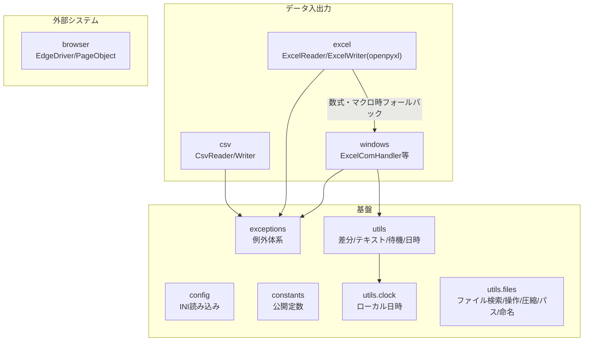

# comken 仕様書（エンジニア向け）

各モジュールの使い方（コード例）は README.md、コーディング規約は CONVENTIONS.md を参照。
この文書はライブラリの設計方針・ユースケース・設計判断を記録する。

## 目次

1. [概要と設計方針](#1-概要と設計方針)
2. [全体構成](#2-全体構成) … モジュール一覧・依存関係
3. [ユースケース](#3-ユースケース)
4. [主要な設計判断](#4-主要な設計判断)
   - 4.1 config.ini は非機密のみ・大文字
   - 4.2 ブラウザ設定は config.ini ではなくクラス変数
   - 4.3 ExcelReader / ExcelWriter と ExcelComHandler の使い分け
   - 4.4 見つからない・失敗はデフォルトで例外
   - 4.5 NAS 上の Excel を同時更新する場合の制約
5. [例外体系](#5-例外体系)
6. [動作環境・依存](#6-動作環境依存) … 必須・オプション依存の一覧
7. [テスト](#7-テスト) … カバー範囲・契約テスト・未テスト領域
8. [参照・運用](#8-参照運用)
   - 参照方式（共有サーバーを直接参照）
   - リリース手順（バージョンアップ）… 番号の付け方・注意点・ロールバック・開発版の事前検証
   - 互換性ポリシー
   - パッケージ名の変更（rename_package.py）

---

## 1. 概要と設計方針

社内業務自動化（Excel・CSV・ブラウザ・Windows 操作）の共通処理を集めたライブラリ。
マクロ（VBA）で行っていた業務の Python 移行を主な用途とする。

| 方針 | 内容 |
|---|---|
| 可読性最優先 | 短く賢いコードより、半年後に読めるコード。bool 引数よりメソッド名で意味を表す |
| 非エンジニア協業前提 | エラーメッセージに対処法を含める。設定値は config.ini で管理する |
| オフライン環境で動く | 社内 BO 環境では pip が使えない。依存は最小限にし、標準ライブラリを優先 |
| 失敗は早く・明確に | 必要なファイルがなければ即例外。エラーを握りつぶさない |
| YAGNI | 3箇所で同じ処理が出るまで共通化しない（今後絶対使うものは例外） |

---

## 2. 全体構成



| モジュール | 責務 | 依存 |
|---|---|---|
| `config` | config.ini を `config.SECTION.KEY`（大文字）で読む | 標準のみ |
| `exceptions` | ライブラリ固有の例外定義（`OriginalLibsError` 基底） | なし |
| `constants` | `Encoding` / `Color` / `FileFormat` / `SortBy` の公開定数 | なし |
| `utils.files` | ファイル検索・操作・圧縮・標準フォルダ・命名方式 | 標準のみ |
| `utils.clock` | PC のローカルタイムゾーン付き現在時刻・今日の日付 | 標準のみ |
| `utils` | 差分比較・テキスト・リトライ・待機・日時取得 | 標準のみ |
| `csv` | CSV の読み書き・検索・索引化 | 標準のみ |
| `excel` | Excel 読み書き（openpyxl）。数式・マクロは windows へフォールバック | openpyxl |
| `windows` | Excel COM・ウィンドウ・レジストリ操作 | pywin32 |
| `browser` | Edge WebDriver・Page Object 基盤 | selenium |
| `runtime` | 実行モード（debug: 処理時間を DEBUG ログ / dry_run: 外部影響のある操作をスキップ）。バージョンは comken.__version__（定義はここ1箇所。pyproject は dynamic version で参照） | なし |

原則: **上のモジュールは下（基盤）に依存してよいが、基盤は業務モジュールに依存しない。**

ログの設定（出力先・フォーマット・レベル）は社内の共通ライブラリ側で行う。
comken と利用プロジェクトは `logging.getLogger(__name__)` を使うだけでよい。

---

## 3. ユースケース

| ID | 業務シナリオ | 使用モジュールの流れ |
|---|---|---|
| UC1 | NAS 上の当日 Excel を加工して出力 | `FileFinder.today` → `ExcelWriter`（大容量は自動ローカルコピー）→ 加工 → `save` |
| UC2 | CSV を Excel 帳票へキー突合転記 | `CsvReader.index` → `ExcelWriter.transfer_by_key` → `save`（数式再計算・PW付き保存が必要なら `ExcelComHandler` 版） |
| UC5 | 既存 VBA マクロを段階的に移行 | `ExcelComHandler.run_macro`（マクロを残したまま前後処理を Python 化）|
| UC6 | 2つのデータの差分チェック | `CsvReader.rows` ×2 → `diff_rows` → 差分を Excel / ログ出力 |

---

## 4. 主要な設計判断

### 4.1 config.ini は非機密のみ・大文字

- パスワード・トークン・個人情報などの機密値は config.ini や git に含めず、
  社内の既存の管理方法を使う
- セクション名・キー名は大文字で書き、Python 側の `config.SECTION.KEY` と表記を一致させる
  （`Config` は内部で `.upper()` するため、小文字の ini でも動くが表記のズレが混乱を生む）
- 自動変換する型: `true`/`false`→bool、`[a, b, c]`→list、絶対パス→Path、整数→int、小数→float
  （変換順・詳細は README の型変換表）。`yes`/`no`/`on`/`off` は変換しない（`1`/`0` の曖昧さ回避）。
  先頭ゼロの数字（電話番号・社員番号）と `nan`/`inf` は桁落ち・不正値を避けて文字列のまま返す

### 4.2 ブラウザ設定は config.ini ではなくクラス変数

`DRIVER_PATH` / `WAIT_SECONDS` 等はプロジェクト固有ではなく環境共通のデフォルトであるため、
`BrowserOptions` のクラス変数として持ち、プロジェクトはサブクラスで差分だけ上書きする。

### 4.3 ExcelReader / ExcelWriter と ExcelComHandler の使い分け

- 読み取りだけなら `ExcelReader`、書き込みを伴う場合は `ExcelWriter`（openpyxl。Excel 不要・高速）
- 数式の計算結果・VBA マクロ・パスワード付き保存が必要なときだけ `ExcelComHandler`（COM。Excel 必須）
- `ExcelWriter` は必要時に内部で COM へ自動フォールバックする

### 4.4 見つからない・失敗はデフォルトで例外

`FileFinder.today/latest/dated` 等は見つからない場合に即例外
（業務スクリプトは「なければ止まって人に知らせる」が正解のため）。
続行したい場合のみ `required=False` を指定する。例外メッセージには具体的な対処法を含める。

### 4.5 NAS 上の Excel を同時更新する場合の制約

大きなブックはローカルにコピーしてから開くため、読み込み後に他の PC が元のブックを
更新しても、その変更を検出せずに上書き保存する。同じブックを複数の PC が同時に更新する
運用では、プロジェクト側で排他制御を用意すること。

---

## 5. 例外体系

```
OriginalLibsError                 ← まとめて捕捉する場合はこれ
├── UnsupportedFileSuffixError    ← 対応外の拡張子
├── ExcelError
│   ├── ExcelFileNotFoundError / SheetNotFoundError / MacroError
│   └── RowTransferError / EmptyHeaderCellError / ExcelHeadersTooFewError / FileFormatMismatchError
├── CsvError
│   └── EncodingDetectionError / CsvHeadersTooFewError
├── ColumnNotFoundError
│   └── ExcelColumnNotFoundError / CsvColumnNotFoundError / KeyColumnNotFoundError
└── ConfigError
    └── ConfigFileNotFoundError / ConfigSectionNotFoundError
```

方針:
- 素の `ValueError` / `Exception` は投げない（呼び出し側で判別できるようにする）
- 1つの失敗ごとに個別例外を作り、メッセージはその `__init__` で組み立てる
- メッセージは「何が・どこで・どうすればよいか」を含める（非エンジニアが読む前提）
- 行処理のエラーは行番号を含めて再送出する（`transfer_by_key` 等）

---

## 6. 動作環境・依存

| 項目 | 内容 |
|---|---|
| Python | 3.10 以上（`unzip` は 3.11 の機能を使うが 3.10 向けフォールバックあり。実行環境は 3.14） |
| OS | Windows（windows / browser は Windows 専用） |
| 必須依存 | openpyxl, selenium, pywin32 |
| 参照方法 | 共有サーバーに置き、各プロジェクトの `実行.bat` が実行中だけ `PYTHONPATH` を設定して直接参照（8章参照。`pip install` はしない） |


---

## 7. テスト

- `tests/` に pytest。実行: `python -m pytest tests -q`
- config / csv / excel（openpyxl）/ utils / logger / exceptions / runtime をカバー
- **未テスト領域**: Excel COM（`ExcelComHandler`）・Selenium 実機（`browser` は配線のみモックでテスト）。
  外部環境が必要なため、実機での動作確認で担保する

---

## 8. 参照・運用

### 参照方式: 共有サーバーを直接参照

comken は共有サーバー上の1か所に置き、各プロジェクトはそこを**直接 import する**。
ローカルへのコピー・同期は行わない（配布作業そのものをなくした）。

```
共有サーバー \\server\share\tools\comken   ← comken の git チェックアウト（main / リリースタグに保つ）
     │  各 PC は PYTHONPATH でここを指す（コピーしない）
     ▼
各プロジェクト                              ← import comken が共有サーバーの実体を直接読む
```

各プロジェクトの `実行.bat` に、共有サーバーのリポジトリルートを `COMKEN_ROOT` として設定する。
バッチが実行中だけ `PYTHONPATH` に追加するため、各 PC の環境変数を事前設定する必要はない。

```bat
set "COMKEN_ROOT=\\server\share\tools\comken"
set "PYTHONPATH=%COMKEN_ROOT%;%PYTHONPATH%"
```

これだけで、どのプロジェクトからでも `import comken` が共有サーバーの最新版を読む。
robocopy 同期・`pip install`・実行.bat の同期処理は不要（`実行.bat` は main.py を起動するだけの
薄いものにするか、無くてもよい）。

| 事象 | 挙動 |
|---|---|
| 共有サーバーの comken を更新した | 次に import した瞬間から全プロジェクトが最新版で動く（同期待ちなし） |
| 共有サーバーにアクセスできない | **import が失敗する**（ローカルコピーを持たないため）。共有サーバーの可用性に依存する |
| 起動速度 | import のたびにネットワークを読むためローカル実行より遅い。大きなデータファイルは従来どおり `local_copy()` でローカルに引く |

> **旧・ローカル同期方式との違い（受け入れた代償）:** 直接参照は「配布作業ゼロ・常に最新」が利点。
> 一方で、起動のたびにネットワークを読むので遅く、**共有サーバーが落ちると全プロジェクトが止まる**。
> この代償を受け入れた上での方式。共有サーバーは高速・高可用に保つこと。

> **バイトコードキャッシュ:** 共有サーバーが読み取り専用だと `__pycache__` を書けず、
> import のたびに再コンパイルが走って遅くなる。共有側を書き込み可にするか、各 PC で
> `setx PYTHONPYCACHEPREFIX %LOCALAPPDATA%\comken-pycache` を設定してキャッシュをローカルに逃がす。

**開発と本番の分離:** 共有サーバーのチェックアウトは常に main（またはリリースタグ）に保つ。
開発は手元のクローンで行い（ブランチ自由）、中央リポジトリ（NAS の bare リポジトリ等）経由で共有する。
**共有サーバーで develop 等をチェックアウトしない**こと（その瞬間に全プロジェクトへ伝播する）。

### リリース手順（バージョンアップ）

リリース1回の影響範囲は大きい（共有サーバーを更新した瞬間、次に import した**全プロジェクトに伝播する**）。
以下の順で行う。

| # | 手順 | 補足 |
|---|---|---|
| 1 | バージョン番号を上げる | `comken/__init__.py` の `__version__` を1行変更。**定義はここだけ**（pyproject.toml は dynamic version で自動参照するため触らない） |
| 2 | README の改訂履歴に行を追加 | 日付と変更内容。非エンジニアも読む場所なので専門用語を控えめに |
| 3 | テストと lint を回す | `python -m pytest tests -q` と `python -m ruff check .` が両方きれいなこと |
| 4 | main にマージ | 開発はブランチ自由。main = リリース可能な状態、を維持する |
| 5 | 共有サーバーのチェックアウトを更新 | 共有サーバー上で main を `git pull`（または リリースタグを `git checkout`）。`release-YYYYMMDD-HHMM` のタグを打っておくとロールバックしやすい |

各プロジェクトは次に import した時点で最新になるので、リリース後の配布作業はない。

**バージョン番号の付け方**（X.Y.Z）:

| 上げる桁 | いつ | 例 |
|---|---|---|
| Z（パッチ） | バグ修正のみ | 0.2.0 → 0.2.1 |
| Y（マイナー） | 機能追加（既存コードはそのまま動く） | 0.2.1 → 0.3.0 |
| X（メジャー） | 互換性が壊れる変更 | 原則やらない（下の注意点参照） |

**リリース前に開発版を実プロジェクトで検証する:**

共有サーバーを触らず、手元の開発クローンを指して実プロジェクトを動かして確認できる。

1. コマンドプロンプトでそのプロセス限りの `PYTHONPATH` を開発クローンに向ける:
   ```bat
   set PYTHONPATH=C:\dev\original_libs
   python main.py
   ```
2. これで開発版の comken を読んで動く。ウィンドウを閉じれば元の設定（共有サーバー）に戻る

注意:
- `setx` でユーザー環境変数そのものを書き換えない（戻し忘れると、そのPCが永久に開発版で動き続ける）。
  コマンドプロンプト内の `set` はそのプロセス限りなので安全
- 検証は管理者の PC だけで行う

**注意点:**

- **公開 API の名前・引数は変えない**のが原則（互換性ポリシー参照）。変える場合は旧名を
  `warn_renamed` 付きで残す。全プロジェクトが常に最新を参照するため、黙って壊すと
  リリースした瞬間に全ツールが止まる
- **ロールバック手順**: 共有サーバーのチェックアウトで `git checkout <直前のタグ>` を実行
  → 次に import した時点で全プロジェクトが前の状態に戻る。修正できたら main に戻す
- 共有サーバーのチェックアウトは常に main（またはリリースタグ）に保つこと。develop 等を
  チェックアウトした瞬間に、その中身が全プロジェクトへ伝播する

### 互換性ポリシー（共有サーバー方式の代償）

全プロジェクトが常に最新を参照する＝**古い comken に固定して逃げる手段がない**。
そのため公開 API の互換性は次のルールで守る。

| ルール | 内容 |
|---|---|
| 原則、名前は変えない | 公開 API（クラス名・メソッド名・引数名）の変更は最後の手段 |
| 変える場合、旧名は削除しない | 旧名は動き続ける。黙って壊すことはしない |
| 旧名には警告を付ける | `comken/deprecation.py` の `warn_renamed(旧名, 新名)` を使う |

警告の仕様:
- `FutureWarning` を使う（`DeprecationWarning` はデフォルト非表示のため気づけない）
- 文言は「動作しますが、○○に書き換えてください」（非エンジニアが見ても不安にならない表現）
- Python の警告機構により、**同じ箇所からは1回の実行につき1度しか表示されない**（スパムにはならない）
- 警告を出し続ける期間: 全プロジェクトの移行を確認できるまで＝実質無期限。
  ただし全プロジェクトの grep で旧名の不使用を確認できたら、旧名と警告を削除してよい

### パッケージ名の変更（rename_package.py）

パッケージ名（comken）を変えたくなった場合はリポジトリルートの `rename_package.py` を使う。
フォルダ名・import 文・ドキュメント・pyproject を一括置換し、

```
python rename_package.py 新しい名前 --dry-run   … 変更内容の確認（書き換えなし）
python rename_package.py 新しい名前              … 実行
python rename_package.py 新しい名前 プロジェクトのパス … プロジェクト側の import も置換
```

実行後は各 PC の `PYTHONPATH`（共有サーバーのパス）とフォルダ名を新名に合わせる。
リネーム後も再登録は不要。

### その他

- プロジェクト側のドキュメント構成（使い方.md / 仕様書.md / ERRORS.md）は CONVENTIONS.md を参照
