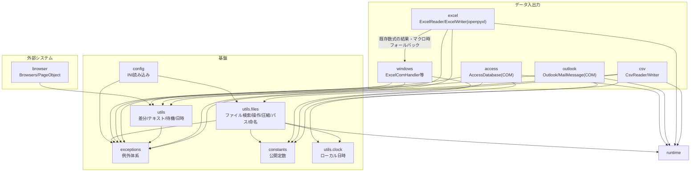

# comken 仕様書（エンジニア向け）

各モジュールの使い方（コード例）は README.md、コーディング規約は CONVENTIONS.md を参照。
この文書はライブラリの設計方針・ユースケース・設計判断を記録する。

## 目次

1. [概要と設計方針](#1-概要と設計方針)
2. [全体構成](#2-全体構成) … モジュール一覧・依存関係
3. [ユースケース](#3-ユースケース)
4. [主要な設計判断](#4-主要な設計判断)
   - 4.1 config.ini は非機密のみ・大文字
   - 4.2 ブラウザ設定は config.ini ではなくクラス変数
   - 4.3 ExcelReader / ExcelWriter と ExcelComHandler の使い分け
   - 4.4 見つからない・失敗はデフォルトで例外
   - 4.5 NAS 上の Excel を同時更新する場合の制約
   - 4.6 例外は1つの失敗につき1クラス
   - 4.7 Excel の読み取りを共通基底に置く
   - 4.8 公開 API は最小限
   - 4.9 シート操作は Sheet に集約する
   - 4.10 テーブルは定義を壊さず、中のデータを操作する
   - 4.11 ログ設定は持たない
   - 4.12 日時は PC のローカルタイムゾーンで扱う
   - 4.13 Access は CSV 直接出力を主役にする
   - 4.14 Access は既定でローカルコピーを開く
   - 4.15 元 DB を更新する場合は、ローカルコピーを書き戻さない
   - 4.16 元 DB を直接開く前に日時付きバックアップを取る
   - 4.17 Outlook は Classic のみ対応し、送信しない
   - 4.18 補助関数より本体が受け入れる
   - 4.19 社内ライブラリの呼び出しは comken が吸収する
   - 4.20 キーで引く操作は「1件」と「複数件」をメソッドで分ける
   - 4.21 config.ini が無ければ example から作り、そこで止める
   - 4.22 config.ini のセクション名・キー名は大文字を強制する
5. [例外体系](#5-例外体系)
6. [動作環境・依存](#6-動作環境依存) … 必須・オプション依存の一覧
7. [テスト](#7-テスト) … カバー範囲・契約テスト・未テスト領域
8. [参照・運用](#8-参照運用)
   - 参照方式（共有サーバーを直接参照）
   - リリース手順（バージョンアップ）… 番号の付け方・注意点・ロールバック・開発版の事前検証
   - 互換性ポリシー
   - パッケージ名の確定

---

## 1. 概要と設計方針

社内業務自動化（Excel・CSV・ブラウザ・Windows 操作）の共通処理を集めたライブラリ。
マクロ（VBA）で行っていた業務の Python 移行を主な用途とする。

| 方針 | 内容 |
|---|---|
| 可読性最優先 | 短く賢いコードより、半年後に読めるコード。bool 引数よりメソッド名で意味を表す |
| 非エンジニア協業前提 | エラーメッセージに対処法を含める。設定値は config.ini で管理する |
| オフライン環境で動く | 社内 BO 環境では pip が使えない。依存は最小限にし、標準ライブラリを優先 |
| 失敗は早く・明確に | 必要なファイルがなければ即例外。エラーを握りつぶさない |
| YAGNI | 3箇所で同じ処理が出るまで共通化しない（今後絶対使うものは例外） |

---

## 2. 全体構成



| モジュール | 責務 | 依存 |
|---|---|---|
| `config` | config.ini を `config.SECTION.KEY`（大文字）で読む | 標準のみ |
| `exceptions` | ライブラリ固有の例外定義（`ComkenError` 基底） | なし |
| `constants` | `Encoding` / `Color` / `FileFormat` / `SortBy` の公開定数 | なし |
| `utils.files` | ファイル検索・操作・圧縮・標準フォルダ・命名方式 | 標準のみ |
| `utils.clock` | PC のローカルタイムゾーン付き現在時刻・今日の日付 | 標準のみ |
| `utils` | 差分比較・テキスト・リトライ・待機・日時取得 | 標準のみ |
| `csv` | CSV の読み書き・検索・索引化 | 標準のみ |
| `excel` | Excel 読み書き（openpyxl）。既存数式の結果・マクロは windows へフォールバック | openpyxl |
| `access` | Access マクロ・VBA実行、テーブル／クエリの CSV 出力・逐次読み取り | pywin32・Microsoft Access |
| `outlook` | Classic Outlook の受信メール読み取り・下書き作成 | pywin32・Classic Outlook |
| `windows` | Excel COM・ウィンドウ・レジストリ操作 | pywin32 |
| `browser` | Edge WebDriver・Page Object 基盤 | selenium |
| `runtime` | 実行モード（debug: 処理時間を DEBUG ログ / dry_run: 外部影響のある操作をスキップ）。バージョンは comken.__version__（定義はここ1箇所。pyproject は dynamic version で参照） | なし |

原則: **上のモジュールは下（基盤）に依存してよいが、基盤は業務モジュールに依存しない。**

ログの設定（出力先・フォーマット・レベル）は社内の共通ライブラリ側で行う。
comken と利用プロジェクトは `logging.getLogger(__name__)` を使うだけでよい。

---

## 3. ユースケース

| ID | 業務シナリオ | 使用モジュールの流れ |
|---|---|---|
| UC1 | NAS 上の当日 Excel を加工して出力 | `FileFinder.today` → `ExcelWriter`（大容量は自動ローカルコピー）→ 加工 → `save` |
| UC2 | CSV を Excel 帳票へキー突合転記 | `CsvReader.index` → `Sheet.transfer_by_key` → `save`（PW付き保存が必要なら `ExcelComHandler` 版） |
| UC5 | 既存 VBA マクロを段階的に移行 | `ExcelComHandler.run_macro`（マクロを残したまま前後処理を Python 化）|
| UC6 | 2つのデータの差分チェック | `CsvReader.rows` ×2 → `diff_rows` → 差分を Excel / ログ出力 |

---

## 4. 主要な設計判断

### 4.1 config.ini は非機密のみ・大文字

- パスワード・トークン・個人情報などの機密値は config.ini や git に含めず、
  社内の既存の管理方法を使う
- セクション名・キー名は大文字で書き、Python 側の `config.SECTION.KEY` と表記を一致させる
  （小文字が混じっていると読み込んだ時点で `ConfigLowerCaseNameError`。理由は 4.22）
- 自動変換する型: `true`/`false`→bool、`[a, b, c]`→list、絶対パス→Path、整数→int、小数→float
  （変換順・詳細は README の型変換表）。`yes`/`no`/`on`/`off` は変換しない（`1`/`0` の曖昧さ回避）。
  先頭ゼロの数字（電話番号・社員番号）と `nan`/`inf` は桁落ち・不正値を避けて文字列のまま返す

### 4.2 ブラウザ設定は config.ini ではなくクラス変数

`DRIVER_PATH` / `WAIT_SECONDS` 等はプロジェクト固有ではなく環境共通のデフォルトであるため、
`BrowserOptions` のクラス変数として持ち、プロジェクトはサブクラスで差分だけ上書きする。

**サイトごとに1ブラウザを起動し、タブでは分けない。** ダウンロード先・起動オプション・
ログイン状態はいずれもブラウザ単位で決まるため、タブで複数サイトを扱うと
「サイトAのCSVがサイトBのフォルダに落ちる」といった取り違えが構造的に避けられない。
またタブでは並列にならない（WebDriver は1接続で逐次処理するため）。
メモリは1ブラウザあたり 200〜400MB 増えるが、社内システムを数個扱う規模では問題にならない。

**入口は `Browsers` に一本化し、サイトが1つでも複数でも書き方を変えない。**
サイトを増やす操作を `launch` の1行追加に収めることで、最初に1サイトで書いたコードが
そのまま育つ。ダウンロードフォルダ・ログイン状態・ログのファイル名は `launch` で付けた
名前ごとに自動で分離するため、増やしたときに設定を見直す必要がない。

**`with` を必須にする。** `with` なしで起動できると、途中で例外が出たときに Edge の
プロセスが残り、次の実行でドライバーの更新まで妨げる。`Browsers` も `BrowserSession` も、
`with` の外で使うとブラウザを起動する前に例外で止める（弾かれた時点では何も起きていない）。

**同期が基本で、`start` / `wait` を書いたところだけ非同期にする。** 利用者には Python
初学者も含まれるため、既定の挙動は「上から順に動く」に揃える。重い画面の読み込み中に
別サイトを進めたい場合だけ `start` で先に始め、結果が要る場所で `wait` する。
`parallel` はこの2つを並べた短縮形として残す。
なお同一セッションを複数スレッドから同時に操作した場合は、待たせずに
`ConcurrentSessionUseError` で止める（黙って別の画面を操作するより早く気づけるため）。

### 4.3 ExcelReader / ExcelWriter と ExcelComHandler の使い分け

- 読み取りだけなら `ExcelReader`、書き込みを伴う場合は `ExcelWriter`（openpyxl。Excel 不要・高速）
- **comken は数式を自動で入れない。** openpyxl は数式を書けるが計算も検証もしないため、
  正しさを確かめるには Excel に再計算させる必要がある。そのための COM での開き直し、
  エラー検出、検査範囲の決定は、値の転記に対して割に合わないコストになる
- 計算は Power Query や、プログラムが触らない範囲（人が用意した数式列・集計シート）で行い、
  プログラムは値の書き込みと転記に徹する
- 既存ブックの数式の計算結果を Python 側で読むときは `read_computed_rows()` を使う
- VBA マクロ・パスワード付き保存が必要なときも `ExcelComHandler`（COM。Excel 必須）
- `ExcelWriter` は必要時に内部で COM へ自動フォールバックする

### 4.4 見つからない・失敗はデフォルトで例外

`FileFinder.today/latest/dated` 等は見つからない場合に即例外
（業務スクリプトは「なければ止まって人に知らせる」が正解のため）。
続行したい場合のみ `required=False` を指定する。例外メッセージには具体的な対処法を含める。

### 4.5 NAS 上の Excel を同時更新する場合の制約

大きなブックはローカルにコピーしてから開くため、読み込み後に他の PC が元のブックを
更新しても、その変更を検出せずに上書き保存する。同じブックを複数の PC が同時に更新する
運用では、プロジェクト側で排他制御を用意すること。

### 4.6 例外は1つの失敗につき1クラス

呼び出し側がメッセージ文字列を解析せず、例外の型だけで失敗内容を判別・個別捕捉できるようにする。
カテゴリ基底はまとめて捕捉する用途に限り、直接送出しない。

### 4.7 Excel の読み取りを共通基底に置く

`ExcelReader` は読み取り専用、`ExcelWriter` は読み書き用とする。読み取り処理を対等な別部品にすると、
読み書きが混在する処理で同じブックを二重に開くことになるため、共通の読み取り処理は
`ExcelBase` に置き、Writer からも同じブックをそのまま読めるようにする。

### 4.8 公開 API は最小限

共有サーバーを全プロジェクトが直接参照するため、一度公開した名前は長期に支える必要がある。
利用側が直接必要とする具象クラス・関数だけを各パッケージの `__all__` に載せ、
基底クラスなどの実装詳細は公開しない。

### 4.9 シート操作は Sheet に集約する

セル書き込み、書式、キー突合転記、構造化テーブルなどシートに対する操作は `Sheet` に置き、
ブックに対する操作だけを `ExcelWriter` に置く。入口が2経路あると、書式を付けるときだけ
書き方が変わるなど一貫しなくなるためである。

### 4.10 テーブルは定義を壊さず、中のデータを操作する

テーブル名の変更・削除は持たない。openpyxl では構造化参照が追随せず、参照していた数式が
`#NAME?` になるためである。テーブルの作成は新規レポートで必要なため残す。業務で頻度の高い
中のデータの追記・全消去・洗い替えは、テーブル名を変えず数式を壊さないため提供する。

### 4.11 ログ設定は持たない

出力先・書式・レベルの設定は社内の共通ライブラリが一元管理する。comken は
`logging.getLogger(__name__)` でログを出すだけとし、利用側のログ設定を上書きしない。

変更点: RPA 基盤を通さない単体実行向けに、明示的に呼ぶ `setup_logging()` を追加した。
import 時の自動設定は利用側の設定を壊すため行わず、root logger が設定済みなら何も変更しない。

### 4.12 日時は PC のローカルタイムゾーンで扱う

業務上の「今日」は実行 PC の日付である。UTC のままでは日本時間の 0:00〜9:00 に日付が
1日ずれるため、`now()` はローカルタイムゾーン付き日時、`today()` はその日付を返す。
Windows のオフライン環境でタイムゾーンデータを追加配布しないため、`ZoneInfo` は使わない。

### 4.13 Access は CSV 直接出力を主役にする

Access の整形結果は数十万件になるため、Python で全件を読み込まず、
`DoCmd.TransferText` で Access 自身に CSV を書き出させる `export_csv()` を主役にする。
Python で各行を処理する必要がある場合だけ、COM の往復を減らすバッチ取得を内部で行う
ジェネレータ `rows()` を使う。

### 4.14 Access は既定でローカルコピーを開く

Access はネットワーク越しに直接開くと遅く、他の利用者の排他に阻まれ、接続断やクラウド同期で
破損する可能性があるため、既定で一時フォルダへコピーしてから開く。整形結果は中間生成物であり、
元 DB に残す必要がないという業務前提に基づく。元 DB を更新するマクロや VBA を実行する場合は
`local_copy=False` を指定する。

### 4.15 元 DB を更新する場合は、ローカルコピーを書き戻さない

「ローカルにコピーして更新し、終わったら元の場所へ上書きで戻す」方式は**採用しない**。
更新が必要なときは `local_copy=False` で元 DB を直接開き、Access のエンジンに任せる。

書き戻し方式を採らない理由:

| 問題 | 内容 |
|---|---|
| 他人の更新が丸ごと消える | ファイル単位で上書きするため、作業中に別の人が入力した内容が、行単位ではなく**データベースごと**失われる。Access は複数人で同時に使う前提の道具であり、ファイル全体の置き換えとは相容れない |
| 速度の利点が消える | 書き戻しでは結局ファイル全体をネットワークへ書くことになる。数百 MB の DB では、読むときに節約した時間を書き戻しで使い切る |
| 最後に失敗する | 誰かが開いていると元ファイルを置き換えられない。**すべての処理が終わったあとで**失敗するため、やり直しの手戻りが最大になる |
| 破損の窓が広がる | 大きなファイルをネットワーク越しに書いている最中に接続が切れると、元の DB が壊れる |

例外は「**自分だけが使う DB で、他の誰も触らないと保証できる**」場合に限られる。
ただしその場合は、そもそも共有フォルダに置く必要があるかを先に検討する。

なお、更新結果を共有 DB に戻すことが目的なら、**戻さずに済む形**を先に検討する。
出力を CSV / Excel として別に出す、あるいは結果専用の DB を分ける方が、
排他・破損・速度のいずれの問題も起こさない。

### 4.16 元 DB を直接開く前に日時付きバックアップを取る

元 DB を直接開く場合は、開く前に日時付きのバックアップを元 DB と同じフォルダの
`backup/` へ取り、既定で7日間残す。元 DB と同じアクセス権限の範囲に置き、顧客情報の
管理範囲を各実行 PC へ広げないためである。git の管理範囲外になることは副次的な利点である。
数百 MB の DB はネットワーク越しのコピーに時間がかかる。巨大な DB では `backup_dir` で
ローカルフォルダを指定できるが、顧客情報がローカルに残ることを理解したうえで選ぶ。
元 DB と同じ障害ドメインのため、サーバー障害や誤削除では控えも一緒に失われる。
この控えは書き込み中の切断による DB 破損からの復旧用であり、本格的な世代保全は
サーバー側のバックアップに依存する。OneDrive などの同期フォルダでは控えも同期対象となり、
容量と帯域を消費する。
バックアップは破損の確率を下げるものではなく、壊れたときに戻せるよう被害を抑えるためのもの。
処理が成功しても消さないのは、不整合が後日発覚することがあるためである。

同名で上書きせず世代を残す。壊れた DB で正常な控えを上書きしてしまう事故を防ぐためである。
自動での書き戻しは、正常なデータを古い控えで壊しうるため行わない（4.13 と同じ理由）。
復旧は状況を確認した人が手でコピーする。

---

### 4.17 Outlook は Classic のみ対応し、送信しない

Outlook は Classic のみ対応する。New Outlook は COM を持たないため自動操作できず、
Graph API は認証とネットワークが必要でオフライン社内では使えないため代替を用意しない。
また Outlook は利用者が開いているものを操作するため、Excel / Access と違い
`DispatchEx` と `Quit()` を使わない。送信は誤送信が取り返しつかないため実装せず、
下書き作成までとする。

---

### 4.18 補助関数より本体が受け入れる

利用者に変換や前処理をさせるくらいなら、公開メソッド側で入力を受け入れる。
例えば Excel の列は `"A"` / `"AA"` / 数値のいずれでも指定できるようにする。
その結果、列記号の変換関数を公開する必要がなくなり、公開 API を減らせる。
**「補助関数を公開する」より「本体が気を利かせる」方を選ぶ。**

### 4.19 社内ライブラリの呼び出しは comken が吸収する

社内 RPA 基盤は import パスにバージョンが入っている（`社内ライブラリ名.vXXXX.rpa`）。
各プロジェクトに直接書くと、バージョンが上がるたびに全プロジェクトの import 行を
書き換えることになる。comken は共有サーバー上の1か所を参照する運用なので、
`comken/run.py` で包めば **comken を差し替えるだけで全プロジェクトが追随する**。

社内ライブラリの import は、`importlib` ではなく**素の `from ... import` を関数の中に置く**。
保守する人が Python に詳しいとは限らないため、動的 import の間接さより素直さを優先する。
関数の中に置くのは、社内ライブラリが無い PC でも `comken` 自体を読み込めるようにするため
（自宅・テストで import が通る）。

**このリポジトリは公開しているため、社内ライブラリの実名は書かない。**
`example_libs.v0000` という仮の名前にしておき、配置時に実際の名前へ書き換える。
実名を書き戻さないこと。

**社内のツールはすべて RPA 基盤を通して動かす**（基盤を通さず単体で動かすツールは無い）。
そのため新規プロジェクトの雛形（`templates/新規プロジェクト/main.py`）は、
`main` を直接呼ばず `backoffice(main, PROJECT_NAME)` に渡す形を既定にしてある。
プロジェクト名は `new_project.py` が作成時に差し込む。

ログの出力先など「毎回書かされる決まり文句」は `_prepare()` に集める。
呼び出し側を変えずに、全プロジェクトへ一度に効かせられる。

社内ライブラリの正式版が出ればこの仕組み自体が不要になりうるため、
**消すときに触る場所を `comken/run.py` の先頭に列挙してある**。
comken の他のモジュールはこのファイルに依存させない。

### 4.20 キーで引く操作は「1件」と「複数件」をメソッドで分ける

`index()` は突合の lookup を作るためのもので、キーが1件に決まることが前提である。
重複を黙って後の行で上書きすると、**転記の結果が静かに変わって気づけない**ため、
`CsvRowDuplicateKeyError` で止める。重複が普通のデータは `group_by()` で束ねる。

`allow_duplicates` のようなフラグは持たせない。フラグでは「重複を許す」としか言えず、
**どう扱うか（後勝ちにするのか、全件返すのか）が読めない**うえ、全件返す形にすると
戻り値の型が `dict[str, dict]` から `dict[str, list[dict]]` へ変わる。
**引数で戻り値の型が変わる**のは補完も効かず、規約の「bool 引数よりメソッド名で意味を表す」に反する。

なお `transfer_by_key` は「Excel の各行のキーで lookup を引いて、その行に書く」ものなので、
1つのキーに複数行を割り当てることはできない。同じキーの行を全部出したい場合は、
転記ではなく `group_by()` / `filter()` で取り出して `write_table()` で書き出す。

### 4.21 config.ini が無ければ example から作り、そこで止める

`config.ini.example` はあるのに `config.ini` を作り忘れる、という失敗が多い。
かといって作って**そのまま動かすと、ダミーの値のまま別のフォルダを読み書きしうる**。
そこで **example からコピーして作り、確認を促して止める**（`ConfigCreatedFromExampleError`）。
2回目の実行からは通常どおり動く。作り忘れの受け皿はここ1か所に集約し、
プロジェクト生成時（`new_project.py`）には config.ini を作らない。

### 4.22 config.ini のセクション名・キー名は大文字を強制する

`config.SECTION.KEY` の形でアクセスするため、読み込み時に大文字へ揃えている。
小文字で書いても読み込み自体は成功してしまい、**小文字のままアクセスしたときに
初めて「そんなセクションはない」と言われる**ため、書いた場所から遠いエラーになる。
読み込んだ時点で `ConfigLowerCaseNameError` にして、直す場所を直接指す。

### 4.23 state.ini は設定と分離し、dry-run では書かない

`config.ini` は人が書く設定、`state.ini` はプログラムが書く前回処理位置などの状態とする。
両者を分けるのは、人が調整した設定をプログラムが上書きし、原因の分からない挙動になるのを
防ぐためである。状態が無い初回実行は正常なので、ファイルが無ければ空のまま続行する。

dry-run で処理済みファイル名などを保存すると、本番時に処理済みと誤判定される。
試運転が本番の挙動を変えないよう、dry-run 中の `State.set()` はログだけを出して保存しない。

INI として壊れたファイルを空の状態として扱うと、「前回の続きから再開」が静かに失敗する。
そのため `StateFileCorruptedError` で止め、利用者に内容の確認または退避を求める。

---

## 5. 例外体系

```
ComkenError                 ← まとめて捕捉する場合はこれ
├── UnsupportedFileSuffixError    ← 対応外の拡張子
├── AccessError
│   └── AccessFileNotFoundError / AccessBackupError / AccessLocalCopyError
│       / AccessRoutineError / AccessSourceNotFoundError
├── OutlookError
│   └── ClassicOutlookNotAvailableError / OutlookFolderNotFoundError
│       / OutlookAttachmentNotFoundError
├── ExcelError
│   ├── ExcelFileNotFoundError / SheetNotFoundError / SheetAlreadyExistsError
│   ├── LastSheetDeletionError / MacroError / RowTransferError
│   ├── InvalidTableNameError / TableAlreadyExistsError / TableNotFoundError
│   └── EmptyHeaderCellError / ExcelHeadersTooFewError / FileFormatMismatchError
├── CsvError
│   └── EncodingDetectionError / CsvHeadersTooFewError / CsvCellReferenceError / CsvNoDataRowsError
├── ColumnNotFoundError
│   └── ExcelColumnNotFoundError / CsvColumnNotFoundError / KeyColumnNotFoundError
├── RpaError
│   └── RpaLibraryNotFoundError
├── SalesforceError
│   ├── SalesforceAuthError / SalesforceConnectionError / SalesforceRequestError
│   ├── SalesforceExternalIdMissingError
│   └── SalesforceReportTruncatedError / SalesforceReportFormatError
│       / SalesforceReportExecutionError
└── ConfigError
    └── ConfigFileNotFoundError / ConfigCreatedFromExampleError
        / ConfigLowerCaseNameError / ConfigSectionNotFoundError
```

方針:
- 素の `ValueError` / `Exception` は投げない（呼び出し側で判別できるようにする）
- 1つの失敗ごとに個別例外を作り、メッセージはその `__init__` で組み立てる
- メッセージは「何が・どこで・どうすればよいか」を含める（非エンジニアが読む前提）
- 行処理のエラーは行番号を含めて再送出する（`transfer_by_key` 等）
- COM は往復のたびにプロセス間通信が発生するため、セル単位ではなく
  `Range.Value` で2次元配列を一括に読み書きする

---

## 6. 動作環境・依存

| 項目 | 内容 |
|---|---|
| Python | 3.10 以上（`unzip` は 3.11 の機能を使うが 3.10 向けフォールバックあり。実行環境は 3.14） |
| OS | Windows（windows / browser は Windows 専用） |
| 必須依存 | openpyxl, selenium, pywin32, requests |
| Outlook 操作 | 従来版（Classic）Outlook が必要。New Outlook は非対応 |
| 参照方法 | 共有サーバーに置き、各プロジェクトの `実行.bat` が実行中だけ `PYTHONPATH` を設定して直接参照（8章参照。`pip install` はしない） |


---

## 7. テスト

- `tests/` に pytest。実行: `python -m pytest tests -q`
- 現在の結果: **404 passed / 17 skipped**（文書検査の対象拡大後）
- config / csv / excel（openpyxl）/ utils / files / exceptions / runtime / 文書コード例をカバー
- **未テスト領域**: Excel COM（`ExcelComHandler`）・Selenium 実機（`browser` は配線のみモックでテスト）。
  外部環境が必要なため、実機での動作確認で担保する

---

## 8. 参照・運用

### 参照方式: 共有サーバーを直接参照

comken は共有サーバー上の1か所に置き、各プロジェクトはそこを**直接 import する**。
ローカルへのコピー・同期は行わない（配布作業そのものをなくした）。

```
共有サーバー \\server\share\tools\comken   ← comken の git チェックアウト（main / リリースタグに保つ）
     │  各 PC は PYTHONPATH でここを指す（コピーしない）
     ▼
各プロジェクト                              ← import comken が共有サーバーの実体を直接読む
```

各プロジェクトの `実行.bat` に、共有サーバーのリポジトリルートを `COMKEN_ROOT` として設定する。
バッチが実行中だけ `PYTHONPATH` に追加するため、各 PC の環境変数を事前設定する必要はない。

```bat
set "COMKEN_ROOT=\\server\share\tools\comken"
set "PYTHONPATH=%COMKEN_ROOT%;%PYTHONPATH%"
```

これだけで、どのプロジェクトからでも `import comken` が共有サーバーの最新版を読む。
robocopy 同期・`pip install`・実行.bat の同期処理は不要（`実行.bat` は main.py を起動するだけの
薄いものにするか、無くてもよい）。

| 事象 | 挙動 |
|---|---|
| 共有サーバーの comken を更新した | 次に import した瞬間から全プロジェクトが最新版で動く（同期待ちなし） |
| 共有サーバーにアクセスできない | **import が失敗する**（ローカルコピーを持たないため）。共有サーバーの可用性に依存する |
| 起動速度 | import のたびにネットワークを読むためローカル実行より遅い。大きなデータファイルは従来どおり `local_copy()` でローカルに引く |

> **旧・ローカル同期方式との違い（受け入れた代償）:** 直接参照は「配布作業ゼロ・常に最新」が利点。
> 一方で、起動のたびにネットワークを読むので遅く、**共有サーバーが落ちると全プロジェクトが止まる**。
> この代償を受け入れた上での方式。共有サーバーは高速・高可用に保つこと。

> **バイトコードキャッシュ:** 共有サーバーが読み取り専用だと `__pycache__` を書けず、
> import のたびに再コンパイルが走って遅くなる。共有側を書き込み可にするか、各 PC で
> `setx PYTHONPYCACHEPREFIX %LOCALAPPDATA%\comken-pycache` を設定してキャッシュをローカルに逃がす。

**開発と本番の分離:** 共有サーバーのチェックアウトは常に main（またはリリースタグ）に保つ。
開発は手元のクローンで行い（ブランチ自由）、中央リポジトリ（NAS の bare リポジトリ等）経由で共有する。
**共有サーバーで develop 等をチェックアウトしない**こと（その瞬間に全プロジェクトへ伝播する）。

### リリース手順（バージョンアップ）

リリース1回の影響範囲は大きい（共有サーバーを更新した瞬間、次に import した**全プロジェクトに伝播する**）。
以下の順で行う。

| # | 手順 | 補足 |
|---|---|---|
| 1 | バージョン番号を上げる | `comken/__init__.py` の `__version__` を1行変更。**定義はここだけ**（pyproject.toml は dynamic version で自動参照するため触らない） |
| 2 | README の改訂履歴に行を追加 | 日付と変更内容。非エンジニアも読む場所なので専門用語を控えめに |
| 3 | テストと lint を回す | `python -m pytest tests -q` と `python -m ruff check .` が両方きれいなこと |
| 4 | main にマージ | 開発はブランチ自由。main = リリース可能な状態、を維持する |
| 5 | 共有サーバーのチェックアウトを更新 | 共有サーバー上で main を `git pull`（または リリースタグを `git checkout`）。`release-YYYYMMDD-HHMM` のタグを打っておくとロールバックしやすい |

各プロジェクトは次に import した時点で最新になるので、リリース後の配布作業はない。

**バージョン番号の付け方**（X.Y.Z）:

| 上げる桁 | いつ | 例 |
|---|---|---|
| Z（パッチ） | バグ修正のみ | 0.2.0 → 0.2.1 |
| Y（マイナー） | 機能追加（既存コードはそのまま動く） | 0.2.1 → 0.3.0 |
| X（メジャー） | 互換性が壊れる変更 | 原則やらない（下の注意点参照） |

**リリース前に開発版を実プロジェクトで検証する:**

共有サーバーを触らず、手元の開発クローンを指して実プロジェクトを動かして確認できる。

1. コマンドプロンプトでそのプロセス限りの `PYTHONPATH` を開発クローンに向ける:
   ```bat
   set PYTHONPATH=C:\dev\original_libs
   python main.py
   ```
2. これで開発版の comken を読んで動く。ウィンドウを閉じれば元の設定（共有サーバー）に戻る

注意:
- `setx` でユーザー環境変数そのものを書き換えない（戻し忘れると、そのPCが永久に開発版で動き続ける）。
  コマンドプロンプト内の `set` はそのプロセス限りなので安全
- 検証は管理者の PC だけで行う

**注意点:**

- **公開 API の名前・引数は変えない**のが原則（互換性ポリシー参照）。変える場合は旧名を
  `warn_renamed` 付きで残す。全プロジェクトが常に最新を参照するため、黙って壊すと
  リリースした瞬間に全ツールが止まる
- **ロールバック手順**: 共有サーバーのチェックアウトで `git checkout <直前のタグ>` を実行
  → 次に import した時点で全プロジェクトが前の状態に戻る。修正できたら main に戻す
- 共有サーバーのチェックアウトは常に main（またはリリースタグ）に保つこと。develop 等を
  チェックアウトした瞬間に、その中身が全プロジェクトへ伝播する

### 互換性ポリシー（共有サーバー方式の代償）

全プロジェクトが常に最新を参照する＝**古い comken に固定して逃げる手段がない**。
そのため公開 API の互換性は次のルールで守る。

| ルール | 内容 |
|---|---|
| 原則、名前は変えない | 公開 API（クラス名・メソッド名・引数名）の変更は最後の手段 |
| 変える場合、旧名は削除しない | 旧名は動き続ける。黙って壊すことはしない |
| 旧名には警告を付ける | `comken/deprecation.py` の `warn_renamed(旧名, 新名)` を使う |

**例外（2026-08-03、browser の作り直し）:**

`EdgeDriver` / `BasePage` と、`click_id` などの種別付きメソッドは旧名を残さず削除した。
新旧で構造が変わり（1サイト単体 → 複数サイトをまとめる `Browsers`）、
旧名を薄いラッパーとして残しても正しく動かせないため。
このライブラリを使う実プロジェクトがまだ無い時期の判断であり、
利用が始まった後は上のルールどおり旧名を残すこと。

削除した名前は `comken/browser/__init__.py` の `_REMOVED_NAMES` に登録してあり、
使うと書き換え先を示す `AttributeError` になる（素の ImportError で放り出さない）。

警告の仕様:
- `FutureWarning` を使う（`DeprecationWarning` はデフォルト非表示のため気づけない）
- 文言は「動作しますが、○○に書き換えてください」（非エンジニアが見ても不安にならない表現）
- Python の警告機構により、**同じ箇所からは1回の実行につき1度しか表示されない**（スパムにはならない）
- 警告を出し続ける期間: 全プロジェクトの移行を確認できるまで＝実質無期限。
  ただし全プロジェクトの grep で旧名の不使用を確認できたら、旧名と警告を削除してよい

### パッケージ名の確定

開発初期にはフォルダ名・import 文・ドキュメント・pyproject を一括変更する
`rename_package.py` を用意していた。パッケージ名が `comken` に確定し、変更する運用が
なくなったため、2026-08-13 にツールとそのテストを削除した。

### その他

- プロジェクト側のドキュメント構成（使い方.md / 仕様書.md / ERRORS.md）は CONVENTIONS.md を参照
